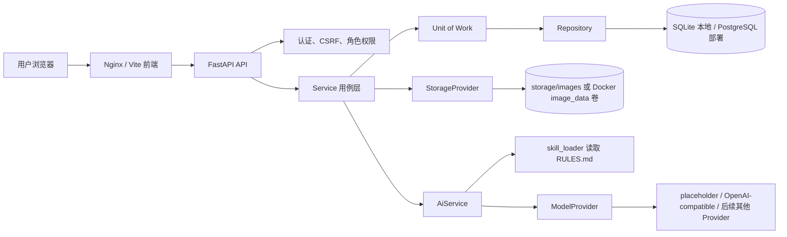
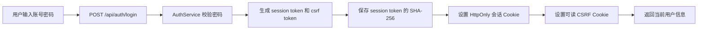
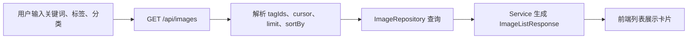
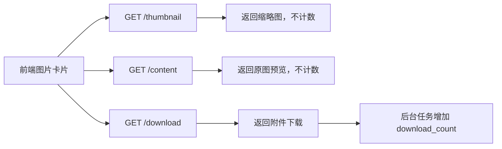
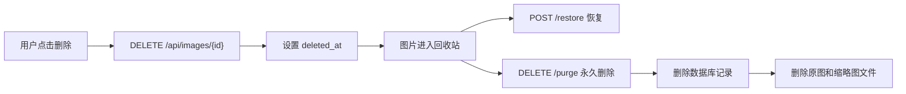
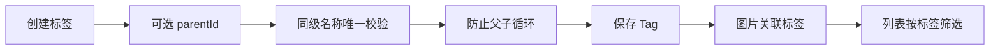
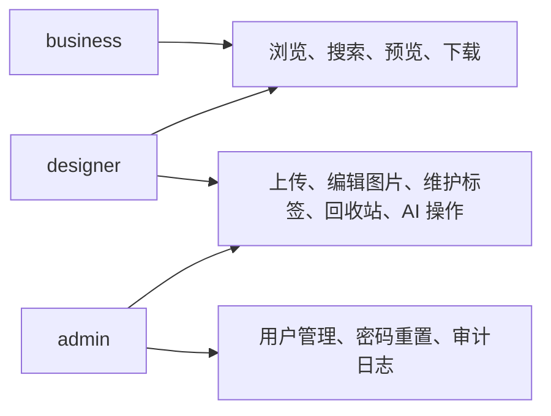
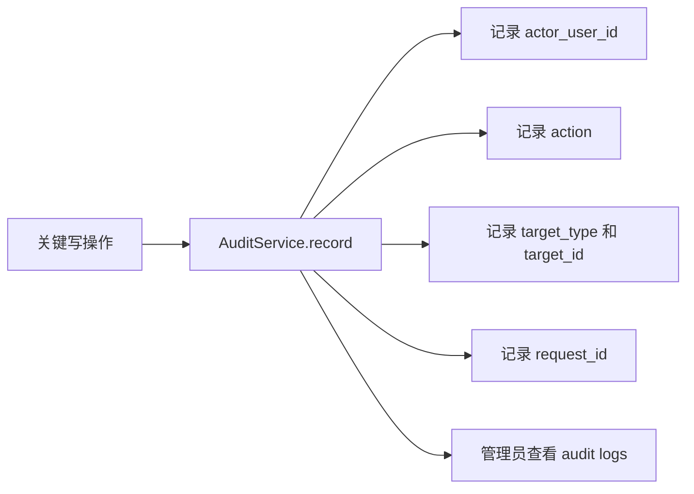
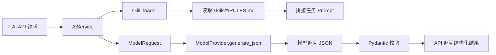

# Piancton 项目汇报文档素材稿

> 历史说明：本文主要记录基础素材库阶段的汇报素材。2026-06-24 起，项目已经进入
> 标签体系、AI 分析来源拆分和 Meilisearch 影子搜索改造阶段。当前事实以
> `README.md`、`docs/ARCHITECTURE.md`、`docs/SEARCH_MODES_AND_AI.md` 和当前代码为准。
> 文中若保留旧复盘语境，应按“历史阶段说明”理解，不能作为后续改造依据。

本文是一份适合汇报前整理使用的详细素材稿。它既要让人读得懂，也要方便后期压缩成表格、PPT 或答辩讲稿。因此本文不会只罗列代码名词，而是尽量说明“为什么这样做”“这个模块解决了什么问题”“复刻时怎么验证”“汇报时应该怎么讲”。

阅读方式建议：

- 如果是给老师、评委或非技术同学看，可以优先读“项目一句话说明”“汇报版摘要”“核心业务流程”和“踩坑复盘”。
- 如果是给懂技术的同学或架构师看，可以重点读“技术栈与工具链”“运行架构图”“目录结构说明”和“AI 任务与 Skill 资产”。
- 如果是给后续复刻项目的人看，可以重点读“傻瓜式复刻指南”和“最小验收清单”。
- 如果后期要做表格，可以直接从每个表格和“后期表格整理建议”中摘取。

项目名称：Piancton 标签图片仓库

项目定位：面向设计师与业务团队的内部图片素材管理系统。设计师负责上传、整理、标注素材；业务人员负责按标签、关键词、分类检索并下载素材；管理员负责内测账号、角色权限和审计日志。项目已经支持 OpenAI-compatible 多模态模型接入、AI 图片理解、搜索意图理解、文案卖点匹配和自动打标边界；未配置模型时默认使用 placeholder 并返回明确的 `503 provider_not_configured`。

适合读者：

- 架构师或主创：看系统边界、核心资产、模块分工和后续可扩展点。
- 新手复刻者：照着步骤启动项目、创建账号、上传图片、测试权限和完成验收。
- 复盘者或后续维护者：看清已经做过的取舍、避坑经验和下一阶段风险。

使用建议：

- 如果要做“技术栈表”，可优先摘取“蓝色部分 1. 技术栈与工具链”。
- 如果要做“系统流程图”，可优先摘取“蓝色部分 3. 核心业务流”。
- 如果要做“复刻步骤表”，可优先摘取“橙色部分”。
- 如果要做“踩坑复盘表”，可优先摘取“黑色部分”。
- 如果要做“核心资产说明”，可优先摘取“AI 任务与 Skill 资产”和“核心资产保险箱”。

## 汇报版摘要

这个项目的核心目标，是把原本分散在文件夹、聊天记录或个人电脑里的图片素材，整理成一个可以登录、可以按标签检索、可以预览下载、可以追踪使用情况的内部素材库。它面向的不是普通公开相册，而是设计师和业务团队之间的协作场景：设计师负责维护素材质量，业务人员负责快速找到能用的图片，管理员负责账号和权限。

项目已经完成了基础素材库最重要的闭环：用户能登录，角色有区分；设计师能上传图片、打标签、管理回收站；业务人员能搜索、筛选、预览和下载；管理员能创建用户、重置密码、查看审计日志。系统还做了安全上传、真实图片校验、缩略图生成、下载计数、CSRF 防护、登录限流和操作审计，这些能力让它更像一个可以真实内部试用的工具，而不是一个只展示页面的 Demo。

项目的另一个重点，是为 AI 能力保留了清晰边界。当前没有把 Gemini、OpenAI 或其他模型 SDK 直接写进业务代码，而是定义了统一的 `ModelProvider` 接口，并已提供 OpenAI-compatible 适配器；图片理解、搜索意图理解、文案卖点匹配、二级卖点分类等规则沉淀在 `skills/*/RULES.md` 中。这样后续更换或新增模型时，只需要新增 Provider 适配器，业务规则和前端使用方式都不需要大改。

从技术实现上看，项目采用前后端分离架构：前端使用 React + Vite + TypeScript，后端使用 FastAPI + SQLAlchemy + Alembic，本地开发默认 SQLite，生产部署推荐 PostgreSQL + Docker Compose。图片文件不直接存进数据库，而是由 StorageProvider 管理本地目录或 Docker volume；数据库只保存图片元数据、标签关系、用户权限和审计记录。这种设计便于开发、部署和后续替换存储方案。

一句话概括：Piancton 是一个面向内部协作的标签图片素材库，已经完成了素材管理、权限安全、审计追踪和 AI 扩展接口四个核心方向，为后续做智能打标和语义检索打好了基础。

## 汇报讲述主线

正式汇报时，可以按下面这条线讲，听起来会比直接介绍技术栈更自然：

1. 先讲问题：素材分散、查找困难、权限不清、误删难恢复、下载使用情况不可追踪。
2. 再讲目标：做一个内部图片素材库，让设计师维护素材，业务人员快速检索使用，管理员负责账号和审计。
3. 然后讲系统：前端负责操作界面，后端负责权限和业务逻辑，数据库保存元数据，文件系统保存图片。
4. 接着讲核心流程：登录、上传、校验、打标签、搜索、预览、下载、回收站、审计。
5. 再讲亮点：安全上传、角色权限、CSRF 防护、缩略图、回收站、下载计数、操作审计、AI Provider 边界。
6. 最后讲复盘：本地 SQLite 降低复刻难度，生产 PostgreSQL 保证部署；AI 已有 Provider 边界和 OpenAI-compatible 接入，未配置模型时会明确失败而不是伪造成功。

可直接使用的开场：

“我这个项目做的是一个内部图片素材库，主要解决设计师和业务团队之间素材管理混乱的问题。设计师可以上传和标注图片，业务人员可以通过关键词和标签快速找到素材，管理员可以管理账号和查看操作日志。项目不仅完成了基础增删改查，还重点做了权限、安全上传、回收站、下载计数和审计日志，并且为后续 AI 自动打标和语义搜索预留了模型接口。”

## 一、项目一句话说明

Piancton 是一个带权限、标签树、图片安全上传、缩略图、回收站、下载计数、审计日志和 AI 扩展接口的内部图片素材库。它的重点不是单纯“上传图片”，而是把素材从“散落文件”变成可检索、可管理、可追踪、可扩展 AI 打标的业务资产。

从用户角度看：

- 业务人员登录后，可以按关键词、标签、分类筛选图片，预览和下载素材。
- 设计师登录后，可以上传图片、维护标题、维护标签、管理回收站。
- 管理员登录后，可以创建用户、禁用用户、重置密码、查看审计日志。

从工程角度看：

- 前端是 React + Vite 单页应用。
- 后端是 FastAPI + SQLAlchemy 分层服务。
- 数据库本地默认 SQLite，生产部署推荐 PostgreSQL。
- 图片字节存储在本地目录或 Docker volume 中，不放进数据库。
- AI 逻辑通过 `ModelProvider` 协议隔离，业务层不绑定具体厂商 SDK。
- Prompt 和规则集中放在 `skills/*/RULES.md`，便于版本化和复用。

## 二、蓝色部分：系统蓝图与核心资产

### 1. 技术栈与工具链

这一部分适合整理成“技术选型表”。每一项可以按“分类、工具、作用、项目位置、选择原因、注意事项”几个字段拆表。

| 分类 | 当前实现 | 项目位置 | 主要作用 | 选择原因 / 备注 |
|---|---|---|---|---|
| 前端框架 | React 19 | `client/src/` | 构建图片库后台操作界面 | 适合复杂交互、组件化页面和状态更新 |
| 构建工具 | Vite 7 | `client/vite.config.ts` | 本地开发服务、生产构建 | 启动快，适合前端单页应用 |
| 前端语言 | TypeScript | `client/tsconfig.json` | 提供类型检查 | 降低接口字段变更导致的运行时错误 |
| 路由 | React Router | `client/src/app.tsx` | 登录页、图片首页、详情页、管理页跳转 | 单页应用常用方案 |
| 请求库 | Axios | `client/src/api/` | 调用后端 API | 统一处理 Cookie、CSRF 和错误 |
| 远程状态 | TanStack Query | `client/src/features/` | 缓存图片、标签、用户等远程数据 | 减少重复请求，管理加载和刷新状态 |
| UI 组件 | Radix UI | `client/src/components/ui/` | Dialog、Dropdown、Popover 等基础组件 | 可访问性较好，便于定制样式 |
| 图标 | lucide-react | 多个页面组件 | 按钮和操作图标 | 风格统一，减少手写 SVG |
| 样式 | Tailwind CSS 4 | `client/src/index.css`、`tailwind-theme.css` | 快速编写布局和视觉样式 | 与组件化开发配合方便 |
| 动效 | Framer Motion | 前端依赖 | 页面或组件过渡 | 提升交互质感，但不影响核心业务 |
| 消息提示 | sonner | 前端依赖 | 操作成功、失败提示 | 上传、删除、保存等操作需要即时反馈 |
| 后端框架 | FastAPI | `backend/app/main.py` | HTTP API、OpenAPI、依赖注入 | 自动生成接口文档，适合类型化 API |
| 数据校验 | Pydantic | `backend/app/schemas/` | 请求和响应结构校验 | 保证 API 输入输出稳定 |
| ORM | SQLAlchemy | `backend/app/models/`、`repositories/` | 数据库模型和查询 | 支持 SQLite 和 PostgreSQL |
| 迁移工具 | Alembic | `backend/alembic/` | 数据库 schema 变更 | 禁止直接 `create_all()` 漂移结构 |
| 本地数据库 | SQLite | `data/piancton.db` | 本地开发和测试 | 不需要安装数据库服务，降低复刻门槛 |
| 生产数据库 | PostgreSQL 17 | `docker-compose.yml` | 生产持久化数据 | 稳定、标准、适合服务器部署 |
| 图片处理 | Pillow | `backend/app/services/storage_service.py` | 校验图片、识别真实格式、生成缩略图 | 防止伪造文件，降低列表加载压力 |
| 认证安全 | Argon2、Cookie、CSRF | `auth_service.py`、`dependencies.py` | 登录、会话、写请求保护 | 后端强制权限，不依赖前端隐藏按钮 |
| 审计 | AuditService | `backend/app/services/audit_service.py` | 记录关键操作 | 便于追踪上传、删除、用户管理等行为 |
| 部署 | Docker Compose | `docker-compose.yml` | 启动 web、backend、postgres | 服务器只需 Docker Engine 和 Compose |
| Web 服务 | Nginx | `docker/nginx.conf` | 提供前端静态文件并转发 API | Compose 内 Nginx 只负责 HTTP |
| API 类型生成 | openapi-typescript | `client/package.json` | 从 FastAPI OpenAPI 生成 TS 类型 | API 变更后减少前后端字段不一致 |
| 后端测试 | pytest | `backend/tests/` | 验证权限、图片、安全、分页、架构边界 | 覆盖核心业务风险 |
| 后端静态检查 | ruff、pyright | `backend/pyproject.toml` | 代码规范和类型检查 | 提前发现导入、类型、风格问题 |
| 前端检查 | ESLint、TypeScript、Vitest | `client/package.json` | 语法、类型、单测、构建 | 保证前端稳定交付 |
| AI 接口 | `ModelProvider` Protocol | `backend/app/ai/contracts.py` | 隔离真实模型厂商 | 已支持 OpenAI-compatible，多模型接入继续走 Provider |
| AI 规则资产 | `skills/*/RULES.md` | `skills/` | 存放 Prompt、标签体系、评分规则 | 是项目最重要的可复用知识资产 |

技术栈说明：

前端选择 React + Vite，是为了快速做出可交互的素材管理后台。这个项目不是纯展示页，而是有登录、筛选、上传、标签选择、弹窗、回收站、管理后台等操作，所以需要组件化和稳定的状态管理。

后端选择 FastAPI，是因为它天然支持 OpenAPI 文档、类型校验和依赖注入，适合做前后端分离项目。Pydantic schema 负责把后端输出稳定成前端可用的 camelCase 字段，避免直接把数据库模型暴露给浏览器。

数据库采用“本地 SQLite、生产 PostgreSQL”的双环境策略。本地复刻者不需要安装复杂数据库，直接用 `data/piancton.db` 就能跑起来；生产环境再通过 Docker Compose 启动 PostgreSQL，保证稳定性和可备份性。

图片没有存进数据库，而是存到 `storage/images` 或 Docker volume。数据库只保存标题、文件名、storage key、缩略图 key、标签、分类、上传人、下载数等元数据。这样做可以避免数据库膨胀，也方便后续替换成对象存储。

AI 部分当前不是把某个厂商 SDK 写死在业务代码里，而是“Provider 适配器 + 规则资产 + 输出校验”的结构。`AiService` 会读取 `skills/*/RULES.md` 拼出任务 Prompt，再交给 `ModelProvider.generate_json()`；配置 `MODEL_PROVIDER=openai_compatible` 后可调用 OpenAI-compatible 多模态模型，未配置时会返回 `503 provider_not_configured`，这是有意设计，不是失败。

### 2. 项目目录结构说明

这一部分适合整理成“目录职责表”。

| 路径 | 职责 | 重要程度 | 备注 |
|---|---|---:|---|
| `README.md` | 项目总说明、本地开发、部署验收清单 | 高 | 面向开发者和部署者 |
| `docs/ARCHITECTURE.md` | 架构边界、图片生命周期、权限和状态记录 | 高 | 当前最正式的架构文档 |
| `docs/SERVER_DEPLOYMENT_CHECKLIST.md` | 服务器部署与验收记录模板 | 高 | 用于生产环境上线检查 |
| `docs/PROJECT_HANDOVER.md` | 本文档，临时详细素材稿 | 中 | 后续可删或压缩 |
| `backend/app/main.py` | FastAPI 应用入口、中间件、健康检查、异常处理 | 高 | 后端启动核心 |
| `backend/app/api/` | API 路由和依赖注入 | 高 | 处理 HTTP、权限、Cookie、CSRF |
| `backend/app/services/` | 业务逻辑层 | 高 | 图片、标签、搜索、认证、用户、审计 |
| `backend/app/repositories/` | 数据库访问层 | 高 | 只做查询和保存，不提交事务 |
| `backend/app/models/` | SQLAlchemy 数据模型 | 高 | 用户、图片、标签等表结构 |
| `backend/app/schemas/` | Pydantic 请求响应模型 | 高 | 保证 API 稳定输出 |
| `backend/app/ai/` | AI Provider 协议、工厂、Prompt 拼装 | 高 | 后续接模型的入口 |
| `backend/alembic/` | 数据库 migration | 高 | 生产数据库结构变更必须走这里 |
| `backend/tests/` | 后端测试 | 高 | 覆盖核心安全和业务流程 |
| `client/src/pages/` | 前端页面 | 高 | 登录、图片首页、详情、回收站、管理页 |
| `client/src/features/` | 前端业务 hooks | 高 | 图片浏览、详情、标签、AI 状态 |
| `client/src/api/` | 前端 API 封装 | 高 | Axios 请求和具体接口函数 |
| `client/src/components/` | 通用布局和 UI 组件 | 中 | Layout、TagTreeSelector、基础 UI |
| `client/src/types/` | API 和 OpenAPI 类型 | 中 | 后端 schema 变化后需要更新 |
| `skills/` | 项目 AI 规则、Prompt、评分和编排说明 | 高 | 核心知识资产，不是普通说明文件 |
| `docker-compose.yml` | 生产/服务器容器编排 | 高 | postgres、backend、web 三个服务 |
| `docker/nginx.conf` | Nginx 配置 | 中 | 静态文件和 API 代理 |
| `.env.docker.example` | 生产环境变量示例 | 高 | 部署前必须复制并修改 |
| `backend/.env.example` | 后端本地环境变量示例 | 中 | 本地开发可参考 |
| `storage/images` | 本地图片存储目录 | 中 | 存原图、缩略图、staging、trash |
| `data/piancton.db` | 本地 SQLite 数据库 | 中 | 本地开发默认数据库 |

目录设计的核心思路：

- 前端只负责展示和交互，不拥有最终权限判断。
- API 层只负责 HTTP 入口，不写复杂业务规则。
- Service 层负责编排完整用例，例如上传图片、删除图片、登录、创建用户。
- Repository 层只负责数据库操作，不决定业务流程。
- Model 层只定义持久化结构，不直接返回给前端。
- AI 规则资产放在 `skills/`，避免散落在页面、服务或模型适配器里。

### 3. 运行架构图



架构解释：

浏览器访问前端页面，前端通过 API 调用 FastAPI。FastAPI 首先处理登录状态、Cookie、CSRF、角色权限，然后把真正业务交给 Service 层。Service 层需要数据库时调用 Repository，需要提交事务时通过 Unit of Work，需要图片文件时调用 StorageProvider，需要 AI 时调用 AiService。

这个结构的价值是“每一层只做自己的事”。例如以后把本地图片存储换成 OSS/S3，只需要实现新的 StorageProvider，不应该改图片上传页面、标签服务或用户服务。以后更换 Gemini、OpenAI-compatible 或其他模型，也应该新增或替换 Provider，而不是把模型 SDK 写进图片服务。

强制边界：

- API 层可以导入 Service，但 Service 不导入 FastAPI。
- Service 可以导入 Repository，但 Repository 不导入 Service。
- Model 不直接作为 HTTP 响应返回。
- 前端永远不能读取服务器物理路径。
- AI Provider 不拥有业务标签体系，标签体系来自 `skills/`。
- 数据库结构禁止靠 `create_all()` 变更，只能通过 Alembic migration。

已有测试保障：

- `backend/tests/test_architecture.py` 检查 Service 不依赖 FastAPI。
- `backend/tests/test_architecture.py` 检查 Repository 不反向依赖 API 或 Service。
- `backend/tests/test_security_and_images.py` 覆盖认证、权限、图片、分页、回收站、审计等核心流程。

### 4. 核心业务流程图

#### 4.1 登录与会话流程



流程说明：

用户登录时，后端不会把明文密码或明文 session token 存进数据库。密码使用 Argon2 校验，session token 只保存 SHA-256 哈希。登录成功后，浏览器收到两个 Cookie：一个是 HttpOnly 的 `piancton_session`，用于证明用户身份；另一个是 `piancton_csrf`，前端读出来后放到写请求的 `X-CSRF-Token` 请求头里。

为什么要这样做：

- HttpOnly Cookie 能降低前端脚本读取 session 的风险。
- CSRF Header + Cookie 能防止第三方页面伪造写请求。
- Origin 校验能进一步确认请求来自可信前端地址。
- 停用账号或重置密码时，后端会删除该用户全部会话。

适合表格字段：

| 环节 | 输入 | 后端处理 | 输出 | 风险控制 |
|---|---|---|---|---|
| 登录 | 用户名、密码 | Argon2 校验、限流、生成 token | 用户信息、Cookie | 防暴力破解、保护会话 |
| 写请求 | Cookie、CSRF Header、Origin | 校验会话、CSRF、角色 | 执行业务操作 | 防伪造请求 |
| 登出 | 当前 session | 删除 session、清 Cookie | 204 | 会话失效 |

#### 4.2 图片上传与入库流程


详细解释：

上传不是简单地把文件保存到目录。后端会先把上传流写入 `.staging` 临时目录，同时检查文件大小是否超过 `MAX_UPLOAD_BYTES`。写完后用 Pillow 打开文件，确认它是真实图片，而不是伪装成 `.png` 的文本或脚本。然后检查像素总量，防止超大图片消耗内存。通过校验后，生成 JPEG 缩略图，再创建数据库记录和标签关系。最后使用原子移动把 staging 文件放到正式目录，并提交数据库事务。

如果中间任一步失败：

- 数据库事务回滚。
- staging 文件清理。
- 已经生成的临时缩略图清理。
- 前端收到明确错误码，例如 `invalid_image`、`upload_too_large`、`image_too_many_pixels`。

重要设计：

- 原始文件名只作为展示字段保存，真实存储文件名由 UUID 生成。
- 后端只把 `contentUrl`、`thumbnailUrl`、`downloadUrl` 返回给前端，不返回服务器物理路径。
- 缩略图统一转成 JPEG，列表页加载缩略图，不直接加载原图。
- 图片分类当前只允许 `scene` 和 `function`，非法分类会被拒绝。

适合表格字段：

| 步骤 | 目的 | 关键代码位置 | 失败时表现 |
|---|---|---|---|
| 写入 staging | 避免半成品进入正式目录 | `storage_service.py` | 删除临时文件 |
| 大小限制 | 防止超大文件 | `MAX_UPLOAD_BYTES` | 413 |
| 格式校验 | 防伪造图片 | Pillow verify | 415 |
| 像素限制 | 防内存攻击 | `MAX_IMAGE_PIXELS` | 413 |
| 生成缩略图 | 提升列表加载性能 | Pillow thumbnail | 上传失败 |
| 写数据库 | 保存元数据和标签关系 | `ImageService.upload` | 回滚 |

#### 4.3 图片浏览、筛选和搜索流程



普通列表支持：

- `keyword`：按标题等字段搜索。
- `tagIds`：多标签筛选。
- `category`：按图片分类筛选。
- `cursor`：稳定游标分页。
- `limit`：每页数量，当前限制 1 到 50。
- `sortBy`：按 `createdAt` 或 `downloadCount` 排序。

多标签筛选语义：

多标签筛选采用 AND 逻辑。也就是说，如果用户同时选择“标签一”和“标签二”，系统只返回同时拥有两个标签的图片，而不是拥有任意一个标签的图片。这个设计更适合素材库场景，因为用户越筛越精确。

语义搜索接口：

`POST /api/images/search` 当前使用确定性模糊匹配，并返回打分结果、匹配等级和原因。它现在还不是完整向量搜索，也没有真实 AI 召回，但接口形状已经为未来扩展留好位置。未来可以把 `SearchService` 扩展成 AI 搜索意图理解 + 多层召回 + 确定性评分，而不需要前端大改。

适合表格字段：

| 能力 | 当前实现 | 后续可扩展 |
|---|---|---|
| 关键词搜索 | 数据库模糊匹配 | 接搜索意图理解 |
| 标签筛选 | 多标签 AND | 支持子树筛选 |
| 分类筛选 | scene/function | 扩展更多分类 |
| 排序 | 创建时间、下载数 | 相关性、热度、更新时间 |
| 分页 | 游标分页 | 无限滚动优化 |
| 语义搜索 | 确定性打分 | AI 召回、向量库 |

#### 4.4 预览、下载和下载计数流程



接口区别：

| 接口 | 用途 | 是否增加下载数 | 返回方式 |
|---|---|---:|---|
| `/thumbnail` | 列表缩略图 | 否 | inline |
| `/content` | 详情预览原图 | 否 | inline |
| `/download` | 用户真正下载 | 是 | attachment |

为什么预览不算下载：

素材库里用户经常浏览和预览图片，如果每次预览都增加下载数，下载统计就会失真。只有用户明确点击下载，才说明这张图被业务使用或保存，因此下载计数只在 `/download` 响应后通过后台任务增加。

#### 4.5 删除、回收站、恢复和永久删除流程



当前真实实现：

- 普通删除不是立刻删除文件，而是设置 `deleted_at`。
- 删除后的图片从正常列表和详情中隐藏。
- 设计师或管理员可以在回收站看到已删除图片。
- 恢复会把 `deleted_at` 重新置空。
- 永久删除才会删除数据库记录、原图和缩略图。

为什么要两阶段删除：

设计师维护素材时容易误删。如果直接删除文件，恢复成本很高。回收站给了项目一个低成本保护层。只有在确认不再需要时，才永久清理文件和数据库记录。

特别说明：

`skills/manage-image-library/RULES.md` 中还保留了早期“删除数据库记录”的旧描述，但当前代码已经升级成软删除 + 回收站 + purge 两阶段。后续文档和讲解应以当前代码为准。

#### 4.6 标签树流程



标签规则：

- 标签可以有父标签，形成层级树。
- 图片必须至少关联一个最末级标签；一级和中间标签只用于导航。
- 上传、编辑和回收站恢复都由后端执行叶子标签校验，不能只依赖前端按钮。
- `backend/app/domain/taxonomy.py` 是六大体系初始化目录的唯一代码来源，修改正式标签树时必须同步更新它。
- 同一个父级下，标签名称不能重复。
- 不同分支下，可以有同名子标签。
- 标签不能把自己设为父标签。
- 标签不能形成祖先和后代之间的循环。
- AI 可以建议标签，但不应自动创建任意手动标签节点。

项目中存在三类“标签/分类概念”，容易混淆：

| 概念 | 来源 | 是否可由用户编辑 | 用途 |
|---|---|---:|---|
| 手动层级标签 | 数据库 `Tag` | 是 | 人工维护素材分类 |
| 内容标签 | AI 图片识别结果 | 否或半自动 | 描述图片可见内容 |
| 二级卖点标签 | 封闭业务标签目录 | 否 | 课程/广告/教育卖点匹配 |

这一点非常重要：不要把 AI 识别出的开放词直接写进手动标签树，也不要把二级卖点标签和普通标签混为一谈。

#### 4.7 用户角色和权限流程



角色能力表：

| 能力 | business | designer | admin |
|---|---:|---:|---:|
| 登录系统 | 是 | 是 | 是 |
| 浏览图片列表 | 是 | 是 | 是 |
| 搜索图片 | 是 | 是 | 是 |
| 预览图片 | 是 | 是 | 是 |
| 下载图片 | 是 | 是 | 是 |
| 上传图片 | 否 | 是 | 是 |
| 编辑图片标题 | 否 | 是 | 是 |
| 编辑图片标签 | 否 | 是 | 是 |
| 删除和恢复图片 | 否 | 是 | 是 |
| 维护标签树 | 否 | 是 | 是 |
| 调用 AI 操作 | 否 | 是 | 是 |
| 创建和管理用户 | 否 | 否 | 是 |
| 重置密码 | 否 | 否 | 是 |
| 查看审计日志 | 否 | 否 | 是 |

权限设计原则：

前端可以根据角色隐藏按钮，但这只是体验优化，不是安全边界。所有写接口都在后端通过 `require_write_role` 或 `require_admin` 强制校验。即使用户手动构造请求，只要角色不对，后端也会返回 403。

#### 4.8 审计日志流程



当前记录的典型行为：

- `auth.login`
- `image.upload`
- `image.update_title`
- `image.update_tags`
- `image.trash`
- `image.restore`
- `image.purge`
- `tag.create`
- `tag.update`
- `tag.delete`
- `user.create`
- `user.update`
- `user.reset_password`

审计价值：

- 能知道谁上传了图片。
- 能知道谁删除或永久删除了图片。
- 能知道用户管理操作由谁执行。
- 出现问题时，可以用 request ID 和日志关联排查。

### 5. AI 任务与 Skill 资产

这一部分是项目的“核心资产保险箱”。项目已经具备模型 Provider 边界和 OpenAI-compatible 适配器；Prompt、标签目录、评分规则和编排原则沉淀在 `skills/` 中，避免业务规则散落到页面或厂商 SDK 里。

#### 5.1 AI 调用架构



AI 层关键代码：

| 文件 | 作用 |
|---|---|
| `backend/app/ai/contracts.py` | 定义 `ModelProvider` 协议、`ModelRequest`、任务类型 |
| `backend/app/ai/factory.py` | 根据配置返回 Provider |
| `backend/app/ai/placeholder.py` | 未配置模型时抛出明确错误 |
| `backend/app/ai/openai_compatible.py` | 通过 OpenAI-compatible `/chat/completions` 调用多模态模型 |
| `backend/app/ai/skill_loader.py` | 按任务读取并拼接 `skills/*/RULES.md` |
| `backend/app/services/ai_service.py` | 模型无关的 AI 业务入口 |
| `backend/app/api/v1/ai.py` | AI API 路由 |
| `backend/app/schemas/ai.py` | AI 结果结构定义 |

#### 5.2 当前已定义的 AI 任务

| 任务名称 | 任务代码 | Prompt 来源 | 输入 | 输出 | 当前状态 |
|---|---|---|---|---|---|
| 图片内容识别 | `image_content_analysis` | `analyze-image-content` + `classify-secondary-selling-points` | 图片路径 | 图片类型、摘要、内容标签、推荐搜索词等 | 已接入 OpenAI-compatible Provider |
| 二级卖点判断 | `secondary_selling_point_classification` | `classify-secondary-selling-points` | 图片证据 | 主标签、副标签、置信度、原因 | 规则资产已完成 |
| 搜索意图理解 | `search_intent_understanding` | `understand-image-search-intent` | 用户搜索词 | 标准查询、扩展标签、相关大类、排除项 | 规则资产已完成 |
| 文案卖点匹配 | `copy_selling_point_matching` | `match-copy-selling-points` | 活动或课程文案 | 六大体系、30 个卖点匹配结果 | 规则资产已完成 |

#### 5.3 重要 Skill 文件说明

| Skill 文件 | 主要内容 | 用途 | 后续整理建议 |
|---|---|---|---|
| `analyze-image-content/RULES.md` | 图片内容识别输出 JSON 协议 | 让视觉模型稳定描述图片 | 可整理成“图片识别字段表” |
| `classify-secondary-selling-points/RULES.md` | 16 个图片二级卖点标签和证据规则 | 判断图片属于哪个教育产品卖点 | 可整理成“二级卖点标签表” |
| `understand-image-search-intent/RULES.md` | 搜索词标准化、扩词、相关大类和排除项 | 把自然语言搜索变成结构化查询 | 可整理成“搜索意图字段表” |
| `match-copy-selling-points/RULES.md` | 六大体系和 30 个文案卖点 | 从文案中识别营销卖点 | 可整理成“六大体系卖点表” |
| `score-image-search-results/RULES.md` | 确定性评分公式和 S/A/B/C 等级 | 对召回图片排序和解释 | 可整理成“评分公式表” |
| `recall-selling-point-images/RULES.md` | 三层图片召回策略 | 根据卖点召回候选图 | 可整理成“召回层级表” |
| `orchestrate-ai-tagging/RULES.md` | AI 自动打标编排流程 | 串联识别、分类、校验、入库 | 可整理成“AI 打标流程表” |
| `integrate-model-provider/RULES.md` | 模型 Provider 替换约定 | 防止业务层绑定厂商 SDK | 可整理成“模型接入规范表” |
| `manage-tag-taxonomy/RULES.md` | 手动标签、内容标签、二级卖点边界 | 防止标签概念混乱 | 可整理成“标签概念对照表” |
| `maintain-piancton-architecture/RULES.md` | 分层和依赖方向 | 新增功能时保持架构稳定 | 可整理成“架构边界表” |

#### 5.4 为什么把规则放在 Skill 文件中

原因一：业务规则比模型更稳定。

模型可以从 Gemini 换到 OpenAI，也可以从一个版本换到另一个版本，但项目希望“图片内容识别字段”“二级卖点标签”“文案卖点目录”“评分公式”保持稳定。因此规则不应该写死在某个模型 SDK 里。

原因二：便于复用和审查。

如果规则散落在多个函数或页面里，后续修改会很难追踪。集中放在 `skills/` 后，主创、产品、运营、开发都可以围绕这些文件讨论。

原因三：便于接入和替换真实模型。

`skill_loader.py` 已经能根据任务读取对应规则，Provider 只负责把 Prompt
传给模型并拿回 JSON。这样模型接入是适配器工作，而不是重写业务系统。

#### 5.5 当前模型接入状态

当前后端已经支持 OpenAI-compatible 多模态模型：

- Provider 文件：`backend/app/ai/openai_compatible.py`
- 启用方式：`MODEL_PROVIDER=openai_compatible`
- 调用协议：OpenAI-compatible `/chat/completions`
- 环境变量：
  - `MODEL_PROVIDER`
  - `MODEL_NAME`
  - `MODEL_BASE_URL`
  - `MODEL_API_KEY`
  - `MODEL_TIMEOUT_SECONDS`
- API Key 只放后端环境变量，不进入前端、不写入示例文件。

Provider 已实现 `ModelProvider` 协议：

   - `name`
   - `configured`
   - `generate_json(request: ModelRequest) -> dict`

`AiService` 继续只依赖 `ModelProvider`，不导入具体 SDK。后续如果换成
Gemini、通义、火山方舟、即梦或其他模型，仍然只需要在 `backend/app/ai/`
新增适配器，并在 `factory.py` 中按 `MODEL_PROVIDER` 切换。

已有测试覆盖：

- Provider 未配置时返回明确错误。
- OpenAI-compatible Provider 能从模型文本中提取 JSON。
- 图片会作为 data URL 发送给多模态接口。

后续可继续补充的模型专项测试：

- 模型 JSON 不符合 schema。
- 模型超时。
- 模型返回未知二级标签。
- 模型返回空结果。

错误策略：

- 未配置 Provider：返回 `503 provider_not_configured`。
- 模型返回无效 JSON：不做部分入库。
- schema 校验失败：返回明确错误。
- 模型超时：保留原有数据，不覆盖旧画像。
- 未知封闭标签：拒绝，不自动写入。

当前 AI 自动打标边界：

- 设计师从页面上传成功后，前端会立即调用同一套完整 AI 分析流程。
- “重新分析”会同时刷新语义总结、AI 自动匹配和隐形内容标签，不是只刷新隐形标签。
- 隐形内容标签必须为 18–22 个、不能重复，默认使用中文，并归入受控维度。
- AI 自动匹配只能来自封闭的 16 个业务标签，最多一个主标签和两个副标签。
- AI 自动匹配与人工层级标签分开存储和展示，不会偷偷覆盖人工标签树。
- 图片上传成功但 AI 分析失败时，页面必须明确提示部分成功；不得把上传成功冒充为分析成功。
- 模型超时、返回数量不足、未知业务标签或无效结构时，保留此前已保存的分析画像。

## 三、橙色部分：傻瓜式复刻指南

这一部分适合整理成“复刻步骤表”。建议按“步骤、操作、命令、成功标志、常见错误”五列整理。

### 1. 环境准备

本地复刻需要：

| 类别 | 工具 | 是否必须 | 说明 |
|---|---|---:|---|
| 后端语言 | Python 3.9+ | 是 | 运行 FastAPI 和测试 |
| 前端运行时 | Node.js + npm | 是 | 安装前端依赖和启动 Vite |
| 本地数据库 | SQLite | 默认 | Python 自带支持，不需要单独安装 |
| 生产容器 | Docker Engine | 服务器需要 | 本地继续开发不强制需要 |
| 容器编排 | Docker Compose | 服务器需要 | 启动 web、backend、postgres |
| PostgreSQL | Compose 内置 | 服务器需要 | 不建议宿主机重复安装 |
| Podman | 不需要 | 否 | 本项目默认不走 Podman |
| 模型 API Key | 当前不需要 | 否 | 未接真实 Provider 时 AI 返回 503 |

本地开发最简结论：

只要有 Python 和 Node.js，就能跑起来。不要一开始就纠结 Docker、Podman、PostgreSQL。Docker Compose 是服务器部署路线，不是本地学习和复刻的前置条件。

### 2. 后端启动步骤

进入后端目录：

```bash
cd backend
```

创建虚拟环境：

```bash
python3 -m venv .venv
```

激活虚拟环境：

```bash
source .venv/bin/activate
```

安装依赖：

```bash
pip install -r requirements-dev.txt
```

执行数据库迁移：

```bash
alembic upgrade head
```

创建管理员：

```bash
python -m scripts.create_admin admin 'replace-with-a-strong-password'
```

启动后端：

```bash
uvicorn app.main:app --reload --port 8000
```

成功标志：

- 终端显示 Uvicorn 正在监听 `127.0.0.1:8000`。
- 访问 `http://127.0.0.1:8000/health/live` 返回 `{"status":"ok"}`。
- 访问 `http://127.0.0.1:8000/health/ready` 返回 `{"status":"ready"}`。
- 访问 `http://127.0.0.1:8000/docs` 能看到 API 文档。

常见问题：

| 问题 | 可能原因 | 解决方式 |
|---|---|---|
| 找不到模块 `app` | 没有在 `backend` 目录启动 | 先 `cd backend` |
| 数据库表不存在 | 没有执行 Alembic | 运行 `alembic upgrade head` |
| 登录不了 | 没有创建管理员 | 运行 `scripts.create_admin` |
| 端口被占用 | 8000 已被其他进程使用 | 换端口或停止旧服务 |

### 3. 前端启动步骤

进入前端目录：

```bash
cd client
```

安装依赖：

```bash
npm install
```

启动开发服务：

```bash
npm run dev
```

成功标志：

- 终端显示 Vite 本地地址。
- 默认访问 `http://127.0.0.1:5173`。
- 能看到登录页。
- 使用刚创建的 admin 账号能登录。

前后端地址：

| 服务 | 默认地址 | 作用 |
|---|---|---|
| 前端 | `http://127.0.0.1:5173` | 浏览器打开的页面 |
| 后端 | `http://127.0.0.1:8000` | API 服务 |
| API 文档 | `http://127.0.0.1:8000/docs` | FastAPI OpenAPI |

### 4. 创建用户和角色

建议复刻时至少创建三个角色账号：

| 账号类型 | 作用 | 验收方式 |
|---|---|---|
| admin | 管理员，负责用户、审计、全部素材操作 | 能进入用户管理和审计日志 |
| designer | 设计师，负责上传和维护素材 | 能上传图片，不能管理用户 |
| business | 业务人员，只负责查找和下载素材 | 能浏览下载，不能上传或改标签 |

操作步骤：

1. 用命令行创建第一个 `admin`。
2. 登录前端。
3. 进入管理员用户页面。
4. 创建 `designer` 用户。
5. 创建 `business` 用户。
6. 分别登录测试角色权限。

权限验收：

- `business` 访问用户管理应失败。
- `business` 调用上传、标签创建等写接口应失败。
- `designer` 可以上传图片和管理标签。
- `designer` 不应看到或调用用户管理能力。
- `admin` 可以管理用户和查看审计日志。

### 5. 标签树复刻步骤

推荐先创建基础标签，再上传图片：

1. 登录 `designer` 或 `admin`。
2. 运行 `python -m scripts.seed_taxonomy` 创建六大体系和正式二级标签。
3. 如需调整正式目录，同时修改 `backend/app/domain/taxonomy.py`，避免服务器初始化恢复旧标签。
4. 尝试在同一父级创建同名标签，应被拒绝。
5. 尝试在不同父级创建同名标签，应允许。
6. 尝试把父标签设置为自己的子标签，应被拒绝。

为什么先建标签：

图片上传和后续编辑都必须至少保留一个最末级标签。一级和中间标签只负责导航，
不能直接挂图片。该规则由后端统一执行，旧数据恢复时也会重新校验，避免无标签图片
或父级直挂图片再次进入正常素材库。

### 6. 图片上传复刻步骤

推荐准备三类测试文件：

- 一张真实 PNG 或 JPEG 图片。
- 一个改成 `.png` 后缀的文本文件，用来测试伪造图片拒绝。
- 一张较大的图片，用来测试大小或像素限制。

操作流程：

1. 登录 `designer` 或 `admin`。
2. 打开图片上传入口。
3. 选择真实图片。
4. 填写标题。
5. 选择标签。
6. 选择分类，例如 `function` 或 `scene`。
7. 提交上传。
8. 回到列表，确认图片卡片出现。
9. 打开详情，确认原图可预览。
10. 检查下载数初始为 0。

验收点：

| 验收项 | 成功表现 |
|---|---|
| 真实图片上传 | 返回 201，列表出现卡片 |
| 伪造图片上传 | 返回 415，不入库 |
| 超大文件 | 返回 413，不入库 |
| 缩略图 | 卡片显示 `/thumbnail` |
| 预览 | `/content` 可打开，不增加下载数 |
| 下载 | `/download` 可下载，下载数增加 |
| 路径安全 | API 响应不出现服务器物理路径 |

### 7. 搜索和筛选复刻步骤

建议上传 3 到 5 张标题和标签不同的图片，然后测试：

1. 按关键词搜索标题。
2. 选择一个标签筛选。
3. 同时选择两个标签筛选。
4. 按分类筛选。
5. 切换按创建时间排序。
6. 切换按下载数排序。
7. 下载其中一张，再看排序和下载数变化。

重点观察：

- 多标签筛选是 AND，不是 OR。
- 预览不会增加下载数。
- 只有下载会增加下载数。
- 列表分页使用游标，连续翻页不应重复或漏数据。

### 8. 回收站复刻步骤

操作流程：

1. 上传一张测试图片。
2. 在详情或列表中删除。
3. 回到普通列表，确认图片消失。
4. 打开回收站，确认图片出现。
5. 点击恢复，确认图片回到普通列表。
6. 再次删除。
7. 在回收站执行永久删除。
8. 确认回收站为空，普通列表也找不到。

验收点：

| 操作 | 成功表现 |
|---|---|
| 删除 | 普通列表不可见，回收站可见 |
| 恢复 | 普通列表可见，回收站消失 |
| 永久删除 | 数据库记录和文件清理，无法恢复 |
| 审计 | admin 审计日志能看到 trash、restore、purge |

### 9. AI 接口复刻说明

当前复刻时不强制申请模型 API Key。AI 相关接口存在；若未配置模型，会稳定返回明确错误，若配置 OpenAI-compatible Provider，则可执行真实分析。

可以验证：

1. 登录 `admin` 或 `designer`。
2. 上传一张图片。
3. 调用图片分析接口。
4. 未配置模型时，系统返回 `503 provider_not_configured`；已配置模型时，系统执行分析并写入分析结果。

这个结果说明：

- AI 入口存在。
- 权限校验已通过。
- 系统明确知道当前模型是否配置完整。
- 未配置时不会用空结果伪装成成功。

如果后续要演示其他厂商模型，应新增对应 Provider 适配器，而不是把厂商 SDK 写进业务服务。

### 10. 生产部署复刻步骤

生产服务器推荐安装：

- Docker Engine
- Docker Compose

不推荐额外在宿主机安装 PostgreSQL，因为 Compose 已经包含 postgres 服务。

复制环境变量文件：

```bash
cp .env.docker.example .env
```

必须修改：

| 变量 | 作用 | 生产建议 |
|---|---|---|
| `POSTGRES_PASSWORD` | PostgreSQL 密码 | 必须改成强密码 |
| `APP_ORIGIN` | 可信前端域名 | 改成最终 HTTPS 域名 |
| `SESSION_COOKIE_SECURE` | Cookie 是否仅 HTTPS | 生产必须 true |
| `WEB_PORT` | Nginx 暴露端口 | 根据服务器代理配置 |

启动：

```bash
docker compose up --build -d
```

创建管理员：

```bash
docker compose exec backend python -m scripts.create_admin admin 'replace-with-a-strong-password'
```

生产环境必须额外确认：

- HTTPS 证书已配置。
- 外层反向代理正确转发到 Compose 的 `WEB_PORT`。
- `postgres`、`backend`、`web` 三个服务健康。
- PostgreSQL volume 已备份。
- 图片 volume 已备份。
- 至少做过一次恢复演练。

注意：

Compose 内 Nginx 当前只提供 HTTP，不负责 HTTPS 证书。生产域名的 HTTPS 应由服务器外层反向代理、云负载均衡或其他网关终止。

## 四、黑色部分：研发日志与踩坑复盘

这一部分适合整理成“问题、表现、原因、解决方案、经验”五列表。

### 1. 核心踩坑与最终决策

| 问题 | 表现 | 最终决策 | 原因 | 后续提醒 |
|---|---|---|---|---|
| 本地是否必须安装 PostgreSQL | 新手容易卡在数据库安装 | 本地默认 SQLite | 降低复刻门槛 | 生产仍需 PostgreSQL 验收 |
| 宿主机是否要装 PostgreSQL | 容器数据库和宿主机数据库易混淆 | 不建议宿主机安装 | Compose 已包含 postgres | 备份 volume 即可 |
| Docker、Podman、PostgreSQL 是否都要装 | 工具链复杂，容易误配 | 默认只走 Docker Compose | 路线简单统一 | Podman 不在默认支持范围 |
| AI 没配置时如何处理 | 可能被误认为系统坏了 | 返回明确 503 | 不用空结果冒充成功 | 文档中要解释这是预期 |
| 图片路径能否返回前端 | 有路径泄露风险 | 不返回物理路径 | 防任意文件读取 | 只返回 API URL |
| 删除图片是否直接删除 | 误删不可恢复 | 先进入回收站 | 保护素材资产 | purge 才永久删除 |
| 预览是否算下载 | 浏览行为会污染统计 | 不算 | 下载数代表真实使用 | 只有 `/download` 计数 |
| 多标签筛选是 AND 还是 OR | 用户期待不一致 | 使用 AND | 更适合精确素材筛选 | 文档中要说明 |
| 标签同名如何处理 | 全局唯一会限制分类 | 同级唯一 | 不同分支可复用名称 | 防止同父级混淆 |
| AI 标签和手动标签是否合并 | 容易污染标签树 | 分开管理 | 手动标签要可控 | AI 结果需人工确认 |
| 数据库结构如何变更 | 手动建表易漂移 | 只走 Alembic | 可追踪、可回滚 | 禁止依赖 `create_all()` |
| 前端权限是否足够 | 隐藏按钮可被绕过 | 后端强制校验 | 安全边界必须在后端 | 所有写接口都要鉴权 |

### 2. 已完成的安全硬化

| 安全点 | 当前实现 | 价值 |
|---|---|---|
| 密码保护 | Argon2 哈希 | 防止明文密码泄露 |
| 会话保护 | 只保存 session token 哈希 | 数据库泄露时降低风险 |
| Cookie 设置 | HttpOnly、SameSite=Lax，生产 Secure | 降低 XSS/CSRF 风险 |
| CSRF 防护 | Cookie + Header 双校验 | 防伪造写请求 |
| Origin 校验 | 写请求校验可信来源 | 防跨站提交 |
| 登录限流 | 按账号和 IP 限制失败次数 | 防暴力破解 |
| 停用会话清理 | 停用账号或重置密码删除会话 | 防旧 session 继续使用 |
| 请求 ID | 每个响应包含 X-Request-ID | 便于日志追踪 |
| 安全响应头 | nosniff、DENY、CSP 等 | 降低浏览器侧攻击面 |
| 操作审计 | 记录登录、图片、标签、用户操作 | 便于追责和排查 |
| 文件校验 | 真实图片格式、大小、像素限制 | 防伪造文件和资源攻击 |
| 路径安全 | storage key 安全解析 | 防路径穿越 |

### 3. 已完成的业务硬化

| 业务点 | 当前实现 | 价值 |
|---|---|---|
| 缩略图 | 上传时生成 JPEG 缩略图 | 列表更快，减少原图加载 |
| 回收站 | 普通删除只设置 `deleted_at` | 防误删 |
| 永久删除 | purge 删除记录和文件 | 清理无用资产 |
| 下载计数 | 只有下载接口增加 | 数据更准确 |
| 游标分页 | createdAt/downloadCount 稳定分页 | 避免翻页重复和漏项 |
| 多标签 AND | 必须同时满足多个标签 | 精准筛选 |
| 标签防循环 | 禁止父子关系形成环 | 保护标签树 |
| 同级唯一 | 同父级标签名唯一 | 防分类混乱 |
| 审计日志 | 写操作记录 request ID | 排查问题更方便 |
| Provider 未配置 | AI 返回 503 | 失败状态清楚 |

### 4. 当前还没有完成的能力

| 能力 | 当前状态 | 后续要做 |
|---|---|---|
| 其他 AI Provider | 已有 placeholder 和 OpenAI-compatible | 按需新增 Gemini/其他 Provider |
| AI 自动打标入库 | 已有自动分析、校验和入库闭环 | 继续补强任务队列、重试和审核体验 |
| 向量搜索 | 未接入 | 评估向量库或数据库扩展 |
| 对象存储 | 当前本地文件/volume | 实现 OSS/S3 StorageProvider |
| CDN 加速 | 未接入 | 图片量变大后再评估 |
| 异步任务队列 | 未接入 | 大批量打标或缩略图重算时需要 |
| 生产服务器验收 | 本地代码验证完成 | 目标服务器按清单验收 |
| 备份恢复演练 | 文档要求，需服务器执行 | PostgreSQL 和图片卷都要演练 |

### 5. 最容易讲错的点

这些点写文档或答辩时要特别注意：

- 不要说“已经接入 Gemini/GPT-image 生图”。准确说法是“已支持 OpenAI-compatible 多模态模型接入，其他厂商继续走 Provider 适配”。
- 不要说“Coze 平台工作流”。准确说法是“自建 FastAPI + React 工程，AI 规则以 Skill 文件沉淀”。
- 不要说“删除就是删除文件”。准确说法是“普通删除进回收站，永久删除才清理文件”。
- 不要说“预览也算下载”。准确说法是“预览不计数，下载才计数”。
- 不要说“本地必须装 Docker 和 PostgreSQL”。准确说法是“本地 SQLite 即可，生产服务器用 Docker Compose”。
- 不要把“手动标签、内容标签、二级卖点标签”混成一种标签。
- 不要把前端隐藏按钮当成权限控制，真正权限在后端。

### 6. 推荐后续路线

短期路线：

1. 把当前文档压缩成表格版，用于课程或汇报。
2. 完成目标服务器 Docker Compose 部署验收。
3. 建立 PostgreSQL 和图片 volume 备份。
4. 做一次恢复演练。
5. 清理或更新旧 Skill 文件中与当前实现不一致的描述。

中期路线：

1. 接入真实 `ModelProvider`。
2. 优先做搜索意图理解和文案卖点匹配，因为这两项不需要处理图片字节，风险较低。
3. 再做图片内容识别和自动打标。
4. 给 AI 结果增加人工确认流程，避免模型直接污染标签和素材数据。
5. 给模型调用增加成本、耗时、错误和审计记录。

长期路线：

1. 根据素材数量决定是否接对象存储。
2. 根据搜索复杂度决定是否引入向量搜索。
3. 根据 AI 任务耗时决定是否引入队列。
4. 根据团队规模完善角色权限和审批流程。
5. 把 `skills/` 规则资产做成可视化维护界面或独立知识库。

## 五、最小验收清单

这一部分可以直接改成项目验收表。

### 1. 后端命令验收

```bash
cd backend
source .venv/bin/activate
pytest -q
ruff check app tests
pyright
```

成功标准：

- pytest 全部通过。
- ruff 无错误。
- pyright 无阻塞问题。

### 2. 前端命令验收

```bash
cd client
npm run lint
npm run typecheck
npm run test
npm run build
```

成功标准：

- ESLint 通过。
- TypeScript 类型检查通过。
- Vitest 通过。
- Vite 生产构建成功。

### 3. API 类型同步

后端 API schema 变化后运行：

```bash
cd client
npm run generate:api
```

成功标准：

- `client/src/types/openapi.d.ts` 更新。
- 前端 TypeScript 仍然通过。
- 页面调用字段没有类型错误。

### 4. 浏览器功能验收

| 模块 | 验收动作 | 成功标准 |
|---|---|---|
| 登录 | admin 登录 | 进入系统 |
| 权限 | business 尝试上传 | 被拒绝 |
| 用户管理 | admin 创建 designer | 创建成功 |
| 标签 | 创建父子标签 | 列表显示层级 |
| 上传 | 上传真实图片 | 卡片出现 |
| 安全 | 上传伪造图片 | 被拒绝 |
| 预览 | 打开图片预览 | 下载数不变 |
| 下载 | 点击下载 | 下载数增加 |
| 筛选 | 多标签筛选 | AND 结果正确 |
| 回收站 | 删除、恢复、永久删除 | 流程正常 |
| 审计 | 查看日志 | 有对应 action |
| AI | 未配置 Provider 时调用 | 返回 503 |

### 5. 生产部署验收

| 项目 | 成功标准 |
|---|---|
| Docker 服务 | `postgres`、`backend`、`web` 均健康 |
| HTTPS | 生产域名证书有效 |
| Cookie | `SESSION_COOKIE_SECURE=true` |
| 数据库 | Alembic 已升级到最新 revision |
| 管理员 | 首位 admin 已创建 |
| 权限 | business/designer/admin 均符合角色边界 |
| 上传 | 真实图片可上传，伪造图片被拒绝 |
| 图片 | 缩略图、预览、下载正常 |
| 删除 | 回收站和永久删除正常 |
| 审计 | 管理员可查看日志 |
| 持久化 | 容器重启后数据和图片仍在 |
| 备份 | PostgreSQL 和图片卷有定时备份 |
| 恢复 | 至少完成一次恢复演练 |

## 六、后期表格整理建议

如果要把本文压缩成最终文档，可以拆成以下表格：

1. 项目概览表：项目名称、定位、用户角色、核心能力、当前状态。
2. 技术栈表：前端、后端、数据库、部署、测试、AI 接口。
3. 目录职责表：路径、职责、重要程度、备注。
4. 核心流程表：登录、上传、搜索、下载、删除、AI。
5. 权限矩阵表：business、designer、admin 三类角色能力。
6. AI Skill 资产表：Skill 文件、规则内容、用途、后续整理方式。
7. 复刻步骤表：环境、后端、前端、用户、标签、上传、搜索、回收站。
8. 踩坑复盘表：问题、表现、决策、原因、后续提醒。
9. 验收清单表：后端、前端、浏览器、生产部署。

最终汇报时可以用一句话概括：

“本项目完成了一个可本地运行、可服务器部署、带权限安全和审计能力的内部图片素材库，并为后续 AI 打标、语义搜索和卖点匹配保留了稳定 Provider 接口与规则资产。”

## 七、可直接改成汇报稿的版本

下面这一段更适合口头汇报或 PPT 备注页，可以根据时间长短删减。

### 1. 1 分钟简短版

这个项目是一个面向设计师和业务团队的内部图片素材库。它解决的主要问题是素材分散、查找效率低、权限不清楚、误删后难恢复，以及下载使用情况无法追踪。

系统里有三类角色：业务人员可以搜索、筛选、预览和下载图片；设计师可以上传图片、维护标签和管理回收站；管理员可以管理用户和查看审计日志。项目还做了安全上传、图片真实格式校验、缩略图生成、下载计数、CSRF 防护和登录限流，保证它不只是能展示页面，而是具备实际内部试用的基础。

技术上，前端使用 React + Vite + TypeScript，后端使用 FastAPI + SQLAlchemy，本地用 SQLite 降低复刻门槛，生产可以用 Docker Compose 部署 PostgreSQL、后端和前端服务。AI 方面，项目没有把模型 SDK 写死在业务代码里，而是通过 `ModelProvider` 接口隔离模型供应商，已支持 OpenAI-compatible 多模态模型，并把图片理解、搜索意图、卖点匹配等规则放在 `skills` 文件夹中。

### 2. 3 分钟完整版

我这个项目叫 Piancton，是一个内部图片素材仓库。它的目标不是做一个普通相册，而是解决团队协作中的素材管理问题。比如设计师上传了很多素材，但业务同学后续很难通过主题、场景或功能快速找到；素材被谁下载过、哪些图更常用，也没有记录；如果误删图片，也不方便恢复。因此我把项目定位成一个带权限、标签、搜索、回收站和审计能力的图片素材管理系统。

系统中主要有三类用户。第一类是 business，也就是业务人员，他们可以浏览图片、按关键词和标签检索、预览和下载素材。第二类是 designer，也就是设计师，他们可以上传图片、维护标题和标签、管理回收站。第三类是 admin，也就是管理员，可以创建用户、禁用用户、重置密码，并查看审计日志。前端会根据角色展示不同入口，但真正的权限判断全部放在后端，避免用户绕过页面按钮直接调用接口。

核心流程是这样的：用户登录后，后端通过 HttpOnly Cookie 保存会话，并通过 CSRF Token 保护写请求。设计师上传图片时，后端不会直接信任文件后缀，而是先把文件写入 staging 临时目录，再用 Pillow 校验真实图片格式、检查大小和像素限制，并生成 JPEG 缩略图。图片正式入库后，数据库只保存标题、标签、分类、存储 key、上传人和下载数等元数据，原图和缩略图保存在本地 storage 目录或 Docker volume 中。

在使用图片时，系统区分了预览和下载。预览接口只用于查看图片，不增加下载数；只有用户点击下载接口，系统才会在后台增加 download count。这样统计数据更接近真实使用情况。删除图片时也不是直接删除文件，而是先进入回收站，后续可以恢复；只有执行永久删除时，才会清理数据库记录和图片文件。

技术架构上，项目采用前后端分离。前端是 React + Vite + TypeScript，使用 TanStack Query 管理远程状态；后端是 FastAPI + SQLAlchemy + Alembic，按 API、Service、Repository、Model 分层。API 层负责 HTTP、Cookie、CSRF 和权限，Service 层负责编排业务流程，Repository 层只做数据库读写，Unit of Work 统一提交事务。这个分层可以让后续扩展更清晰，比如替换存储、增加搜索能力或接入 AI 模型时，不需要大面积改动。

AI 部分采用的是 Provider 适配器和规则资产分离的方式。项目定义了统一的 `ModelProvider` 协议，已提供 OpenAI-compatible 适配器；未配置模型时 AI 请求会明确返回 `503 provider_not_configured`。同时，项目把图片内容识别、搜索意图理解、文案卖点匹配、二级卖点标签判断等规则放在 `skills/*/RULES.md` 中。这样后续无论接 Gemini、OpenAI-compatible 还是其他模型，都只需要新增 Provider 适配器，而不是把模型 SDK 和业务规则混在一起。

最后从复盘角度看，这个项目最大的收获是把“能跑的 Demo”和“可维护的内部工具”区分开了。除了页面功能，我还补了权限、安全上传、登录限流、审计日志、回收站、部署清单和测试验收。后续如果继续推进，优先方向是补强 AI 任务可靠性和审核体验、做服务器部署验收，并根据素材规模考虑对象存储和语义搜索。

### 3. PPT 页面建议

如果要做 PPT，建议不要把所有技术细节堆在一页，可以拆成 6 到 8 页：

| 页码 | 标题 | 主要内容 |
|---|---|---|
| 1 | 项目背景 | 素材分散、检索困难、权限不清、误删难恢复 |
| 2 | 项目目标 | 内部图片素材库，服务设计师、业务人员、管理员 |
| 3 | 核心功能 | 登录、角色权限、上传、标签、搜索、预览、下载、回收站、审计 |
| 4 | 系统架构 | React 前端、FastAPI 后端、数据库、StorageProvider、ModelProvider |
| 5 | 关键流程 | 图片上传校验、缩略图、下载计数、回收站 |
| 6 | AI 扩展 | `skills` 规则资产、`ModelProvider` 接口、未来自动打标 |
| 7 | 安全与质量 | CSRF、Cookie、登录限流、审计日志、测试验收 |
| 8 | 复盘与后续 | 已完成、未完成、踩坑、下一步计划 |

每页建议只放 3 到 5 个要点。流程图可以用本文的 Mermaid 图重新画成 PPT 图形，表格可以从本文已有表格中压缩。

### 4. 汇报时的重点表达

可以重点强调这些亮点：

- 不是简单相册，而是面向团队协作的素材管理工具。
- 角色权限明确，业务人员、设计师、管理员各有边界。
- 图片上传做了真实格式校验、大小限制、像素限制和缩略图。
- 删除采用回收站机制，避免误删资产。
- 下载计数只统计真实下载，不被预览污染。
- 操作审计能追踪关键行为。
- 本地用 SQLite 降低复刻难度，生产用 PostgreSQL 和 Docker Compose。
- AI 不是临时硬接，而是通过 `ModelProvider` 和 `skills` 规则资产预留扩展。

汇报时尽量避免这样说：

- 不要说“已经完成真实 AI 生图”，因为当前只是预留 Provider 接口。
- 不要说“这是 Coze 工作流”，因为当前是自建 FastAPI + React 项目。
- 不要说“前端控制权限”，因为真正权限在后端。
- 不要说“图片存在数据库里”，因为数据库只存元数据，图片文件在 storage 或 volume 中。

### 5. 最后总结句

可以用这句话收尾：

“这个项目的重点不只是完成图片上传和展示，而是围绕内部素材协作，把权限、安全、检索、回收、审计和 AI 扩展边界一起做出来。它目前已经具备内测版素材库的基础能力，也支持 OpenAI-compatible 多模态模型；后续可以继续补强自动打标审核、任务可靠性和更智能的素材召回。”
