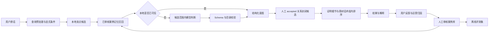
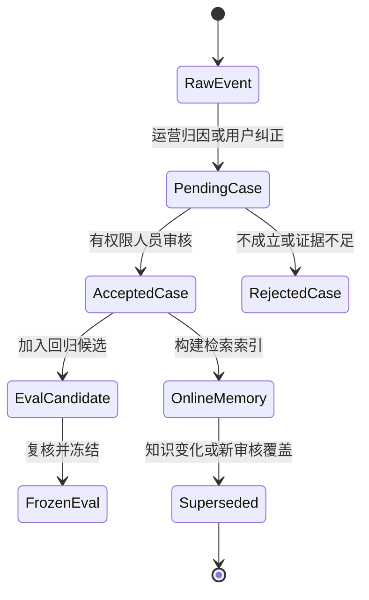

# 卖点智库搜索系统优化实施手册

版本：1.0
日期：2026-07-23
状态：已确认优化方向，尚未开始代码实施
适用范围：卖点智库的图片搜索、六大体系与卖点理解、证明点/证据表达点、模型 Provider、案例记忆、排序、反馈、评测、发布和回滚
上位事实源：`docs/IMAGE_SEARCH_REBUILD_MASTER_PLAN.md`
稳定检查点：分支 `codex/d104-pre-optimization-checkpoint-20260723`，提交 `641d8bc`

> 本手册是总纲 D105 的可执行施工说明。若本手册与总纲冲突，以总纲为准；实施中发现方案需要变化时，必须先在总纲新增决策记录，再修改本手册，不能直接覆盖历史结论。

---

## 0. 如何使用本手册

### 0.1 面向执行者的规则

1. 不要一次完成所有阶段。严格按照阶段前置条件、任务清单、测试和退出条件推进。
2. 每完成一个任务，把 `[ ]` 改成 `[x]`，并在任务后补充提交号或报告路径。
3. 一个阶段只有在“退出条件”全部满足后才能标记完成。
4. 遇到失败时先归因，不允许通过删除测试、放宽指标或绕过人工审核来制造通过。
5. 每个阶段使用独立提交；涉及数据库迁移时必须另有迁移验证记录。
6. 外发真实业务查询或图片给任何模型 Provider 前，必须取得本次数据集、本次 Provider 的明确授权。
7. 本手册中的迁移编号是建议顺序。实施时必须先读取当前 Alembic head，再确定实际 revision，禁止复制一个已被占用的编号。

### 0.2 勾选状态定义

- `[ ]`：未开始。
- `[~]`：进行中；同时写明阻塞或剩余事项。
- `[x]`：代码、测试、文档和必要运行验证全部完成。
- `[-]`：经新增总纲决策取消；必须附决策编号，不能直接删除任务。

### 0.3 每个阶段的固定交付物

- [ ] 变更前基线报告。
- [ ] 新增或修改文件清单。
- [ ] 数据迁移与回滚验证结果；无迁移也要写“无”。
- [ ] 专项测试结果。
- [ ] 后端全量测试、前端检查和文档一致性结果。
- [ ] 搜索质量前后对比；纯重构至少证明指标不下降。
- [ ] 遗留问题和下一阶段入口。
- [ ] 总纲和 `docs/IMAGE_SEARCH_REBUILD_PROJECT_LOG.md` 更新。

---

## 1. 优化目标与冻结边界

### 1.1 最终目标

把当前系统升级为一个“本地能力优先、模型按需增强、人工真值封闭、历史经验可复用、质量可量化、失败可降级”的图片搜索系统。

目标链路：



### 1.2 不得改变的业务事实

- [ ] 六大体系继续作为稳定业务地图，不成为所有搜索的唯一硬过滤。
- [ ] 16 个核心卖点及稳定 code 未经业务方明确确认不新增、不改名、不迁移主体系。
- [ ] 一张素材可以表达或支持多个业务概念。
- [ ] 人工 accepted 关系是素材业务语义金标准；AI pending/rejected 不得进入正式搜索。
- [ ] 没有对应可信素材时允许返回空，不得用全局相似图冒充证明。
- [ ] 普通用户继续只使用一个搜索框，不暴露精准/智能内部模式。
- [ ] 延展尺寸不要求首次上传时完成。
- [ ] 搜索反馈不能自动推翻发布审批或人工业务关系。

### 1.3 本轮新增的明确原则

- [ ] 证明点全量补标不是架构、API、缓存、案例记忆、遥测和卖点优化的前置条件。
- [ ] 证明点精度优化只要求先选择 3～6 张代表素材做试点，不要求一次补完 40 张。
- [ ] API 默认无长期记忆；只有经过审核并被在线链路检索使用的数据，才构成数据飞轮。
- [ ] Embedding 只承担候选生成或相似案例检索，不直接决定卖点、证明点或最终图片。
- [ ] 模型负责受约束的结构化理解，Python 负责合法性校验、人工边界、召回、排序、缓存、事务和降级。
- [ ] 在积累足够人工确认数据前，不训练自有大模型；先建设已审核案例记忆和可复现评测。

### 1.4 非目标

- 本轮不追求把所有历史搜索自动变成训练数据。
- 本轮不使用点击率自动写入 accepted 关系。
- 本轮不恢复固定二级标签树、OCR、`content_tags` 或生成式图片摘要裁判。
- 本轮不把全部六体系知识、全部历史记录和全部图片塞入每次模型调用。
- 本轮不因某个 Provider 故障改变业务定义。
- 本轮不在缺少金标准时宣称证明点准确率已经提升。

---

## 2. 当前基线与问题清单

> 下列运行数据是 2026-07-23 审计快照。开始实施时必须重新采集，不能把快照永久当作当前事实。

### 2.1 已确认基线

- [x] 已建立优化前 GitHub 检查点：`641d8bc`。
- [x] 前端 typecheck、ESLint、22 条 Vitest 和 production build 通过。
- [x] 后端功能测试 `222 passed`。
- [ ] 后端架构测试仍有 3 个失败：`SearchService` 和 `AssetSelectionPolicyService` 超过体量护栏；同一 `SearchService` 问题被两条测试覆盖。
- [ ] `AsyncSearchOrchestrator` 当前也超过 300 行预算，前置断言修复后需要复查是否显现新的失败。
- [ ] 活跃 Docker 数据库审计时仍为 Alembic `20260718_0018`，而工作区已有 `20260721_0019`；重新部署前必须确认并消除运行态漂移。
- [ ] 现有评测主要覆盖卖点和素材结果，没有证明点/证据表达点的完整金标准指标。
- [ ] 当前证明点本地识别主要依赖字符串相似度阈值，且同一卖点默认只保留一个证明点。
- [ ] 搜索日志没有持久化全部卖点、证明点、证据点、逐 Provider 尝试和最终采用来源。
- [ ] 审计时反馈表为 0 条，尚不能证明在线反馈闭环已经运行。

### 2.2 问题必须按类型归因

| 类型 | 判断问题 | 允许的修复位置 | 禁止做法 |
|---|---|---|---|
| 运行态漂移 | 代码、迁移、容器是否同版 | 部署、迁移、版本接口 | 用文档声称代替运行检查 |
| 卖点理解错误 | 体系/卖点是否判断错 | 本地目录、案例记忆、模型仲裁 | 在图片排序器补卖点关键词 |
| 证明点理解错误 | 卖点正确但证明细节错 | 证明候选、案例、受约束模型 | 把新证明点硬写成新卖点 |
| 人工关系缺口 | 正确图片未进入可信集合 | 人工关系审核 | 放开全库相似召回 |
| 素材缺口 | 业务点存在但没有图片 | 素材需求队列 | 用兄弟证明图补位 |
| 图片组内排序错误 | 正确集合内顺序不理想 | 素材话术、组内排序、反馈统计 | 修改卖点定义迎合单图 |
| Provider 故障 | 鉴权、超时、结构错误 | Provider 适配器、预算和降级 | 把厂商逻辑写入业务服务 |
| 评测金标准错误 | 预期答案本身不准确 | 人工复核评测集 | 为了过测试修改线上规则 |

---

## 3. 实施总顺序与依赖

| 阶段 | 名称 | 是否需要证明点补标 | 是否允许改搜索结果 | 前置阶段 |
|---:|---|---|---|---|
| 0 | 基线冻结与运行一致性 | 否 | 否 | 无 |
| 1 | 架构减重与职责拆分 | 否 | 否，必须等价 | 0 |
| 2 | API Gateway 与决策遥测 | 否 | 只允许降级更稳定 | 0；建议 1 |
| 3 | 已审核查询案例记忆 | 否 | 先 shadow，不直接改变 | 2 |
| 4 | 分层混合查询理解 | 否 | 是，受评测门禁 | 1、2、3 |
| 5 | 证明点小样本试点 | 仅 3～6 张 | 是，仅试点范围 | 2、4 |
| 6 | 素材组内排序与反馈闭环 | 否 | 是 | 2、4 |
| 7 | 评测体系与质量门禁 | 否；证明专项需试点 | 否 | 各阶段同步 |
| 8 | 灰度发布、监控与回滚 | 否 | 是 | 0～7 对应部分 |
| 9 | 小模型/微调决策 | 是数据门槛，不是补标门槛 | 先 shadow | 至少积累 2000 条审核案例 |

允许并行：阶段 1 与阶段 2；阶段 5 可推迟，不阻塞阶段 3、6 的非证明点部分。
禁止并行：同一搜索核心文件上的结构重构和行为调优；先完成等价重构，再改行为。

---

## 4. 阶段 0：基线冻结与运行一致性

### 4.1 目标

确保后续所有结论都来自同一份代码、同一迁移版本、同一知识版本和可恢复数据。

### 4.2 实施任务

- [ ] 确认当前分支和远程检查点存在，记录 `git rev-parse HEAD`。
- [ ] 备份 PostgreSQL 数据库和图片卷；记录备份目录、时间、校验值和恢复命令。
- [ ] 读取 `alembic current`、`alembic heads`，确认是否只有一个 head。
- [ ] 在数据库副本验证 `0018 → 0019 → 0018 → 0019`。
- [ ] 经授权后升级当前运行库到 `0019`；不得在未备份时升级。
- [ ] 重建 backend/web，确认四个容器健康。
- [ ] 验证 40 个素材组、图片文件、人工卖点关系和素材话术数量没有异常变化。
- [ ] 新增只读运行版本接口 `GET /api/system/version`，至少返回：
  - `gitCommit`
  - `buildTime`
  - `databaseRevision`
  - `skillVersion`
  - `intentCatalogVersion`
  - `proofCatalogVersion`
  - `evidenceCatalogVersion`
  - `searchPolicyVersion`
  - `promptVersion`
- [ ] 前端管理员页显示运行版本；普通业务页不展示内部实现细节。
- [ ] 搜索日志为每次请求保存上述版本快照或统一 `decision_version` 指纹。

### 4.3 建议文件边界

- Schema：新增 `backend/app/schemas/system.py`。
- Service：新增 `backend/app/services/system_version_service.py`。
- API：新增 `backend/app/api/v1/system.py`。
- 版本计算应读取现有目录和配置，不复制业务知识。
- 数据库 revision 只能只读查询，不在 API 请求中执行迁移。

### 4.4 验证命令

```bash
git status --short
docker compose ps -a
docker compose exec -T backend alembic current
docker compose exec -T backend alembic heads
cd backend && .venv/bin/python -m pytest -q
cd client && npm run typecheck
cd client && npm run lint
cd client && npm test -- --run
cd client && npm run build
```

### 4.5 退出条件

- [ ] 运行数据库 revision 与代码 head 一致。
- [ ] 版本接口与实际 Git/目录版本一致。
- [ ] 备份恢复在副本完成演练。
- [ ] 功能数据数量无异常变化。
- [ ] 无真实素材被批量补标或改写。

### 4.6 回滚

1. 停止新容器。
2. 恢复数据库和图片卷备份。
3. 切回检查点 `641d8bc`。
4. 重建旧服务并验证健康。
5. 将失败原因写入项目日志，不能只口头说明。

---

## 5. 阶段 1：架构减重与职责拆分

### 5.1 目标

在不改变任何搜索结果的前提下恢复架构护栏，为后续案例记忆和模型优化预留清晰入口。

### 5.2 拆分方案

#### A. `SearchService`

保留职责：依赖装配、同步/异步入口。
迁出职责：显式业务 facet 解析、同步上下文保护、请求选项构建。

建议新增：

- `search_request_context_service.py`：构建 query、显式体系/卖点/证明点/证据点约束。
- `search_sync_bridge.py`：仅处理非异步环境的同步桥接。

#### B. `QueryUnderstandingService`

拆为：

- `local_intent_candidate_service.py`：本地卖点候选和否定证据。
- `query_case_memory_service.py`：已审核案例召回；阶段 3 实现，阶段 1 先定义接口。
- `proof_point_candidate_service.py`：证明点和证据表达点候选。
- `query_model_arbitration_service.py`：本地与模型结果仲裁。
- `query_understanding_presenter.py`：稳定展示名称和理由。
- 原服务退化为薄编排器，不持有大量词项和排序细节。

#### C. `AssetSelectionPolicyService`

拆为：

- `asset_selection_evidence_service.py`：计算素材话术、辅助文本和 facet 证据。
- `asset_admission_policy.py`：纯函数判断准入/拒绝及原因码。
- `asset_route_ordering.py`：继续只负责排序。

#### D. `AsyncSearchOrchestrator`

保留流水线顺序；迁出响应中间态组装和分支结果归并细节。不得把外部 I/O 或 Repository 查询重新塞回编排器。

### 5.3 实施任务

- [ ] 为当前关键查询保存 golden response 快照，仅保存非敏感结构化字段。
- [ ] 先写 characterization tests，再移动代码。
- [ ] 每次只拆一个服务，并保证单次提交可独立回退。
- [ ] 所有业务词继续位于 taxonomy、Skill 或 Domain 配置，不移动到编排器。
- [ ] 保持 `SearchService`、Orchestrator、外部分支和 Reranker 的依赖方向。
- [ ] 去除重复的状态推导，不通过删除空行机械满足体量测试。
- [ ] 更新架构图、文件职责表和测试体量预算。

### 5.4 退出条件

- [ ] 后端全量测试 0 failure。
- [ ] 当前 3 个架构失败全部消失。
- [ ] `SearchService ≤150`、`AssetSelectionPolicyService ≤140`、`AsyncSearchOrchestrator ≤300`，或经新增决策采用更合理的复杂度指标。
- [ ] 103 条本地评测不得低于总纲最新基线。
- [ ] 同一输入的结构化意图、结果资产 ID 顺序、解释原因没有非预期变化。

---

## 6. 阶段 2：API Gateway 与决策遥测

### 6.1 目标

让每次模型调用的成本、耗时、成功来源、失败原因和业务效果都可追踪，同时保持 Provider 与业务规则解耦。

### 6.2 数据设计

建议迁移 A：`model_attempts`

| 字段 | 类型 | 说明 |
|---|---|---|
| `id` | UUID/string | 主键 |
| `request_id` | string | 与搜索请求关联 |
| `search_log_id` | nullable FK | 搜索日志写入后关联 |
| `task` | string | 固定模型任务 |
| `provider` | string | 适配器逻辑名 |
| `model` | string | 脱敏模型名 |
| `attempt_index` | int | 第几次尝试 |
| `status` | enum/string | ok/failed/timed_out/invalid_schema/skipped |
| `duration_ms` | int | 单次耗时 |
| `input_tokens` | nullable int | Provider 返回时记录 |
| `output_tokens` | nullable int | Provider 返回时记录 |
| `cache_hit` | bool | 是否复用缓存 |
| `error_code` | nullable string | 安全错误码，不保存密钥和完整响应 |
| `created_at` | datetime | 创建时间 |

建议迁移 B：扩展 `search_logs`

- `decision_version`
- `matched_concept_codes_json`
- `matched_proof_point_codes_json`
- `matched_evidence_point_codes_json`
- `excluded_concept_codes_json`
- `understanding_source`：local/case_memory/model/mixed/manual
- `selected_provider`
- `candidate_counts_json`
- `decision_trace_json`：只保存原因码和分数，不保存完整 Prompt。

### 6.3 Provider 接口改造

现有 `generate_json()` 可逐步返回统一 envelope：

```python
@dataclass(frozen=True)
class ModelResult:
    payload: dict[str, Any]
    provider: str
    model: str
    duration_ms: int
    input_tokens: int | None
    output_tokens: int | None
    attempt_count: int
```

要求：

- [ ] 业务 Service 不读取厂商 `choices`、`usage` 等 envelope。
- [ ] Fallback provider 为每一级创建独立 attempt 记录。
- [ ] 不捕获无法恢复的程序错误后伪装成普通 Provider 失败。
- [ ] 临时网络错误、鉴权错误、Schema 错误和业务目录越界使用不同错误码。
- [ ] 日志不保存 API key、Authorization、图片字节、完整 Prompt 和完整模型原文。
- [ ] 模型成功只代表结构有效，不代表业务判断正确。

### 6.4 调用预算

| 路径 | 是否调用模型 | 目标 |
|---|---|---|
| 本地高置信卖点+证明 | 否 | P95 ≤500ms |
| 本地卖点可信、证明未知 | 最多一次证明补全 | 候选体系内调用 |
| 弱候选/真实歧义 | 体系路由+卖点判断 | 有总截止和降级 |
| 纯画面查询 | 不调用业务意图模型 | 使用画面召回 |
| 用户显式选择卖点/证明 | 默认不自动向下补全 | 尊重人工约束 |

模型时延目标不能凭感觉确定。阶段 2 先记录一周真实分布，阶段 4 再设置新的 SLO。当前长预算只作为可用性上限，不作为性能目标。

### 6.5 退出条件

- [ ] 每次模型尝试可按 request ID 还原 Provider 顺序和耗时。
- [ ] 运营页能区分“模型未调用、模型成功、模型失败后本地兜底、模型成功但业务错误”。
- [ ] 单个 Provider 失败不清空已有可信本地结果。
- [ ] 故障注入覆盖鉴权失败、超时、无效 JSON、自造 code 和跨体系 code。
- [ ] 迁移完成 upgrade/downgrade/upgrade 验证。

---

## 7. 阶段 3：已审核查询案例记忆

### 7.1 目标

让历史人工纠正能够被下一次查询实际使用。没有被在线消费的数据只是日志，不算数据飞轮。

### 7.2 数据模型

建议表：`approved_query_cases`

| 字段 | 说明 |
|---|---|
| `id` | 主键 |
| `query_text` | 原始业务查询 |
| `normalized_query` | 规范化查询 |
| `query_type` | 封闭查询状态 |
| `concept_codes_json` | 正确卖点，可多选 |
| `proof_point_codes_json` | 可空；正确证明点 |
| `evidence_point_codes_json` | 可空；正确证据表达点 |
| `excluded_concept_codes_json` | 显式排除 |
| `correct_asset_group_ids_json` | 可空；正确素材 |
| `forbidden_asset_group_ids_json` | 可空；错误素材 |
| `should_return_empty` | 是否应为空 |
| `source` | feedback/eval/manual/import |
| `review_status` | pending/accepted/rejected |
| `reviewed_by/reviewed_at` | 审核信息 |
| `knowledge_version` | 审核时知识版本 |
| `superseded_by` | 被新案例替代时保留历史 |

可选派生表：`approved_query_case_embeddings`。Embedding 是可重建派生数据，不是事实源。

### 7.3 写入纪律

- [ ] 搜索日志不能自动成为 accepted 案例。
- [ ] “就是这张”只生成弱候选，仍需审核。
- [ ] “不相关”必须允许选择原因；未说明原因时不能自动推断正确卖点。
- [ ] 管理员/负责人可以把一次搜索修正为卖点、证明点、正确素材或“应为空”。
- [ ] 同一查询的新审核结果不得覆盖旧记录；使用版本和 supersede 关系。
- [ ] 数据、学校、媒体、证书和效果事实仍受来源核验约束。

### 7.4 在线检索规则

1. 只检索 `accepted` 案例。
2. 先用当前本地候选体系缩小案例范围。
3. 词法召回与 Embedding 可并行，合并后最多取 5 条。
4. 案例存在相互冲突时，不直接裁决；降低置信度进入模型或待消歧。
5. 案例知识版本过旧且涉及已变更 code 时必须失效。
6. 相似案例只能提供候选和理由，不能突破当前 active 目录和人工 excludes。

### 7.5 Shadow 阶段

- [ ] 首先只计算案例候选，不影响线上结果。
- [ ] 记录“当前结果”和“加入案例记忆后的建议结果”。
- [ ] 用至少 100 条历史/评测查询比较增益和新增错误。
- [ ] 只有意图指标不下降、越界为 0 后才允许参与正式仲裁。

### 7.6 退出条件

- [ ] 管理端可以新增、审核、拒绝和废止案例。
- [ ] 在线链路只消费 accepted 案例。
- [ ] 相关案例 Top 5 检索可解释且可复现。
- [ ] 案例库更新后缓存按版本失效。
- [ ] 删除派生 Embedding 后可以从事实表完整重建。

---

## 8. 阶段 4：分层混合查询理解

### 8.1 目标

提高新口语命中率，同时减少模型调用、Prompt 体积和自由发挥。

### 8.2 决策顺序

```text
显式用户筛选
→ 查询否定与原子需求拆解
→ 本地稳定表达
→ 已审核案例记忆
→ 候选体系
→ 候选卖点
→ 可选证明点/证据点
→ 必要时模型裁决
→ Normalizer + Schema + 目录/父链校验
→ 置信度与查询状态
```

### 8.3 查询原子化

不使用生成式模型也应先识别：

- 对象：教材、章节、当前题、历史错题、考试题型、学习计划、学习过程。
- 动作：同步、讲解、测试、拍摄、归档、规划、督促、汇总。
- 时间尺度：当前一题、一课、课前/课后、每天、每周、跨学段。
- 目的：听懂、确认掌握、迁移、执行、反馈。
- 主体：AI、系统、真人老师、专家。
- 否定：不要、无需、排除、不想。
- 并列：既要、还要、同时、以及。

原子化结果用于候选生成和解释，不新增业务事实。

### 8.4 候选与置信度策略

- 本地完整表达、稳定 code、人工显式筛选是最强证据。
- 已审核相似案例是强辅助，但不能单独越过冲突边界。
- 共享短词只能形成探索或待消歧。
- 模型只能在候选体系和 active code 中选择。
- 模型自报置信度不得直接使用；最终置信度由证据类型、候选差距、案例一致性和模型合法性组合得到。
- 阈值必须通过评测校准。初始值沿用当前基线，禁止未评测随意调数字。

### 8.5 模型输入最小化

每次调用只包含：

1. 固定输出契约与安全边界。
2. 第一层候选体系的完整已审核知识；若未来改成编译摘要，必须新增决策并证明等价。
3. 候选体系内 active 卖点目录。
4. 与当前查询最相关的 0～5 条 accepted 案例。
5. 原始查询和显式用户条件。

不得包含：全部历史记录、无关体系、未审核案例、全部图片文档、API 密钥、用户身份信息。

### 8.6 缓存键

```text
normalized_query
+ explicit_filters
+ intent_catalog_version
+ proof_catalog_version
+ evidence_catalog_version
+ approved_case_store_version
+ prompt_version
+ model_route_version
+ search_policy_version
```

任何组成版本变化都必须自然失效，不能手工猜测哪些旧缓存安全。

### 8.7 退出条件

- [ ] 本地高置信查询不调用模型。
- [ ] 同一句或等价规范化查询命中缓存。
- [ ] 新口语优先复用审核案例，仍不确定时才调用模型。
- [ ] 自造 code、错误父链和跨体系结果全部被拒绝。
- [ ] 本地评测不得低于基线；模型增强不得引入业务空结果和可信范围泄漏。
- [ ] 记录本地、案例、模型三种来源各自准确率与 P95。

---

## 9. 阶段 5：证明点小样本试点（可推迟）

### 9.1 重要声明

本阶段不是阶段 0～4、6 的阻塞项。没有时间审核证明点时，可以停在卖点+素材话术链路继续优化。

### 9.2 最小试点范围

- 选择 3～6 张代表素材。
- 覆盖至少 3 个卖点、每个卖点至少 2 个兄弟证明点边界。
- 优先选择真实搜索频率高、当前容易混淆、已有明确作图依据的素材。
- 每张只要求确认当前能确认的关系，不要求补齐所有可能支持项。

### 9.3 关系策略

短期继续使用 `asset_groups.primary_proof_point_code` 和 `primary_evidence_point_code` 作为主要 facet。只有试点证明“单值字段阻碍正确表达”后，才新增：

- `asset_proof_point_links`
- `asset_evidence_point_links`

若新增多对多表，必须保留：relation role、origin、review status、审核人、证据理由和版本。不得自动把单值字段批量扩散为多个 accepted 关系。

### 9.4 专项评测集

每个试点证明点至少准备：

- 5 条标准/专业表达。
- 5 条了解者自然表达。
- 5 条业务小白表达。
- 5 条兄弟证明点硬负例。
- 2 条多证明组合。
- 2 条显式否定。
- 2 条应该返回空的素材缺口。

建议首轮 100～200 条，字段至少包括：

- `expected_concept_codes`
- `expected_proof_point_codes`
- `expected_evidence_point_codes`
- `forbidden_proof_point_codes`
- `expected_asset_group_ids`
- `should_return_empty`
- `reviewed_by`
- `knowledge_version`

### 9.5 指标

- Proof micro/macro precision、recall、F1。
- 父卖点正确但证明点错误率。
- 同卖点兄弟证明点混淆矩阵。
- 多证明点全覆盖率。
- 证据表达点 Top 1 准确率。
- 缺素材正确空结果率。
- 证明点命中后的素材 Top 1/Top 3。
- 模型调用率、缓存率、P50/P95。

### 9.6 退出条件

- [ ] 试点素材人工关系完成。
- [ ] 证明点专项评测可独立运行。
- [ ] 兄弟证明点误放行率有明确基线。
- [ ] 试点提升经人工抽查确认，不只是自动分数上涨。
- [ ] 决定继续单值 facet 还是升级多对多，并写入新决策。

---

## 10. 阶段 6：素材组内排序与反馈闭环

### 10.1 排序层级

可信业务查询的优先级必须保持：

1. 人工 accepted `expresses/supports` 划定候选。
2. 人工显式 proof/evidence facet 命中。
3. 用户原话命中 accepted 素材独有话术。
4. 证明点/证据表达具体线索命中。
5. 标题、语义总结、V3 画面事实与场景辅助。
6. Meilisearch/Embedding/Reranker 只在可信集合内部补充顺序。

### 10.2 反馈字段

在现有 relevant/not_relevant 基础上增加原因码：

- `wrong_selling_point`
- `wrong_proof_point`
- `asset_does_not_prove`
- `ranking_issue`
- `style_mismatch`
- `asset_missing`
- `query_ambiguous`

可选补充：用户认为正确的卖点/证明点/素材。只有有权限角色的审核结果才能进入 accepted 案例库。

### 10.3 简单排序学习

在数据不足时不训练复杂模型。先使用可解释统计：

- 同查询簇/同卖点内 relevant 次数。
- not_relevant 次数。
- 曝光位置校正。
- 时间衰减。
- 最小样本门槛。

建议使用平滑分数而非裸点击率：

```text
feedback_score = (relevant + α) / (impressions + α + β)
```

该分数只能作为可信集合内末级排序信号，不能突破人工关系和 excludes。

### 10.4 退出条件

- [ ] 每条反馈能追溯 search log、素材组、决策版本和位置。
- [ ] 反馈原因可以自动进入运营归因队列。
- [ ] 反馈分数不会改变素材审批或 accepted 关系。
- [ ] 低流量素材不会因样本不足永久沉底。
- [ ] 排序变更使用离线回放和灰度对照验证。

---

## 11. 阶段 7：评测体系与质量门禁

### 11.1 评测分层

| 层级 | 金标准 | 核心指标 |
|---|---|---|
| 体系 | 人工用例 | accuracy、候选覆盖 |
| 卖点 | active code + 人工用例 | micro/macro F1、query type |
| 证明点 | 试点审核用例 | precision/recall/F1、兄弟混淆 |
| 素材准入 | 人工关系 | 越界率、excludes 违规、正确空结果 |
| 排序 | 正确素材集合 | MRR、nDCG@5、Top1/Top3 |
| 性能 | 真实链路 | P50/P95/P99、模型调用率、缓存率 |
| Provider | attempt 日志 | 成功率、超时率、Schema 错误率、成本 |

### 11.2 数据集分组

- `regression_core`：冻结核心边界，任何版本都必须通过。
- `novice_language`：业务小白长句。
- `hard_negatives`：兄弟卖点/证明点。
- `multi_intent`：真多卖点与多证明。
- `negation`：显式排除。
- `asset_gap`：应返回空。
- `visual_only`：纯画面，有画面金标准前保持 partial。
- `fresh_holdout`：从未进入 Prompt、案例库或调参过程的盲测集。

### 11.3 CI 门禁

每个 PR 必须运行：

- 后端 Ruff、Pyright、Pytest。
- 前端 typecheck、ESLint、Vitest、build。
- 文档一致性。
- taxonomy/Skill/code 映射校验。
- 本地搜索核心回归。

模型在线评测不进入普通 PR 必跑项，原因是成本、网络和数据授权；它使用人工触发的受控 workflow，并保存报告。

### 11.4 发布门槛

- [ ] 卖点本地基线不下降。
- [ ] 可信范围泄漏为 0。
- [ ] 人工 excludes 违规为 0。
- [ ] 业务查询非预期空结果为 0。
- [ ] 模型增强指标不低于本地链路。
- [ ] 新算法 P95 满足当期 SLO。
- [ ] 任何下降均有业务方书面接受和新决策，不能静默发布。

---

## 12. 阶段 8：灰度发布、监控与回滚

### 12.1 功能开关

建议使用以下独立开关，不能只设一个总开关：

- `SEARCH_CASE_MEMORY_ENABLED`
- `SEARCH_CASE_MEMORY_SHADOW`
- `SEARCH_PROOF_PILOT_ENABLED`
- `SEARCH_FEEDBACK_RANKING_ENABLED`
- `SEARCH_MODEL_ARBITRATION_ENABLED`

默认顺序：shadow → 管理员 → 小比例用户 → 全量。

### 12.2 灰度步骤

- [ ] 新逻辑 shadow 运行，不改变响应。
- [ ] 比较旧/新决策差异，人工抽查所有新增错误。
- [ ] 管理员账号启用新逻辑。
- [ ] 小比例真实流量启用，监控至少一个完整业务周期。
- [ ] 达到质量门槛后全量。
- [ ] 每次扩大流量前保存报告和当前 commit。

### 12.3 监控告警

- 非预期空结果率上升。
- fallback/timeout 上升。
- 模型调用率异常升高。
- P95/P99 超预算。
- Schema invalid 或自造 code 增加。
- not_relevant 反馈增加。
- 某卖点/证明点结果长期为零。
- 数据库 revision 与代码版本不一致。

### 12.4 回滚原则

1. 优先关闭新功能开关。
2. 若数据结构向后兼容，保留新表但停止写入。
3. 若必须降级迁移，先确认新数据已导出并可恢复。
4. 切回上一个 Git 检查点。
5. 重建派生索引，不把 Meilisearch 当事实备份。
6. 回滚完成后重跑健康检查和核心查询。

---

## 13. 阶段 9：何时训练小模型或微调

### 13.1 启动条件

全部满足才进入模型训练评审：

- [ ] 至少 2000～5000 条 accepted 查询案例。
- [ ] 16 个卖点均有足够正例，主要证明点有可用覆盖。
- [ ] 具有兄弟类别硬负例、否定、多标签和空结果样本。
- [ ] 训练、验证和盲测集按查询簇去重分离。
- [ ] 当前 RAG/案例记忆基线已稳定，能证明训练的增量价值。
- [ ] 有明确推理时延、成本、部署和回滚方案。

### 13.2 建议训练目标

优先训练轻量多标签分类器或蒸馏模型，只输出：

```json
{
  "query_type": "business_intent_search",
  "concept_codes": ["transfer_practice"],
  "proof_point_codes": ["pp_exam_transfer_variant_practice"],
  "excluded_codes": [],
  "abstain": false
}
```

不训练模型直接输出最终图片 ID，不训练模型生成未经核验的业务事实。

### 13.3 上线条件

- [ ] blind holdout 不低于现有混合链路。
- [ ] 置信度经过校准，低置信可 abstain。
- [ ] shadow 运行至少一个完整业务周期。
- [ ] 模型输出继续经过现有 Schema、目录和人工关系边界。
- [ ] 模型不可用时本地/案例链路仍可返回结果。

---

## 14. 数据飞轮的标准闭环

### 14.1 数据状态机



### 14.2 每周运营流程

- [ ] 汇总零结果、高频 fallback、不相关反馈和高延迟查询。
- [ ] 每条失败只选一个主归因，必要时附次归因。
- [ ] 优先处理重复次数高、影响核心卖点、可形成通用规则的问题。
- [ ] 判断应该改案例、公共话术、人工关系、素材、排序还是代码。
- [ ] 先把失败固化为测试，再修改。
- [ ] 审核通过后进入 accepted 案例库。
- [ ] 重建案例派生索引并增加版本。
- [ ] 重跑核心评测，确认无回归后发布。

### 14.3 不进入飞轮的数据

- 未审核模型输出。
- 单次点击但没有上下文。
- 测试账号、自动化脚本和批量评测产生的行为日志，除非显式标记来源。
- 含未核验数字、学校、媒体、证书或效果事实的自由文本。
- 无法判断是风格问题还是业务语义问题的模糊反馈。

---

## 15. 任务执行模板

后续每个具体任务复制此模板：

```markdown
## 任务：<名称>

### 目标

### 非目标

### 前置条件
- [ ]

### 变更边界
- API：
- Service：
- Domain：
- Repository：
- Model/迁移：
- 前端：
- Skill/taxonomy：

### 实施步骤
- [ ]

### 测试
- [ ] 专项：
- [ ] 后端全量：
- [ ] 前端：
- [ ] 搜索评测：

### 验收指标
- [ ]

### 回滚

### 交付记录
- Commit：
- 迁移：
- 报告：
- 遗留问题：
```

---

## 16. 第一轮建议执行包

第一轮只做不会要求业务负责人批量审核证明点的内容。

### Sprint A：恢复可验证地基

- [ ] 阶段 0 全部任务。
- [ ] 修复 3 个已知架构失败及潜在 Orchestrator 体量问题。
- [ ] 建立运行版本接口。
- [ ] 重新生成本地基线报告。

### Sprint B：让 API 可观测

- [ ] `model_attempts` 与扩展 search log 迁移设计评审。
- [ ] Provider 统一结果 envelope。
- [ ] 逐级 Provider 遥测和安全错误码。
- [ ] 运营页展示调用率、成功率、P95 和最终采用来源。

### Sprint C：让历史数据真正被消费

- [ ] `approved_query_cases` 表和审核接口。
- [ ] 管理端案例审核列表。
- [ ] accepted 案例词法检索。
- [ ] 可选 Embedding 派生索引。
- [ ] shadow 对比，不立即改变线上结果。

### Sprint D：质量门禁

- [ ] 扩展评测报告，分开本地、案例、模型来源。
- [ ] 固化错误归因枚举。
- [ ] 建立 shadow 差异报告。
- [ ] 通过后再决定是否开始 3～6 张证明点试点。

第一轮完成标准：即使暂时一张证明点都不新增审核，项目也应达到“运行版本一致、架构全绿、API 调用可追踪、历史正确案例可被检索、搜索质量可比较”的状态。

---

## 17. 总体验收清单

### 工程

- [ ] 运行版本与 Git/数据库/Skill 一致。
- [ ] 后端和前端检查全部通过。
- [ ] 核心搜索服务职责和体量护栏通过。
- [ ] 所有迁移可升级、降级、再升级。
- [ ] 派生索引可从数据库重建。

### 搜索质量

- [ ] 卖点基线不下降。
- [ ] 可信范围泄漏为 0。
- [ ] excludes 违规为 0。
- [ ] 非预期业务空结果为 0。
- [ ] 新口语命中有独立 holdout 证明。
- [ ] 证明点未试点时不宣称证明点准确率。

### API 与成本

- [ ] 模型调用率、缓存率、每级 Provider 成功率和 P95 可见。
- [ ] 模型失败不破坏本地可信结果。
- [ ] 每次调用只加载相关知识和案例。
- [ ] 成本可以按任务、模型和搜索请求统计。

### 数据飞轮

- [ ] 原始日志、待审核案例、accepted 案例和评测集分层保存。
- [ ] 只有 accepted 案例参与在线记忆。
- [ ] 反馈不会自动修改人工事实。
- [ ] 每轮改进先有失败用例，后有修复和回放报告。

### 发布

- [ ] 新能力先 shadow 后灰度。
- [ ] 功能开关可独立关闭。
- [ ] 数据备份和回滚演练完成。
- [ ] 每次发布都有 commit、迁移、指标和遗留问题记录。

---

## 18. 最终原则

1. 不把“API 返回成功”当成“业务理解正确”。
2. 不把“保存了日志”当成“已经形成数据飞轮”。
3. 不把“语义相似”当成“图片能够证明该业务点”。
4. 不让模型重新学习全部历史；只检索当前相关的已审核经验。
5. 不要求先补完所有证明点；先完成工程地基和可验证闭环。
6. 不用单句修补代替评测集和通用边界。
7. 不在没有回滚点、版本指纹和质量对比时发布搜索改动。
