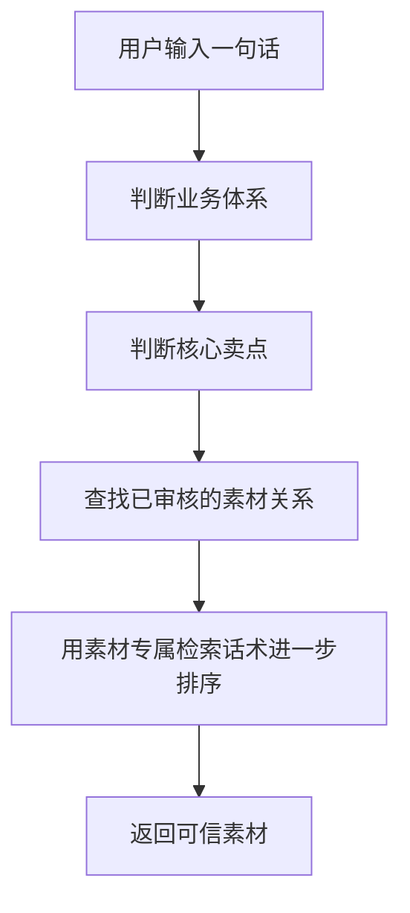
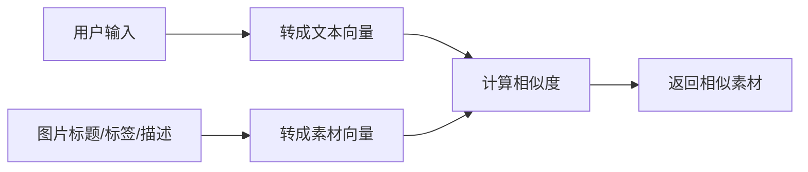
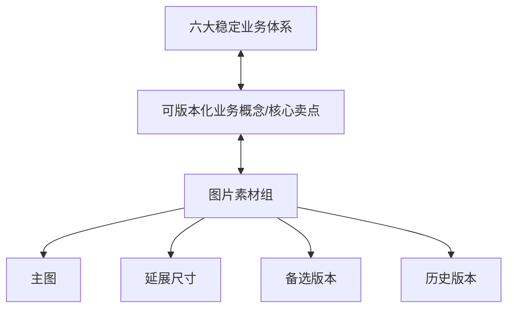
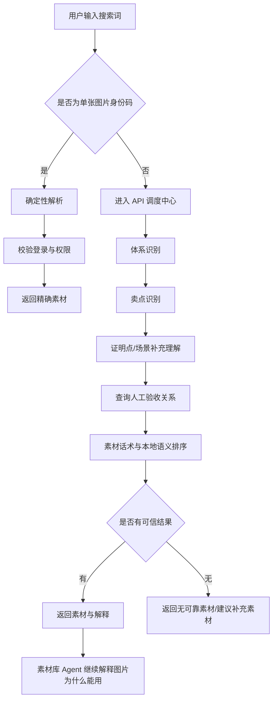
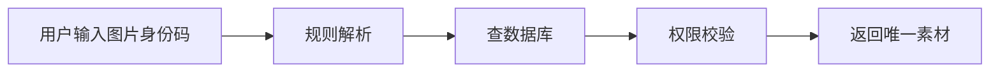
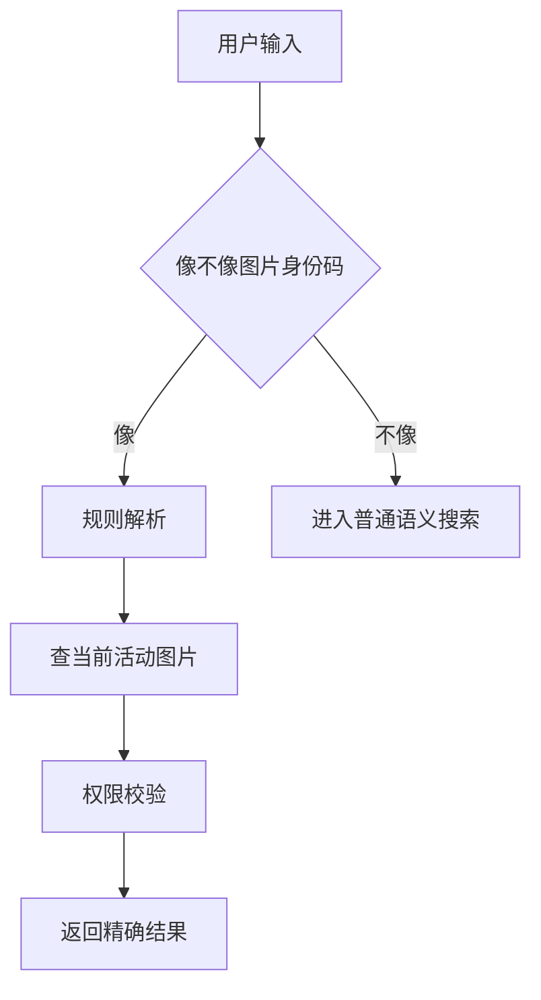
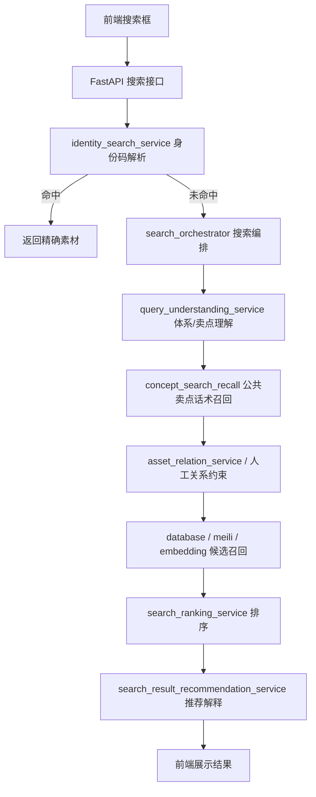
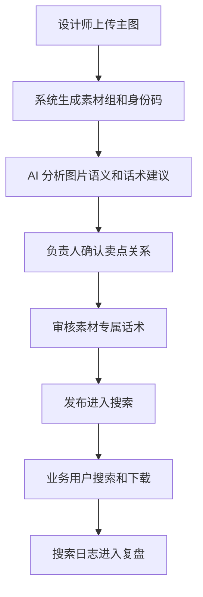
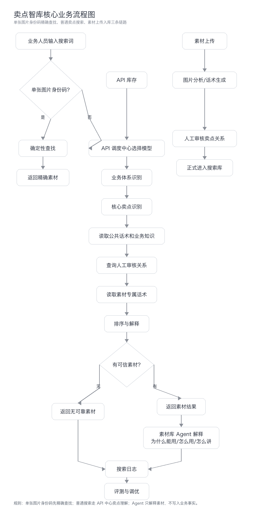
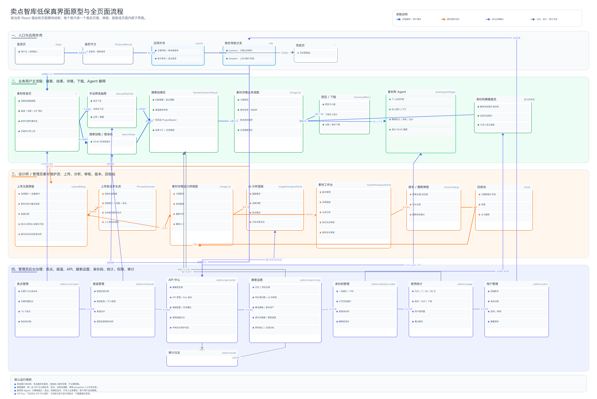

# 卖点智库项目说明与傻瓜式复刻指南

> 2026-09-09 更新：身份码现已按 D282 收口为“一张活动图片一个码”。本文后文若仍出现素材组码、版本码、分享链接或删除历史占位，均属于旧方案说明，不再作为当前实现与验收标准。

> 这份文档的目标只有一个：让别人看得懂、照着做得出来、复盘时说得清楚。
>
> 本文把项目分成三层来讲：
>
> 1. 给懂行的人看：系统蓝图、技术栈、核心资产、数据怎么流。
> 2. 给新手照做：一步一步复刻一个可跑通的最小版本。
> 3. 给复盘的人看：为什么这样设计，踩过哪些坑，哪些路不要再走。

## 0. 一句话说明这个项目

卖点智库不是一个普通图库，也不是一个只靠相似图片搜索的素材库。

它真正要解决的问题是：

> 当业务人员输入一句很口语、很模糊的话时，系统要能判断这句话背后想表达的是哪个业务卖点，然后从已经审核过的素材里，找出真正能支撑这个卖点的图片。

例如用户不一定会搜索标准卖点名：

- 用户可能不会搜“AI 定制学习方案”，而是搜“给家长看的个性化规划图”。
- 用户可能不会搜“动画精讲”，而是搜“孩子一看就懂的动画课画面”。
- 用户可能不会搜“真人老师督学”，而是搜“能体现老师在管孩子学习的图”。

所以这个系统不能只看图片像不像，也不能只看关键词有没有命中。它必须懂三件事：

1. 用户这句话属于哪个业务体系。
2. 用户实际想找哪个卖点。
3. 哪些图片已经被业务负责人确认过，确实能表达或支撑这个卖点。

同时，本项目不止停在“把图找出来”。

素材库 Agent 是另一条很重要的产品线索：搜索负责找到可信素材，Agent 负责在素材被找到后继续解释“这张图为什么能用、适合放在哪里、对业务同事或家长应该怎么讲”。这让系统从一个素材检索工具，进一步变成一个能帮助新人理解业务表达、减少误用、统一讲法的素材理解助手。

换句话说，卖点智库交付的不是一堆图片结果，而是两段完整能力：

```text
先找准素材：用户用口语搜索，系统理解卖点并返回已审核图片。
再讲清素材：用户把图片交给素材库 Agent，Agent 基于图片上下文和卖点关系解释怎么用。
```

## 1. 项目要解决的核心矛盾

传统素材搜索解决的是“我知道我要找什么”的问题。

卖点智库解决的是“用户只说了一句模糊的话，但系统要知道他真正想要什么”的问题。

### 1.1 传统图库的问题

像花瓣、普通素材站、普通向量搜索，一般依赖这几类信息：

- 图片标题。
- 图片标签。
- 图片 OCR 文字。
- 图片视觉相似度。
- 文本与图片向量相似度。

这些方法适合找“长得像”的图，比如：

- 搜“蓝色教室”，找蓝色教室画面。
- 搜“老师讲课”，找老师讲课图片。
- 搜“学习计划表”，找计划表样式图片。

但它们不适合判断“这张图能不能证明某个卖点”。

例如一张图里有老师、有学生、有屏幕，它视觉上可能像“上课”，但业务上可能有完全不同含义：

- 如果它表达的是“老师讲解知识点”，可能属于“动画精讲”或“同步校内”。
- 如果它表达的是“老师监督学习进度”，可能属于“真人老师督学”。
- 如果它表达的是“阶段性学习反馈”，可能属于“学情报告反馈”。
- 如果它只是普通课堂氛围图，可能并不能支撑任何核心卖点。

视觉相似不等于业务正确。

### 1.2 本项目的关键判断

本项目的核心判断是：

> 搜索素材时，不能先问“这张图像什么”，而要先问“用户想证明什么”。

因此项目采用的是业务意图优先的检索方法：



这套方法的好处是：

- 结果更稳：只从人工验收过的素材关系里找图。
- 业务更准：先理解卖点，再找图片。
- 可解释：能说清楚为什么这张图适合这个搜索。
- 可迭代：新增卖点、新增素材、新增话术时，不需要推翻整个图库结构。
- 可控：找不到可靠素材时可以返回空，而不是硬凑一张看起来相似但业务错误的图。

## 2. 为什么不用“直接向量模型搜索”

这里要特别说清楚，因为这是项目最容易被误解的地方。

直接向量搜索的逻辑通常是：



这个方法不是不能用，而是不能作为本项目的唯一主干。

### 2.1 向量搜索能解决什么

向量搜索擅长解决这些问题：

- 用户表达和素材标题不完全一样，但语义接近。
- 用户用了同义词，系统也能召回。
- 用户描述视觉场景，系统能找到相似画面。
- 用户搜索范围比较宽，需要先粗召回一批候选。

例如：

- “老师讲题”可以匹配到“教师讲解错题”。
- “学习报告”可以匹配到“学情反馈报告”。
- “孩子做题”可以匹配到“学生练习场景”。

### 2.2 向量搜索不能解决什么

但本项目真正难的不是“语义像不像”，而是“业务上能不能用”。

向量搜索有几个天然问题：

1. 它容易返回“看起来像，但卖点错”的素材。
2. 它不知道哪些素材关系已经被业务负责人确认过。
3. 它无法稳定区分“主要表达”和“可以支持”。
4. 它不能理解六大业务体系里的边界。
5. 它可能把待审核、废弃、实验性描述也当成可靠依据。
6. 它很难解释“为什么这张图能支撑这个卖点”。

举个例子：

用户搜：

> 想找一张体现家长不用操心也能知道孩子学得怎么样的图。

如果只走向量搜索，可能召回：

- 一个家长看手机的图。
- 一个学生坐在电脑前的图。
- 一个老师批改作业的图。
- 一个学习报告页面截图。

视觉和语义上都可能“有点像”，但业务上最准确的应该是“学情报告反馈”或“真人老师督学”相关素材。只有被确认过能表达这些卖点的素材，才应该优先返回。

所以本项目不是完全抛弃向量搜索，而是把它放在正确的位置：

> 向量搜索可以做辅助召回和排序，但不能代替业务概念、人工验收关系和卖点边界。

## 3. 系统蓝图与核心资产

这一章给懂行的架构师、主创、项目负责人看。

它回答三个问题：

1. 这个工具用了哪些底层能力。
2. 数据是怎么流转的。
3. 哪些资产是项目真正的“保险箱”。

### 3.1 技术栈与工具链

当前真实项目可以理解为下面这一套：

| 模块 | 作用 | 为什么需要 |
| --- | --- | --- |
| `client` 前端 | React 19 + Vite + TypeScript + TanStack Query + Radix UI + Tailwind | 给业务、设计师、管理员提供同一套网页操作台 |
| `backend` 后端 | FastAPI + SQLAlchemy + Alembic + Service/Repository 分层 | 统一处理权限、上传、搜索、AI、API 中心、审计和日志 |
| 数据库 | 本地开发默认 SQLite，服务器推荐 PostgreSQL 17 | 保存用户、素材组、图片版本、业务概念、人工关系、话术、日志和 API 配置 |
| 文件存储 | 本地 `storage/images` 或 Docker volume `image_data` | 保存原图、缩略图、回收站文件和版本文件 |
| 搜索增强 | 默认数据库搜索，可选 Meilisearch、Embedding、Reranker | 在不破坏业务事实源的前提下增强召回和排序 |
| 素材库 Agent | 基于图片上下文、卖点关系和素材话术解释素材为什么能用、怎么用、怎么讲 | 把“找到素材”继续推进到“理解素材、正确使用素材、统一对外讲法” |
| API 调度中心 | API 库存、能力探测、健康检查、自动/手动任务分配、调用追踪 | 避免模型慢、挂、格式错、能力不匹配时拖垮全流程 |
| 技能知识库 | `skills/` 下的意图识别、卖点匹配、素材话术生成等规则 | 把项目的业务判断沉淀成可维护资产 |
| 业务文档 | `docs/IMAGE_SEARCH_REBUILD_MASTER_PLAN.md` 等 | 作为跨窗口接力、架构决策、验收标准的事实来源 |
| Docker 部署 | `docker-compose.yml` 编排 Postgres、backend、web、可选 Meilisearch | 让新机器能按同一方式复刻运行环境 |

所以本文里的“复刻”，不是做一个简化 demo，也不是用 Coze/飞书搭一个相似流程，而是：

> 在一台新电脑或服务器上，把当前这个仓库按真实架构完整跑起来，并让上传、AI 分析、卖点关系、素材库 Agent、API 中心、身份码、搜索和验收链路全部可用。

### 3.2 核心数据结构

本项目没有把图片简单塞进一个固定标签树。

正确结构是：



这套结构的意思是：

- 六大体系是稳定的业务地图。
- 核心卖点可以版本化，可以逐步补充。
- 一张图片可以主要表达一个卖点，也可以辅助支撑多个卖点。
- 图片可以有主图、延展尺寸、备选版本、历史版本。
- 延展尺寸不是首次上传必填，可以后面继续追加。
- 搜索语言优先沉淀在业务概念层，图片层只补充它独有的画面和使用场景。

这样设计的好处是：

1. 业务结构稳，不会因为换一张图就推翻整个知识库。
2. 图片关系灵活，一张图可以服务多个卖点。
3. 后期扩展方便，可以新增尺寸、版本和话术。
4. 搜索时能先锁定业务含义，再选择素材。

### 3.3 六大体系与核心卖点

当前项目里的稳定业务地图是六大体系：

| 体系 | 核心卖点 |
| --- | --- |
| 同步校内 | 同步校内、动画精讲、课后小测 |
| 同步考点 | 新课标新考法预测、专项培优、举一反三 |
| 同步培养 | 专家规划、学段衔接、万能解法 |
| 同步规划 | AI 定制学习方案 |
| 同步自学 | AI 私教答疑、AI 拍题精学、极速预习复习、AI 错题本 |
| 同步伴学 | 真人老师督学、学情报告反馈 |

注意：

> 六大体系是稳定业务地图，但不是所有搜索的唯一硬过滤条件。

这句话很重要。

有些搜索明确属于某个体系，例如“校内同步”“中考考点”“错题本”。这时体系判断很有用。

但有些搜索更像场景或视觉描述，例如“找一张老师和学生互动的图”。这类搜索不应该被六大体系强行卡死，而应该允许走场景搜索或更宽的候选召回。

### 3.4 核心业务流向图

生产版搜索主流程可以这样理解：



这里有两个关键点：

1. 单张图片身份码属于精确查找，先于语义搜索。
2. 普通搜索进入 API 调度中心的模型链，但最终结果必须受本地业务事实和人工验收关系约束。
3. 素材库 Agent 只在已有图片、卖点关系和素材话术基础上解释，不绕过人工关系新增业务事实。

换句话说：

> 模型负责理解用户想要什么，数据库负责确认哪些素材真的能用。

### 3.5 核心资产保险箱

项目真正值钱的不是某一段代码，而是这些可复用、可迁移、可解释的资产：

| 核心资产 | 具体内容 | 为什么重要 |
| --- | --- | --- |
| 核心系统指令 | 意图识别、卖点匹配、素材话术生成等 Prompt | 决定模型怎么理解业务 |
| 六大体系知识库 | 六个体系的正式说明、边界、反例、常见误判 | 决定业务边界 |
| 卖点目录 | 16 个核心卖点及其标准表达 | 决定搜索目标 |
| 公开话术治理规则 | 哪些话术能进入公共检索层，哪些只能做测试样例 | 防止话术库变脏 |
| 人工验收关系 | 图片和卖点之间的 expresses/supports/not_applicable 关系 | 搜索结果可信的根 |
| 素材专属话术 | 某张图为什么会被业务人员搜索 | 区分同卖点下的不同图片 |
| 素材库 Agent 会话 | 用户私有会话、图片上下文、素材解释问答 | 帮业务人员理解素材怎么用，降低看图和讲图成本 |
| API 调度中心配置 | 模型能力、健康状态、任务类型、手动/自动分配 | 保证模型调用可控 |
| 身份码 | 每张活动图片唯一的 identity_code | 保证精确定位当前图片 |
| 搜索日志 | 每次搜索的意图、候选、结果、失败原因 | 后续调优和复盘依据 |
| 评测用例 | 典型搜索词、期望结果、空结果案例 | 防止改动后效果倒退 |

这些资产要像保险箱一样管理：

- 不要随便覆盖旧版本。
- 不要把待审核内容当成正式事实。
- 不要把一次测试生成的话术直接全部灌进正式库。
- 不要让模型的临时判断覆盖人工验收关系。

## 4. 检索方法为什么这样设计

本项目使用的是“业务意图分层理解 + 人工验收关系约束 + 素材话术排序”的检索方法。

完整逻辑可以拆成五步。

### 4.1 第一步：先识别是不是精确查找

如果用户输入的是系统分配给当前图片的身份码，系统不应该再让模型猜。

系统不应该再让模型猜。

正确做法是：



这样做的原因是：

- 精确查找不需要模型。
- 模型可能会误解编码。
- 编码查找应该稳定、快速、可追踪。
- 用户拿着编码来找图，本质上是“我要这张”，不是“帮我猜一张”。

### 4.2 第二步：判断业务体系

如果不是精确查找，系统先判断用户的话可能属于哪些业务体系。

例如：

| 用户输入 | 可能体系 |
| --- | --- |
| “跟学校进度一致的图” | 同步校内 |
| “新课标新考法怎么体现” | 同步考点 |
| “小升初衔接的素材” | 同步培养 |
| “给孩子定制学习计划” | 同步规划 |
| “拍题后 AI 讲解” | 同步自学 |
| “老师盯着孩子学” | 同步伴学 |

这一步的作用不是直接选图片，而是缩小业务理解范围。

### 4.3 第三步：判断核心卖点

体系只是大方向，真正用于找素材的是卖点。

例如“同步伴学”下面至少有两个不同卖点：

- 真人老师督学。
- 学情报告反馈。

用户说“家长不用天天盯，但能知道孩子学得怎么样”，更可能是“学情报告反馈”。

用户说“有人管孩子学习，提醒他别偷懒”，更可能是“真人老师督学”。

如果只停留在体系层，就会把两类素材混在一起。

### 4.4 第四步：只在人工验收过的关系里找素材

这是项目的可信度核心。

每张图片和卖点之间的关系不能只由模型临时决定，而要经过业务负责人确认。

关系可以分为：

| 关系 | 含义 | 搜索时怎么用 |
| --- | --- | --- |
| 主要表达 | 这张图的核心意义就是这个卖点 | 优先返回 |
| 可以支持 | 这张图能辅助证明这个卖点 | 可以返回，但权重低一些 |
| 不适用 | 这张图不能支撑这个卖点 | 不应返回 |
| 待审核 | 还没确认 | 不作为正式搜索依据 |

这样做的原因是：

- 模型可以辅助判断，但不能替业务负责人拍板。
- 搜索结果要能对外使用，不能靠“看起来差不多”。
- 当用户问“为什么返回这张图”时，系统要能说出业务依据。

### 4.5 第五步：用素材专属话术区分同卖点素材

同一个卖点下面可能有很多张图。

例如“AI 错题本”下面可能有：

- 错题自动归类页面。
- 错因分析页面。
- 相似题推荐页面。
- 学生复盘错题的场景图。

它们都能支撑“AI 错题本”，但用户真正想要的可能不一样。

所以每张素材还需要生成和维护“素材专属话术”。

素材专属话术不是普通图片描述。

它描述的是：

> 什么样的业务人员，在什么场景下，会用什么话来找这张图。

例如：

| 图片内容 | 不好的描述 | 好的话术 |
| --- | --- | --- |
| 错题归类页面 | “页面上有错题和标签” | “找一张能体现错题自动分类整理的图” |
| 学情报告页面 | “有折线图和文字” | “找一张能让家长看到孩子学习进展的图” |
| 老师督学群聊 | “手机聊天界面” | “找一张体现真人老师持续跟进孩子学习的图” |

这就是为什么要做卖点话术和素材话术。

## 5. 为什么要生成卖点话术

### 5.1 用户不会按标准卖点名搜索

内部文档里的卖点名通常很标准：

- 同步校内。
- 动画精讲。
- AI 定制学习方案。
- 真人老师督学。
- 学情报告反馈。

但真实用户会这样搜：

- “跟学校课本一样的”
- “孩子能看懂的动画”
- “给家长看的学习计划”
- “老师帮忙盯学习”
- “学习情况反馈给家长”

如果系统只存标准卖点名，就会出现一个问题：

> 业务上明明是同一个意思，但用户换一种说法就搜不到。

所以需要把一个卖点拆成多种可检索表达。

### 5.2 卖点话术分三层

本项目里的话术应该分层管理。

| 层级 | 作用 | 是否进入正式搜索 |
| --- | --- | --- |
| 标准卖点名 | 内部统一命名 | 是 |
| 公共检索话术 | 用户常用、稳定、可复用的表达 | 是 |
| 素材专属话术 | 某张图片独有的使用场景 | 是，但只绑定具体素材 |
| 新手长句/测试句 | 用来模拟真实用户搜索 | 不一定，更多用于评测 |
| 一次性生成废话术 | 低信息量、重复、泛泛而谈 | 不进入 |

这套治理非常重要。

如果把所有模型生成的话术都塞进正式库，话术库会越来越脏，最后出现：

- 大量重复表达。
- 大量泛泛的营销空话。
- 不同卖点之间边界混乱。
- 搜索召回越来越宽，但准确率下降。

所以话术生成不是“越多越好”，而是：

> 生成是为了发现用户可能怎么搜，入库必须经过筛选和治理。

### 5.3 卖点话术带来的好处

做卖点话术至少带来五个好处：

1. 降低使用门槛：业务人员不用记标准术语。
2. 提升召回率：口语、场景话、结果话都能命中。
3. 提升准确率：话术先归到卖点，再找已审核素材。
4. 支持复盘：能看到用户到底用什么语言找素材。
5. 支持迭代：常见搜索词可以沉淀成新的公共话术或评测用例。

### 5.4 为什么还要做素材库 Agent

卖点话术解决的是“用户怎么找到素材”。

素材库 Agent 解决的是“用户找到素材后，怎么理解素材、怎么判断素材能不能用、怎么把素材讲出去”。

这两个问题不一样。

搜索结果能返回一张图，只说明系统认为它和当前需求匹配。但业务人员看到图以后，还会继续问：

- 这张图到底在表达什么？
- 它对应哪个卖点？
- 为什么它适合这个卖点？
- 它适合放在什么场景里？
- 如果给家长、销售、老师或设计师讲，应该怎么说？
- 它有没有不适合使用的地方？

如果没有素材库 Agent，业务人员仍然要靠自己理解图片。这样会带来三个问题：

1. 找图效率提高了，但理解成本还在。
2. 不同人对同一张图的理解可能不一致。
3. 素材可能被搜到了，但最终被用错场景或讲错卖点。

所以素材库 Agent 有它独立存在的必要。

它的定位不是“随便陪聊”，而是：

> 一个围绕素材库工作的图片理解助手，帮助用户把“这张图是什么”翻译成“这张图为什么能支撑某个业务卖点，以及应该怎么使用”。

### 5.5 素材库 Agent 具体解释什么

素材库 Agent 至少要解释六类内容：

| 解释内容 | 作用 |
| --- | --- |
| 图片画面内容 | 让用户快速知道图里有什么，不用自己反复放大看 |
| 关联卖点 | 说明这张图和哪些核心卖点有关 |
| 推荐理由 | 解释为什么这张图适合当前卖点或当前搜索 |
| 使用场景 | 判断适合放在海报、详情页、朋友圈、课件、汇报还是运营素材里 |
| 讲解话术 | 帮业务人员把图片转成可对外说明的话 |
| 使用边界 | 提醒哪些场景不适合用，避免误用 |

它和搜索结果解释的区别是：

| 能力 | 搜索结果解释 | 素材库 Agent |
| --- | --- | --- |
| 触发时机 | 用户搜索后自动出现 | 用户主动打开或把图片加入上下文后提问 |
| 解释对象 | 本次搜索为什么返回这些图 | 单张或多张素材为什么能用、怎么用 |
| 交互方式 | 固定文案或结果摘要 | 多轮问答 |
| 使用价值 | 帮用户判断搜索结果是否靠谱 | 帮用户理解素材、生成讲法、辅助决策 |
| 是否写入业务事实 | 不写入 | 也不写入，只做解释和辅助 |

这也是为什么素材库 Agent 不应该被写成“聊天框小功能”。它其实是素材库的理解层。

### 5.6 素材库 Agent 为什么不能直接改业务事实

素材库 Agent 可以解释，但不能越权替业务负责人确认事实。

原因很简单：

- Agent 可以说“这张图看起来适合表达专家背书”。
- 但它不能直接把这张图写成“专家背书 accepted 关系”。

正式业务关系仍然必须由负责人审核。

正确边界是：

```text
Agent 可以做：
解释图片
解释卖点
生成使用建议
生成讲解话术
帮助业务人员理解素材

Agent 不应该做：
直接确认 accepted 关系
直接改卖点体系
直接把待审核建议变成正式事实
直接替管理员修改 API 配置
直接替负责人判断素材最终归属
```

这样设计的好处是：

1. Agent 让系统更好用。
2. 人工关系仍然保证系统可信。
3. 后续出现解释偏差时，可以追溯和修正，而不会污染正式素材库。

## 6. 为什么要做 API 调度中心

API 调度中心不是为了“显得架构复杂”，而是为了解决模型调用在真实业务里的不稳定问题。

### 6.1 如果没有 API 调度中心，会发生什么

如果每个功能自己直接调模型 API，会出现这些问题：

- 某个模型慢了，整个搜索卡死。
- 某个 Key 额度用完了，系统不知道怎么切换。
- 某个模型支持文本但不支持图片，任务发过去才报错。
- 某个模型能返回文本，但不能稳定返回 JSON。
- 管理员不知道某次失败到底是哪个 API 失败。
- 开发人员无法复盘为什么这次用了模型 A，而不是模型 B。
- 一个失败的调用可能误把整个 API 禁用，影响其他任务。

这些问题在测试环境可能不明显，但一到真实使用就会变成主要风险。

### 6.2 API 调度中心负责什么

API 调度中心至少要做八件事：

| 能力 | 说明 |
| --- | --- |
| API 库存管理 | 保存供应商、模型、Base URL、Key 指纹、能力信息 |
| 去重 | 防止同一个供应商、模型、地址、Key 被重复加入 |
| 能力探测 | 区分 text_json、vision_json 等能力 |
| 健康检查 | 判断 API 当前是否可用 |
| 任务分配 | 按任务类型选择合适 API |
| 手动指定 | 管理员可以给某类任务指定 API |
| 自动调度 | 多个可用 API 之间按负载和最近调用情况分配 |
| 调用日志 | 记录每次调用、失败、切换、耗时、错误码 |

### 6.3 为什么不能“失败就禁用 API”

一个 API 调用失败，不代表这个 API 永久不可用。

失败可能来自：

- 当前网络抖动。
- 任务太重超时。
- 模型临时拥堵。
- 输入图片过大。
- 返回 JSON 格式不稳定。
- 这个模型不适合当前任务，但适合其他任务。

所以项目把几个状态分开：

| 状态 | 含义 |
| --- | --- |
| 管理员启用/禁用 | 人为决定这个 API 是否进入库存 |
| 运行时健康 | 系统探测它当前是否可用 |
| 自动候选资格 | 它能不能被自动调度选中 |
| 任务手动指定 | 某个任务是否固定使用它 |
| 任务排除 | 某个任务是否明确不使用它 |

这样做的好处是：

- 不会因为一次失败就误伤 API。
- 管理员还能手动指定关键任务。
- 系统可以自动避开短期异常。
- 日志里能清楚看到每次调用链路。

### 6.4 为什么重任务要单独预算

图片分析、素材话术生成、复杂搜索理解，都属于重任务。

重任务的特点是：

- 输入长。
- 规则多。
- 有时要处理图片。
- 要求 JSON 稳定。
- 不能只看接口健康是否 OK。

所以重任务需要更长的总预算、并行候选、延迟对冲和失败回退。

这就是 API 调度中心存在的实际价值：

> 它让模型调用从“靠运气”变成“可管理、可复盘、可降级”的基础设施。

## 7. 为什么要做身份码

身份码是这个项目里定位当前活动图片的确定性机制。

### 7.1 身份码解决什么问题

素材库里一张活动图片需要一个不依赖标题的精确入口：

- 标题被改了。
- 卖点关系被调整了。
- 同一素材组新增了横版、竖版、方图等延展尺寸。

如果只靠标题或搜索词找图，就会出现：

- 同名素材找错。
- 改名后无法再按旧标题定位。
- 同组多张图时不知道具体指哪一个文件。

身份码解决的是：

> 在图片仍处于活动状态时，使用一个身份码精确找到这一张图片。

### 7.2 一张图片只有一个身份码

素材组不再分配素材码，图片的版本序号也不再生成版本码。横版、竖版或其他延展图都是独立的物理图片，各自只有一个 `identity_code`。

### 7.3 身份码与删除生命周期一致

图片进入回收站时，身份码立即清空，并从精确搜索和管理员身份码页面消失；系统不展示删除或退休历史。恢复图片时重新分配一个新码。

### 7.4 身份码和搜索的关系

身份码搜索不走模糊语义。

正确顺序是：



这样做能保证：

- 有明确编码时，结果唯一。
- 没有明确编码时，再让模型理解业务意图。
- 精确查找和模糊搜索互不干扰。

## 8. 傻瓜式复刻指南

这一章给新手、小白、接手项目的人看。

这里的“复刻”不是做一个小 demo，也不是用 Coze 或飞书重新搭一个相似工具，而是：

> 在一台新电脑或新服务器上，把当前 `piancton` 这个真实项目完整跑起来。

完整复刻要包括：

1. 代码能启动。
2. 数据库迁移能跑完。
3. 管理员能登录。
4. 六大体系和 16 个核心卖点能初始化。
5. 素材能上传。
6. API 中心能配置模型。
7. AI 分析和素材话术能跑。
8. 负责人能确认素材和卖点关系。
9. 业务用户能用一个搜索框搜素材。
10. 素材库 Agent 能解释素材。
11. 身份码能精确定位素材。

### 8.0 小白从零复刻总路线

如果你是第一次接触这个项目，不要先去看所有代码。

请按下面顺序做，一步成功了再做下一步。

| 顺序 | 你要做什么 | 在哪里做 | 成功标志 | 失败先看哪里 |
| --- | --- | --- | --- | --- |
| 1 | 拿到代码 | 终端 | 项目目录里能看到 `backend/`、`client/`、`docker-compose.yml` | 仓库地址、Git 权限 |
| 2 | 配后端 `.env` | 项目根目录 | `backend/.env` 文件存在 | 是否复制了 `backend/.env.example` |
| 3 | 装后端依赖 | `backend/` | `.venv` 存在，`pip install` 没报错 | Python 版本、网络、依赖安装错误 |
| 4 | 跑数据库迁移 | `backend/` | `alembic upgrade head` 执行成功 | `DATABASE_URL`、数据库文件权限 |
| 5 | 初始化体系 | `backend/` | 命令输出无错误，页面能看到六大体系 | 是否激活虚拟环境 |
| 6 | 创建管理员 | `backend/` | 能用 admin 登录 | 用户名、密码、数据库是否同一个 |
| 7 | 启动后端 | `backend/` | `http://127.0.0.1:8000/health` 返回 ready | 端口 8000 是否被占用 |
| 8 | 启动前端 | `client/` | `http://127.0.0.1:5173` 能打开登录页 | Node/npm、端口 5173 |
| 9 | 配 API 中心 | 页面后台 | API 健康检查有结果 | Base URL、模型名、Key、能力 |
| 10 | 上传素材 | 页面素材库 | 能看到缩略图和详情页 | 文件格式、大小、存储目录 |
| 11 | 确认卖点关系 | 素材详情页 | 至少有一条 accepted 关系 | 是否有业务概念数据 |
| 12 | 搜索验收 | 首页搜索框 | 口语搜索能返回相关素材 | 搜索日志、关系、话术、API 调用 |
| 13 | 素材库 Agent 验收 | 素材库 / 素材详情 | Agent 能读取图片上下文并解释卖点 | API 中心、会话接口、图片上下文 |
| 14 | 身份码验收 | 首页搜索框 | 粘贴编码能精确返回素材 | 身份码是否生成/迁移 |

这张表就是小白总地图。

如果某一步没成功，不要跳到后面。后面的失败通常都是前面某一步没做好造成的。

### 8.0.1 准备两个终端

本地开发时，请准备两个终端窗口。

第一个终端专门跑后端：

```text
终端 1：backend / FastAPI / 8000 端口
```

第二个终端专门跑前端：

```text
终端 2：client / Vite / 5173 端口
```

不要在同一个终端里启动后端后又继续输入前端命令。

原因是：

> 后端启动后会一直占着终端运行。你要保留它，让它持续服务前端请求。

### 8.0.2 先判断自己是否真的完成了

很多新手会把“页面打开了”误认为“项目复刻完成了”。

本项目不是这样。

只打开登录页，最多说明前端跑起来了。

真正完成至少要看到这些：

| 能看到什么 | 说明什么 |
| --- | --- |
| 登录页 | 前端启动了 |
| `/health` 返回 ready | 后端和数据库连上了 |
| 管理员能登录 | 用户表、会话、密码逻辑正常 |
| 六大体系存在 | `seed_taxonomy` 跑成功 |
| 能上传图片 | 上传接口和文件存储正常 |
| 能看到缩略图 | 图片处理和存储路径正常 |
| API 中心能检测模型 | 模型配置和调度中心正常 |
| 素材有 accepted 卖点关系 | 搜索事实源存在 |
| 口语搜索能返回素材 | 搜索链路跑通 |
| Agent 能解释一张素材 | 素材理解链路跑通 |
| 身份码能精确搜索 | 身份码链路跑通 |

所以复刻不是一个动作，而是一条链路。

### 8.1 先分清你要复刻哪一种

复刻前先问一句：

> 我是只复刻系统框架，还是要连当前素材数据一起复刻？

这两种不一样。

| 类型 | 复刻后有什么 | 适合谁 |
| --- | --- | --- |
| 空库工程复刻 | 有完整系统、表结构、账号、六大体系、16 个卖点，但没有真实素材 | 开发、新服务器初始化、从零搭建 |
| 带数据完整复刻 | 除了系统，还有当前素材、图片文件、人工关系、话术、身份码 | 换电脑、迁移服务器、交给别人继续运营 |

如果只按启动命令做，默认得到的是“空库工程复刻”。

如果要得到“和我现在这个项目一样有素材”的版本，必须同时迁移数据库和图片存储目录。

### 8.2 课前准备

请先准备下面这些东西。

| 准备项 | 用途 | 推荐版本/要求 |
| --- | --- | --- |
| Git | 拉取项目代码 | 能执行 `git clone` |
| Python | 跑 FastAPI 后端 | 本地开发可用 Python 3.9+，Docker 使用 Python 3.12 |
| Node.js | 跑 React 前端 | 推荐 Node 22 |
| npm | 安装前端依赖 | 随 Node 安装 |
| Docker | 服务器部署推荐 | Docker Engine + Docker Compose |
| 模型 API Key | API 中心调用模型 | OpenAI-compatible 接口，最好支持 JSON 和图片输入 |
| 图片素材 | 验证上传和搜索 | 至少准备 3-6 张代表素材 |

如果只是本地开发，可以先不装 Docker。

如果是服务器复刻，建议直接走 Docker 路线。

#### 8.2.1 先做环境自检

打开终端，逐条执行：

```bash
git --version
python3 --version
node -v
npm -v
```

如果要走 Docker 部署，再执行：

```bash
docker --version
docker compose version
```

成功标准：

| 命令 | 成功时应该看到 |
| --- | --- |
| `git --version` | 一行 Git 版本号 |
| `python3 --version` | 一行 Python 版本号 |
| `node -v` | 一行 Node 版本号 |
| `npm -v` | 一行 npm 版本号 |
| `docker --version` | 一行 Docker 版本号 |
| `docker compose version` | 一行 Docker Compose 版本号 |

如果某条命令提示 `command not found`，说明这个工具还没装好。

先把工具装好，再继续后面的步骤。

不要在工具没装好的情况下继续操作项目，否则后面报错会越来越难判断。

### 8.3 项目目录看懂

把项目拉下来后，先看这几个目录。

| 路径 | 里面是什么 | 新手要知道什么 |
| --- | --- | --- |
| `client/` | 前端网页 | 登录页、素材页、API 中心、管理员页面都在这里 |
| `backend/` | 后端服务 | 权限、上传、搜索、AI、数据库逻辑都在这里 |
| `backend/alembic/versions/` | 数据库迁移 | 所有表结构都通过迁移创建，不要手工建表 |
| `backend/scripts/` | 初始化和维护脚本 | 创建管理员、初始化体系、重建搜索索引都在这里 |
| `docs/` | 项目总纲和说明 | 架构决策、阶段状态、验收标准在这里 |
| `skills/` | 业务技能和规则 | 六大体系、意图识别、卖点匹配、话术生成规则在这里 |
| `data/` | 本地 SQLite 数据库 | 本地默认数据库是 `data/piancton.db` |
| `storage/images/` | 本地图片文件 | 原图、缩略图、回收站文件在这里 |
| `docker-compose.yml` | Docker 编排 | 服务器上用它启动 Postgres、后端、前端和可选 Meilisearch |
| `docker/nginx.conf` | Docker 前端网关 | `/api/` 代理到后端，`/health` 代理到后端健康检查 |

不要自己去数据库里手工建表。

正确方式是：

```text
运行 Alembic 迁移 -> 运行 seed_taxonomy -> 用页面或脚本写入业务数据。
```

### 8.4 本地开发复刻

这一节适合在自己电脑上跑项目。

#### 8.4.1 拉取代码

打开终端，进入你想放项目的目录，然后执行：

```bash
git clone https://github.com/qqq54522/piancton.git piancton
cd piancton
```

如果代码已经在本机，就直接进入项目目录：

```bash
cd /Users/yangcong/Desktop/piancton
```

#### 8.4.2 配置后端环境变量

复制后端环境变量模板：

```bash
cp backend/.env.example backend/.env
```

打开 `backend/.env`，先确认这几项：

```env
DATABASE_URL=sqlite:///../data/piancton.db
STORAGE_DIR=../storage/images
CORS_ORIGINS=http://localhost:5173,http://127.0.0.1:5173
SESSION_COOKIE_SECURE=false
MODEL_PROVIDER=placeholder
SEARCH_BACKEND=database
```

本地第一次跑，模型可以先不配。

不配模型时，上传和 AI 分析相关功能会提示未配置，但基础登录、上传、人工维护、普通数据库搜索仍然可以排查。

#### 8.4.3 创建后端虚拟环境

进入后端目录：

```bash
cd backend
```

创建虚拟环境：

```bash
python3 -m venv .venv
```

激活虚拟环境：

```bash
source .venv/bin/activate
```

安装依赖：

```bash
pip install -r requirements-dev.txt
```

#### 8.4.4 初始化数据库

仍然在 `backend/` 目录里执行：

```bash
alembic upgrade head
```

这一步会创建项目需要的所有数据库表。

然后初始化六大体系和业务概念：

```bash
python -m scripts.seed_taxonomy
```

再创建管理员账号：

```bash
python -m scripts.create_admin admin 'replace-with-a-strong-password'
```

请把 `replace-with-a-strong-password` 换成真正的强密码。

#### 8.4.5 启动后端

在 `backend/` 目录执行：

```bash
uvicorn app.main:app --reload --port 8000
```

启动成功后，打开：

```text
http://127.0.0.1:8000/health
```

如果看到健康检查成功，说明后端活了。

也可以打开接口文档：

```text
http://127.0.0.1:8000/docs
```

#### 8.4.6 启动前端

新开一个终端，进入前端目录：

```bash
cd /Users/yangcong/Desktop/piancton/client
```

安装依赖：

```bash
npm install
```

启动前端：

```bash
npm run dev
```

打开浏览器：

```text
http://127.0.0.1:5173
```

用刚才创建的管理员账号登录：

```text
用户名：admin
密码：你刚才设置的强密码
```

到这里，空库工程复刻完成。

#### 8.4.7 本地启动后逐项确认

本地启动成功后，按下面顺序检查。

| 检查项 | 操作 | 成功标志 |
| --- | --- | --- |
| 后端健康 | 浏览器打开 `http://127.0.0.1:8000/health` | 返回里有 `status: ready` |
| 接口文档 | 浏览器打开 `http://127.0.0.1:8000/docs` | 能看到 FastAPI 接口页面 |
| 前端页面 | 浏览器打开 `http://127.0.0.1:5173` | 能看到登录页 |
| 管理员登录 | 输入 admin 和密码 | 进入系统首页 |
| 管理员菜单 | 看左侧导航 | 能看到 API 中心、用户管理、审计等入口 |
| 业务概念 | 进入业务概念页面 | 能看到六大体系和 16 个卖点 |

如果前端打开了，但登录时报错，优先检查后端终端有没有报错。

如果后端健康检查失败，优先检查：

1. `backend/.env` 是否存在。
2. `DATABASE_URL` 是否正确。
3. `alembic upgrade head` 是否执行过。
4. 当前终端是否激活了 `.venv`。

### 8.5 Docker 服务器复刻

这一节适合在新服务器上部署。

#### 8.5.1 复制 Docker 环境变量

在项目根目录执行：

```bash
cp .env.docker.example .env
```

打开根目录 `.env`，至少改这些：

```env
POSTGRES_PASSWORD=换成强密码
CORS_ORIGINS=https://你的正式域名
SESSION_COOKIE_SECURE=true
WEB_PORT=80
```

如果暂时只有 IP，没有 HTTPS，可以临时这样配置：

```env
CORS_ORIGINS=http://你的服务器IP
SESSION_COOKIE_SECURE=false
```

注意：正式上线 HTTPS 时必须改回：

```env
SESSION_COOKIE_SECURE=true
```

#### 8.5.2 启动 Docker 服务

在项目根目录执行：

```bash
docker compose up --build -d
```

查看服务状态：

```bash
docker compose ps
```

至少要看到：

- `postgres` healthy。
- `backend` healthy。
- `web` healthy。

#### 8.5.3 创建管理员和初始化体系

执行：

```bash
docker compose exec backend python -m scripts.create_admin admin 'replace-with-a-strong-password'
docker compose exec backend python -m scripts.seed_taxonomy
```

然后打开：

```text
http://你的服务器IP
```

或：

```text
https://你的正式域名
```

用管理员账号登录。

#### 8.5.4 Docker 不健康时怎么查

如果 `docker compose ps` 里不是 healthy，先不要反复重启。

按下面顺序查。

查看后端日志：

```bash
docker compose logs backend --tail=120
```

查看数据库日志：

```bash
docker compose logs postgres --tail=120
```

查看前端 Nginx 日志：

```bash
docker compose logs web --tail=120
```

常见判断：

| 哪个服务异常 | 最常见原因 | 先检查什么 |
| --- | --- | --- |
| `postgres` 不健康 | 数据库密码、卷、镜像拉取问题 | `.env` 里的 `POSTGRES_PASSWORD`，以及 Docker 日志 |
| `backend` 不健康 | 数据库没连上、迁移失败、环境变量错误 | `DATABASE_URL`、后端日志 |
| `web` 不健康 | 前端构建失败、后端没健康 | `client` 构建日志、`backend` 状态 |
| 页面打不开 | 端口没开放或 `WEB_PORT` 配错 | 服务器安全组、防火墙、`.env` |
| 登录接口失败 | `/api/` 没代理到后端 | `docker/nginx.conf` 和后端状态 |

### 8.6 连当前素材数据一起复刻

如果你要复刻的是“我现在这个项目里的完整内容”，不能只复制代码。

你还必须迁移两类东西：

1. 数据库。
2. 图片文件。

#### 8.6.1 本地 SQLite 完整复刻

本地开发默认使用：

```text
data/piancton.db
storage/images/
```

如果要在另一台电脑上得到同样的本地素材库，请复制：

```text
data/piancton.db
storage/images/
```

复制完成后，再按“本地开发复刻”启动后端和前端。

注意：

> 数据库和图片目录必须一起复制。只复制数据库不复制图片，页面会有记录但图片打不开；只复制图片不复制数据库，系统不知道这些图片是谁。

#### 8.6.2 先给当前本地素材做备份

在当前机器上进入 `backend/`：

```bash
cd backend
source .venv/bin/activate
python -m scripts.backup_local_assets
```

脚本会在 `backups/` 下生成一个带时间戳的备份目录，里面包含：

- SQLite 数据库备份。
- 图片存储目录备份。
- `manifest.json` 备份说明。

#### 8.6.3 把本地 SQLite 素材恢复到 Docker/PostgreSQL

如果目标环境是 Docker/PostgreSQL，不能直接把 SQLite 文件替换进去。

正确方式是：

1. 先启动 Docker。
2. 先跑数据库迁移。
3. 先跑 `seed_taxonomy`。
4. 再用恢复脚本把 SQLite 里的素材、图片、关系和话术导入 PostgreSQL。

示例：

```bash
docker compose up --build -d
docker compose exec backend python -m scripts.seed_taxonomy
docker compose exec backend python -m scripts.restore_assets_from_sqlite \
  --source-db /path/to/piancton.db \
  --source-images /path/to/storage/images \
  --target-images /data/images
```

如果只是想先检查，不真的写入：

```bash
docker compose exec backend python -m scripts.restore_assets_from_sqlite \
  --source-db /path/to/piancton.db \
  --source-images /path/to/storage/images \
  --target-images /data/images \
  --dry-run
```

注意：

> `restore_assets_from_sqlite` 只恢复素材相关数据。用户、会话、体系、业务概念和运行日志保留目标库自己的数据。

这样设计是为了避免把旧环境的账号、登录状态和运营日志一起覆盖到新服务器。

### 8.7 配置 API 中心

项目不是让每个功能直接读取 `.env` 里的模型 Key。

真实运行时，API 中心才是唯一入口。

#### 8.7.1 首次空库导入

为了兼容已有部署，项目允许第一次启动时从 `.env` 导入初始模型配置。

但这个导入只发生一次：

```text
只有 API 中心数据库完全没有 API 记录时，才会从 .env 导入。
```

导入后，日常新增、修改、启用、停用 API，都要在管理后台的“API 中心”里操作。

不要以为改了 `.env` 就一定会改线上模型配置。

#### 8.7.2 在后台添加 API

用管理员账号登录后，进入：

```text
API 中心
```

新增 API 时至少填写：

| 字段 | 填什么 |
| --- | --- |
| Provider | `openai_compatible` 或你的供应商名称 |
| Base URL | 例如 `https://api.example.com/v1` |
| Model Name | 具体模型名 |
| API Key | 真实密钥，只在后台保存 |
| Temperature | 通常先用 `0.2` |
| Timeout | 图片分析和复杂搜索建议用更长时间 |

示例填写，不要照抄真实 Key：

| 字段 | 示例 |
| --- | --- |
| API 别名 | `主力视觉模型` |
| Provider | `openai_compatible` |
| Base URL | `https://api.example.com/v1` |
| Model Name | `your-vision-model` |
| API Key | `sk-xxxxxxxxxxxxxxxx` |
| Temperature | `0.2` |
| Timeout | `120` |

如果是文本模型，可以这样命名：

| 字段 | 示例 |
| --- | --- |
| API 别名 | `搜索理解文本模型` |
| Provider | `openai_compatible` |
| Base URL | `https://api.example.com/v1` |
| Model Name | `your-text-model` |
| API Key | `sk-xxxxxxxxxxxxxxxx` |
| Temperature | `0.2` |
| Timeout | `120` |

这里的 `sk-xxxxxxxxxxxxxxxx` 只是占位符。

不要把你的真实 API Key 写进文档、截图、聊天记录或 Git 仓库。

然后做三件事：

1. 点健康检查。
2. 看能力探测结果。
3. 把它分配给对应任务。

#### 8.7.3 任务怎么分配

常见任务包括：

| 任务 | 需要什么能力 |
| --- | --- |
| 图片分析 | 视觉输入、稳定 JSON |
| 素材话术生成 | 长文本理解、稳定 JSON |
| 搜索意图理解 | 中文业务理解、稳定 JSON |
| 搜索候选审查 | 业务边界判断、稳定 JSON |
| 搜索结果推荐 | 对结果做简短解释和推荐 |

不要把所有任务都盲目塞给一个模型。

如果某个模型只擅长文本，就不要把图片分析任务交给它。

如果某个模型 JSON 不稳定，就不要让它做搜索理解主链路。

### 8.8 初始化业务体系和卖点

项目里的六大体系和 16 个卖点不是手工建表出来的。

正确初始化命令是：

```bash
python -m scripts.seed_taxonomy
```

Docker 环境里执行：

```bash
docker compose exec backend python -m scripts.seed_taxonomy
```

这条命令会根据项目里的正式业务知识初始化：

- 六大体系稳定节点。
- 16 个核心卖点。
- 卖点和体系的关系。
- 概念搜索表达。
- 概念关系。

初始化后，到后台检查：

```text
管理员页面 -> 业务概念 / 卖点管理
```

确认能看到六大体系和 16 个卖点。

### 8.9 上传素材并建立人工关系

登录后，用 `admin` 或 `designer` 角色上传图片。

上传后要检查四件事：

1. 素材组是否自动创建。
2. 主图是否能预览。
3. 缩略图是否生成。
4. 身份码是否生成。

然后进入素材详情页，确认业务概念关系。

关系不是随便选，它有明确含义：

| 关系 | 含义 | 搜索作用 |
| --- | --- | --- |
| 主要表达 | 这张图核心表达该卖点 | 优先返回 |
| 可以支持 | 这张图能辅助支撑该卖点 | 可返回，权重低一些 |
| 不适用 | 这张图不适合该卖点 | 不返回 |

注意：

> 搜索只应该信任已经 accepted 的关系。AI 建议只是建议，不是正式事实。

### 8.10 生成和维护素材话术

上传素材后，系统可以用 AI 生成素材独有搜索话术。

这些话术的作用不是描述图片上有什么，而是描述：

> 业务人员可能为什么会找这张图。

好话术示例：

```text
找一张能体现老师持续督促孩子学习的图。
```

坏话术示例：

```text
图片里有聊天框、头像和文字。
```

话术生成后要人工检查：

1. 删除低信息量话术。
2. 删除和其他卖点边界混乱的话术。
3. 保留能代表真实搜索意图的话术。
4. 把稳定、可复用的表达沉淀到公共卖点话术。
5. 把只属于某张图的表达保留在素材专属话术。

### 8.10.1 验收素材库 Agent

素材库 Agent 是复刻时必须验收的一环。

不要只看右下角有没有一个聊天入口，要确认它真的能围绕素材解释。

推荐按下面步骤验收：

1. 先上传一张测试素材。
2. 在素材详情页确认这张图有素材名称、身份码和至少一条 accepted 卖点关系。
3. 打开素材库 Agent。
4. 把当前图片加入 Agent 上下文。
5. 输入一个和素材理解有关的问题。

可以直接问：

```text
这张图适合表达哪个卖点？为什么？
```

也可以问：

```text
如果我要把这张图推荐给业务同事使用，应该怎么讲？
```

成功标准：

- Agent 能识别当前图片上下文。
- Agent 能说出图片画面内容。
- Agent 能结合已确认卖点关系解释为什么适合。
- Agent 能给出使用场景或讲解话术。
- Agent 不会把没有审核过的卖点说成正式事实。

如果 Agent 不能正常回答，优先检查：

| 问题 | 可能原因 |
| --- | --- |
| Agent 打不开 | 前端会话接口或登录状态异常 |
| 提示没有图片上下文 | 没有把图片加入 Agent，或上下文同步失败 |
| 回答报模型错误 | API 中心没有给 `asset_agent_chat` 配可用模型 |
| 回答很泛 | 图片没有 accepted 卖点关系，或素材话术太少 |
| 回答内容偏离事实 | 需要检查 Agent Prompt、图片上下文和人工关系读取 |

注意：

> Agent 验收不是为了确认它“会聊天”，而是确认它能基于素材库事实帮助用户理解图片。

### 8.11 启用可选搜索增强

默认情况下，项目可以用数据库链路搜索。

如果要启用 Meilisearch 关键词增强，在根目录 `.env` 设置：

```env
SEARCH_BACKEND=meilisearch
COMPOSE_PROFILES=search
MEILISEARCH_URL=http://meilisearch:7700
MEILISEARCH_API_KEY=replace-with-a-search-master-key
```

然后执行：

```bash
docker compose --profile search up --build -d
docker compose exec backend python -m scripts.verify_search_index
docker compose exec backend python -m scripts.rebuild_search_index
```

如果要启用 Embedding 增强，先配置：

```env
EMBEDDING_BASE_URL=https://api.example.com/v1
EMBEDDING_API_KEY=replace-with-your-secret-key
EMBEDDING_MODEL_NAME=your-embedding-model
```

然后重建向量：

```bash
cd backend
python -m scripts.rebuild_embeddings
```

注意：

> Meilisearch 和 Embedding 都是增强分支，不是事实源。真正决定素材能不能返回的，仍然是业务概念和人工 accepted 关系。

### 8.12 真实项目 Workflow 连线

这个项目的真实 Workflow 不是 Coze 节点，而是后端服务编排。

可以按下面这张图理解代码链路：



如果新手要定位代码，可以按这个顺序看：

| 想看什么 | 先看哪个文件 |
| --- | --- |
| FastAPI 入口 | `backend/app/main.py`、`backend/app/api/router.py` |
| 搜索主流程 | `backend/app/services/search_service.py`、`backend/app/services/search_orchestrator.py` |
| 身份码搜索 | `backend/app/services/identity_search_service.py` |
| 业务意图理解 | `backend/app/services/query_understanding_service.py` |
| 卖点召回 | `backend/app/services/concept_search_recall.py` |
| 素材排序 | `backend/app/services/search_ranking_service.py` |
| API 中心 | `backend/app/services/api_center_service.py`、`backend/app/repositories/api_center_repository.py` |
| 图片上传 | `backend/app/services/image_service.py`、`backend/app/services/storage_service.py` |
| 素材关系 | `backend/app/services/asset_relation_service.py` |
| 前端路由 | `client/src/app.tsx` |
| API 中心页面 | `client/src/pages/AdminApiCenter/AdminApiCenter.tsx` |
| 素材首页 | `client/src/pages/ImageHome/ImageHome.tsx` |
| 素材详情 | `client/src/pages/ImageDetail/ImageDetail.tsx` |

### 8.13 测试与调优验收

复刻完成后，不要只看页面能打开。

请按下面顺序验收。

#### 8.13.1 后端健康检查

打开：

```text
http://127.0.0.1:8000/health
```

或 Docker 服务器：

```text
http://你的服务器IP/health
```

如果失败，先查后端是否启动、数据库是否连上。

#### 8.13.2 登录验收

用管理员登录。

确认：

- `admin` 能看到用户管理、审计、API 中心。
- `designer` 能上传和维护素材。
- `business` 只能浏览、搜索、预览、下载。

前端隐藏按钮不算真正权限。

真正权限必须以后端接口返回为准。

#### 8.13.3 体系和卖点验收

进入业务概念页面。

确认：

- 能看到六大体系。
- 能看到 16 个核心卖点。
- 卖点处于启用状态。
- 公共话术能显示和编辑。

#### 8.13.4 上传验收

上传一张真实图片。

确认：

- 上传成功。
- 页面能预览原图。
- 列表能显示缩略图。
- 素材组生成。
- 身份码生成。
- 非图片文件会被拒绝。
- 超限图片会被拒绝。

#### 8.13.5 AI 分析验收

在 API 中心配置可用模型后，上传一张图。

确认：

- AI 分析任务能开始。
- 有语义总结或画面事实。
- 有业务概念关系建议。
- 有素材专属话术建议。
- 失败时能看到明确错误，而不是静默失败。

如果返回 `503 provider_not_configured`，说明 API 中心没有可用 API。

#### 8.13.6 人工关系验收

进入素材详情页。

手动确认至少一个卖点关系：

```text
relation = expresses
review_status = accepted
```

然后用这个卖点相关的口语词搜索。

如果没有 accepted 关系，搜索不应该把它当作正式结果。

#### 8.13.7 搜索验收

用下面几条搜索词测试：

| 搜索词 | 期望卖点 |
| --- | --- |
| 找一张能体现和学校课程同步的图 | 同步校内 |
| 孩子一看就懂的动画课画面 | 动画精讲 |
| 能体现老师帮家长盯孩子学习的图 | 真人老师督学 |
| 家长不用天天问，也能看到孩子学得怎么样 | 学情报告反馈 |
| 拍一下题目 AI 分步骤讲 | AI 拍题精学 |
| 自动整理错题还能复习同类题 | AI 错题本 |

成功标准：

- 能识别到合理卖点。
- 返回素材来自 accepted 关系。
- 不把视觉相似但业务错误的图排到前面。
- 找不到可信素材时，能说明没有可靠结果。

#### 8.13.8 身份码验收

找一张已有素材，复制它的 `asset_code` 或 `version_code`。

在搜索框粘贴编码。

成功标准：

- 系统直接返回对应素材。
- 不走模糊卖点搜索。
- 不会因为标题变化而找错。

#### 8.13.9 下载和预览验收

确认：

- 预览不增加下载数。
- 下载才增加下载数。
- 重复刷新页面不应误计下载。

#### 8.13.10 回收站验收

删除一张非关键测试图。

确认：

- 删除后进入回收站。
- 可以恢复。
- 永久删除才清理文件。
- 不要拿正式素材直接做永久删除测试。

### 8.14 常见报错排查

| 问题 | 可能原因 | 怎么排查 |
| --- | --- | --- |
| 前端打不开 | `npm run dev` 没启动，或端口不是 5173 | 看终端输出的 Vite 地址 |
| 登录失败 | 管理员没创建，或密码输错 | 重新执行 `python -m scripts.create_admin` |
| 后端启动失败 | `.env` 缺失、依赖没装、数据库迁移没跑 | 检查 `backend/.env`，重新执行安装和 `alembic upgrade head` |
| 页面没有六大体系 | 没跑 `seed_taxonomy` | 执行 `python -m scripts.seed_taxonomy` |
| 上传图片失败 | 文件太大、格式伪造、存储目录无权限 | 检查大小、格式和 `STORAGE_DIR` |
| 图片记录有但打不开 | 只迁移了数据库，没迁移 `storage/images` | 数据库和图片目录一起迁移 |
| AI 分析失败 | API 中心没有可用 API 或模型能力不对 | 进 API 中心看健康检查和能力探测 |
| 素材库 Agent 无法回答 | `asset_agent_chat` 没有可用 API，或图片上下文没有加入会话 | 检查 API 中心任务配置、Agent 会话接口和素材详情上下文 |
| Agent 回答太空泛 | 素材没有 accepted 关系，或素材专属话术不足 | 先补人工关系和素材话术，再重新提问 |
| 搜索没有结果 | 没有 accepted 关系，或素材话术缺失 | 检查素材详情里的卖点关系和话术 |
| 返回图业务不对 | 人工关系标错或公共话术太宽 | 修正关系，收窄话术，增加反例 |
| 身份码搜不到 | 编码没有生成，或迁移时丢了身份码数据 | 检查素材详情和身份码管理页面 |
| Meilisearch 不生效 | 没启 profile，或索引没重建 | 执行 `docker compose --profile search up` 和 `rebuild_search_index` |

### 8.15 完整复刻成功标准

当下面这些都满足时，才算真正复刻成功：

1. 前端能打开。
2. 后端健康检查通过。
3. 数据库迁移到最新版本。
4. 管理员能登录。
5. 六大体系和 16 个卖点存在。
6. API 中心能新增、检测、启用 API。
7. 图片能上传、预览、生成缩略图。
8. 素材组和图片版本能生成身份码。
9. AI 分析失败时有明确错误，成功时有结构化结果。
10. 负责人能确认素材和卖点关系。
11. 搜索结果受 accepted 关系约束。
12. 身份码搜索能精确返回素材。
13. 素材库 Agent 能基于图片上下文解释素材卖点、使用场景和讲解话术。
14. 预览和下载计数分离。
15. 回收站、恢复、永久删除链路正常。
16. 服务器部署时 Postgres、backend、web 都是 healthy。

## 9. 真实项目运维与交接

复刻成功以后，项目还要能持续运营。

这部分不是启动教程，而是交接时必须说清楚的维护规则。

### 9.1 日常新增素材流程

新增素材按这个顺序做：



不要跳过负责人确认。

AI 建议不能直接等于正式业务事实。

### 9.2 日常新增卖点话术流程

新增话术按这个顺序做：

1. 先从真实搜索日志里找用户常用表达。
2. 判断这句话属于哪个卖点。
3. 判断它是公共话术还是素材专属话术。
4. 删除太泛、太空、跨卖点容易误召回的话术。
5. 小批量加入。
6. 用评测词验证搜索结果有没有变好。

不要一次性把模型生成的几十条话术全量入库。

### 9.3 日常 API 中心维护

每周或每次模型异常后检查：

- 哪些 API 最近失败率高。
- 哪些任务超时多。
- 哪些 API 能力探测不符合任务。
- 有没有重复录入的同供应商、同模型、同 Base URL、同 Key。
- 是否需要给重任务单独分配更稳的模型。

维护时不要直接删关键 API。

推荐顺序是：

1. 先禁用自动候选。
2. 再观察任务是否恢复。
3. 确认不再使用后再删除。

### 9.4 日常备份

如果是本地 SQLite：

```bash
cd backend
source .venv/bin/activate
python -m scripts.backup_local_assets
```

如果是 Docker/PostgreSQL，至少备份：

- PostgreSQL 数据卷或数据库 dump。
- `image_data` 图片卷。
- 当前 `.env` 配置。

注意：

> 数据库备份和图片备份必须成对保存。

### 9.5 发版前检查

发版前运行：

```bash
make check
```

它会检查：

- 后端 pytest。
- 后端 Ruff。
- 后端 Pyright。
- 前端 TypeScript。
- 前端 ESLint。
- 前端 Vitest。
- 前端生产构建。

如果只改了 API 类型，后端启动时还要在 `client/` 下执行：

```bash
npm run generate:api
```

### 9.6 不要随便改的东西

这些是项目底线：

1. 不要绕过 Alembic 手工改表结构。
2. 不要让模型直接覆盖人工 accepted 关系。
3. 不要把待审核关系当正式搜索依据。
4. 不要删除身份码历史占位。
5. 不要把所有生成话术直接入库。
6. 不要把 Meilisearch 或 Embedding 当事实源。
7. 不要在前端保存完整 API Key。
8. 不要把真实 API Key 提交到 Git。
9. 不要只迁移数据库不迁移图片文件。
10. 不要让素材库 Agent 直接写入正式业务事实。
11. 不要在生产 HTTPS 环境使用 `SESSION_COOKIE_SECURE=false`。

## 10. 研发日志与踩坑复盘

这一章给复盘大会、后续接手的人看。

它不要求新手复刻时全部理解，但必须保留。

### 10.1 坑一：只靠图片相似度会搜错

现象：

用户搜一个业务需求，系统返回了一张视觉上相似但业务上不对的图片。

原因：

图片相似度只知道“画面像”，不知道“卖点对不对”。

最终方案：

先识别卖点，再查人工验收关系，最后才做素材排序。

### 10.2 坑二：只靠模型判断会不稳定

现象：

模型能输出看起来合法的 JSON，但业务判断不一定准，耗时也可能很长。

原因：

模型擅长理解语言，但不应该临时决定哪些素材可以对外代表业务卖点。

最终方案：

模型只做意图理解和辅助排序，正式搜索结果受本地业务事实约束。

### 10.3 坑三：把所有生成话术都入库会污染搜索

现象：

话术越来越多，但搜索越来越不准。

原因：

很多生成话术只是换一种说法，信息量低，甚至会跨卖点误召回。

最终方案：

区分公共检索话术、素材专属话术、测试用例和废弃话术。只有稳定、独特、可复用的话术才进入正式库。

### 10.4 坑四：固定二级标签树不够用

现象：

一张图可能同时能支撑多个卖点，但固定标签树只能把它放到一个位置。

原因：

业务素材不是商品分类，不能简单用唯一目录管理。

最终方案：

采用“六大体系 + 可版本化业务概念 + 图片素材组 + 多对多关系”。

### 10.5 坑五：上传时强制填所有尺寸会拖慢流程

现象：

素材首次上传时要求填写太多信息，导致负责人不愿意维护。

原因：

不是所有延展尺寸都在首次发布时准备好。

最终方案：

主图先发布，延展尺寸、备选版本、历史版本可以后续追加。

### 10.6 坑六：API 健康和任务能力不是一回事

现象：

某个 API 健康检查通过，但一到图片分析或复杂 JSON 任务就失败。

原因：

简单健康检查只能证明接口能通，不能证明它适合当前任务。

最终方案：

API 调度中心要记录能力画像，例如是否支持 `text_json`、是否支持 `vision_json`，并按任务类型调度。

### 10.7 坑七：失败就禁用 API 会误伤系统

现象：

一次超时后 API 被禁用，其他本来能跑的任务也受影响。

原因：

单次失败不等于 API 永久不可用。

最终方案：

把管理员启用状态、运行时健康、自动候选资格、手动任务分配分开管理。

### 10.8 坑八：没有身份码就无法稳定复盘

现象：

用户说“上次那张图”，但标题改过、版本换过，系统找不到当时那张。

原因：

标题、搜索词、图片内容都可能变化。

最终方案：

素材组使用稳定 `asset_code`，图片版本使用稳定 `version_code`，删除后也不复用编码。

### 10.9 坑九：只做搜索不做理解，素材还是用不起来

现象：

系统能把图片搜出来，但业务人员看到图以后仍然要自己判断“这张图到底表达什么、适合哪里、应该怎么讲”。

原因：

搜索解决的是“找到素材”，但没有完全解决“理解素材”和“正确使用素材”。

最终方案：

增加素材库 Agent。搜索结果或素材详情把图片交给 Agent 后，Agent 基于图片上下文、已审核卖点关系和素材话术，解释图片为什么能用、适合什么场景、可以怎么对业务同事或家长讲。Agent 只做解释和辅助，不直接写入正式业务事实。

## 11. 项目最终要坚持的原则

这部分可以作为项目验收标准。

1. 搜索结果必须能解释业务理由。
2. 模型不能绕过人工验收关系直接决定正式结果。
3. 未审核、待审核、废弃的数据不能作为正式搜索依据。
4. 六大体系是业务地图，不是所有搜索的强制硬过滤器。
5. 一张图可以主要表达一个卖点，也可以辅助支撑多个卖点。
6. 卖点话术要治理，不是生成越多越好。
7. 身份码查找必须先于语义搜索。
8. API 调用必须可管理、可降级、可复盘。
9. 没有可靠素材时，返回空比返回错图更正确。
10. 素材库 Agent 只能基于图片上下文、业务知识和人工关系解释，不直接写入正式业务事实。
11. 每次设计都要能说清楚为什么这样做。

## 12. 给汇报时可以直接说的话

如果要向别人解释这个项目，可以这样讲：

> 我们做的不是普通图库搜索，而是一个围绕业务卖点组织的素材检索系统。传统图库主要解决“图片像不像”的问题，但我们的业务更关心“这张图能不能支撑某个卖点”。所以我们先把教育产品拆成六大体系和核心卖点，再把图片和卖点之间的关系做成人工审核的多对多关系。用户搜索时，系统先理解他想表达的业务意图，再从已审核素材里找结果。这样可以避免模型看着相似就乱返图，也能让每个搜索结果都有业务解释。

还可以这样讲 API 调度中心：

> API 调度中心的作用是把模型调用从单点依赖变成可管理的基础设施。不同模型能力不同、速度不同、稳定性不同，如果每个功能直接调模型，一旦超时或格式错误就很难排查。调度中心统一管理 API 库存、能力探测、健康状态、任务分配、失败回退和调用日志，让系统能稳定运行，也方便后续复盘。

还可以这样讲身份码：

> 身份码是素材资产的稳定坐标。标题会变，主图会换，尺寸会扩展，业务关系也会调整，但编码不能乱。用户拿到编码或分享链接时，系统应该直接返回对应素材，而不是再让模型猜。这样素材分享、复盘和版本追踪才可靠。

还可以这样讲素材库 Agent：

> 素材库 Agent 的作用不是替代搜索，而是补上“理解素材”的最后一步。搜索负责把图找出来，Agent 负责帮助用户看懂这张图为什么适合某个卖点、适合放在哪些场景、对业务同事或家长应该怎么讲。它基于图片上下文、已审核卖点关系和素材话术做解释，不直接修改正式业务事实，所以既提高了素材使用效率，也不会污染审核结果。

## 13. 最后一张总图

这里不要直接粘 Mermaid 代码块。

很多文档平台不支持 Mermaid，复制过去会显示成“代码块”。正式文档里建议直接插入下面这张 PNG 图片：



图片文件：

```text
docs/diagrams/piancton_search_workflow.png
```

Mermaid 源码文件：

```text
docs/diagrams/piancton_search_workflow.mmd
```

如果以后要改流程图，先改 `.mmd` 源码，再重新导出图片。当前仓库也提供了一个不依赖 Mermaid 的 Python 绘图脚本：

```bash
backend/.venv/bin/python docs/diagrams/render_piancton_search_workflow.py
```

这张图表达的是：

- 用户搜索和素材上传是两条链路。
- 上传链路负责沉淀可信素材。
- 搜索链路负责理解需求并查找可信素材。
- 素材库 Agent 负责在素材被找到后继续解释图片为什么能用、怎么用、怎么讲。
- API 调度中心负责模型稳定性。
- 日志和评测负责持续改进。

这就是卖点智库的完整逻辑。

## 14. 全界面低保真界面原型图

为了让复刻者先理解“页面怎么跳、模块怎么连”，这里单独放一张按当前真实页面绘制的全界面低保真原型图。它不是概括流程图，而是把登录、素材库、搜索结果、素材详情、素材库 Agent、上传弹窗、AI 分析、素材工作台、回收站和管理员后台都画出来。

图片文件：

```text
docs/diagrams/piancton_all_interface_flow.png
```

Mermaid 源码：

```text
docs/diagrams/piancton_all_interface_flow.mmd
```

如果需要重新生成 PNG，可以直接用项目里的 Python 脚本：

```bash
backend/.venv/bin/python docs/diagrams/render_piancton_all_interface_flow.py
```

完整说明文档：

```text
docs/ALL_INTERFACE_LOW_FIDELITY_FLOW.md
```

当前全界面低保真图如下：


