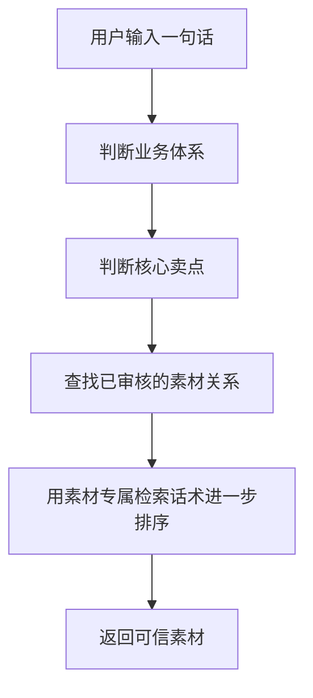
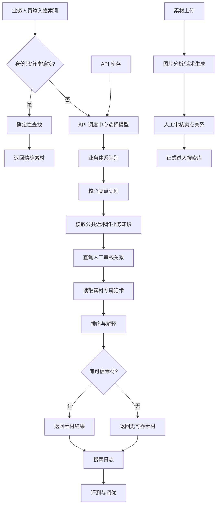
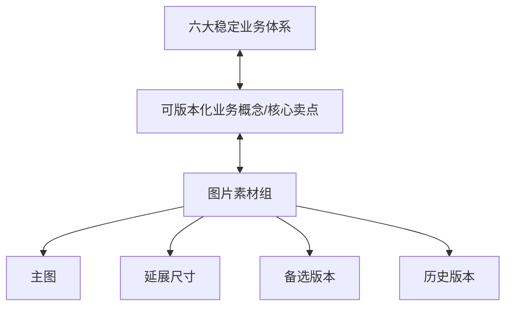
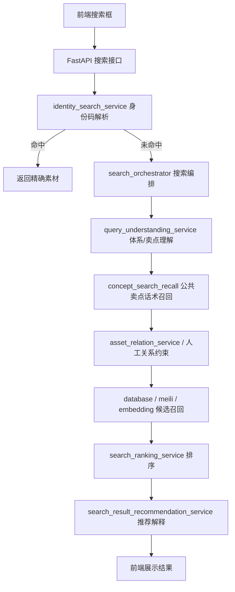
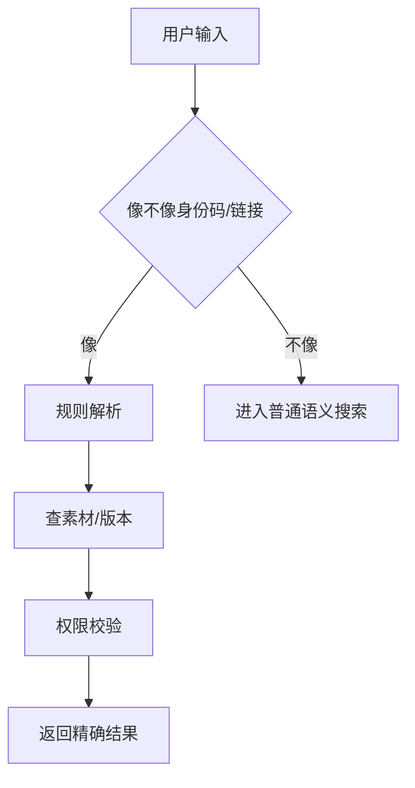
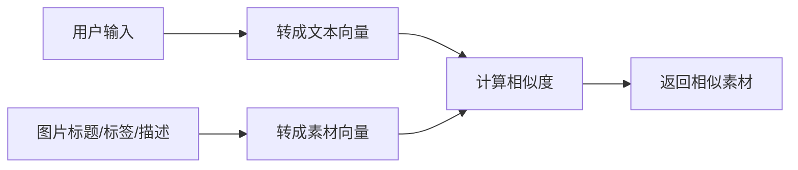
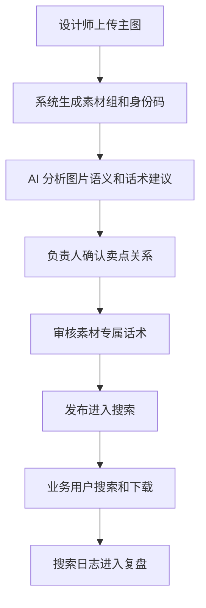

# 卖点智库研发日志与踩坑复盘

版本：2026-09-20
用途：承接最初卖点智库文档中的研发过程、旧技术路线、决策原因和踩坑。当前运行事实仍以图片搜索改造总纲和当前代码为准。

> 这份文档专门承接最初卖点智库文档中不适合继续放在当前复刻指南里的内容。它保留“以前怎么想、怎么试、哪里踩坑、为什么改”的过程，方便后续重新写入飞书或继续追加。
>
> 项目价值、画板内容和排期属于项目起点资料，不在本日志重复展开。

## 1. 如何阅读这份日志

- 复刻指南回答“现在怎么装、怎么启动、怎么验收”。
- 本日志回答“以前为什么这样做、后来为什么改、哪些旧东西不要再恢复”。
- 最初飞书文档保留项目起点、原型和业务背景；不作为当前技术事实源。
- 旧路线不等于当前部署依赖，但不能从历史中抹掉，否则后续接手者会重复踩同样的坑。

## 2. 项目从卖点智库走向图片搜索引擎

最初产品设想是：业务人员选择或描述卖点，工具自动匹配能体现价值的图片。

研发过程中逐渐发现，真正困难的不是把图片展示出来，而是：

1. 业务方不会总说标准卖点名。
2. 相邻卖点可能共享对象、动作和画面。
3. 视觉相似的图片可能业务含义完全不同。
4. 一张图片可以支撑多个卖点。
5. 图片版本、渠道、延展尺寸会持续增加。
6. 业务关系需要负责人确认，不能让模型临时拍板。
7. 搜索失败时应该说明没有可靠素材，而不是凑一张相似图。
8. 找到图之后，业务人员仍然需要知道怎么讲、怎么用。

因此系统逐步形成：

- 业务意图理解。
- 业务概念治理。
- 人工关系管理。
- 图片搜索引擎。
- 素材 Agent。
- 搜索反馈和行为闭环。

## 3. 阶段一：向量数据库和 Embedding 探索

### 3.1 当时的设想

早期路线把图片标题、标签、OCR、画面描述或模型摘要转成文本，再通过 Embedding 建立向量。用户搜索也转成向量，系统最后按相似度召回图片。

它对以下需求确实有效：

- “老师讲题”和“教师讲解”。
- “学习报告”和“学情反馈页面”。
- “拍题”和“题目识别”。
- “蓝色教室”和相似视觉场景。

### 3.2 实际暴露的问题

向量可以判断“像不像”，但不能可靠判断：

- 是否表达这个卖点。
- 是主要表达还是辅助支持。
- 是否属于正确体系。
- 是否存在排除边界。
- 是否经过负责人确认。
- 是否当前已发布。
- 是否属于当前渠道。
- 是否是历史图片还是当前版本。

典型错误包括：

- 用户要“家长能看到学习进展”，返回普通家长拿手机图片。
- 用户要“老师持续督学”，返回动画课或普通课堂图片。
- 用户要“拍题精学”，返回普通题目截图。
- 用户要某渠道素材，返回另一个渠道的同主题图片。

### 3.3 留下的有效资产

向量路线并非全部无效，留下了：

- 同义表达和自然语言样例。
- 对“语义召回”和“业务准入”边界的认识。
- 不能把图片相似当业务事实的结论。
- 后续评测用例。
- 索引重建和无损迁移经验。

但向量服务不再是当前唯一搜索事实源，也不属于当前复刻必须启动的组件。

## 4. 阶段二：独立知识库判断卖点

### 4.1 为什么建立知识库

为了把“业务理解”和“图片查找”分开，项目把六大体系和16个卖点整理成知识文档。

知识文档包含：

- 体系名称。
- 卖点名称。
- 一句话定义。
- 背后的业务需求。
- 产品对象。
- 产品动作。
- 预期结果。
- 典型搜索说法。
- 正向信号。
- 易混卖点。
- 排除边界。
- 证明点和证据样例。

这一步把链路从“找相似图”改成：

~~~text
用户话术
  → 体系理解
  → 卖点理解
  → 本地人工关系取图
~~~


## 5. 阶段三：Viking AI Search 单入口

### 5.1 单入口统一了什么

当前 AI Search 应用统一承载：

- 普通搜索。
- chat_search Agent。
- 推荐。
- 摘要。
- 行为数据闭环。
- 知识与图片数据集的在线检索。

### 5.2 单入口没有统一什么

以下内容仍然在本地：

- 图片是否存在。
- 图片是否发布。
- 图片属于哪个权限范围。
- 图片是否属于当前渠道。
- 图片是否为当前版本。
- 图片和卖点的 accepted 关系。
- 删除、恢复、回收站和下载权限。
- 数据库事务和审计。
- 代表素材的人工金标准。

单入口只是收口在线语义能力，不是把所有事实搬到云端。

### 5.3 外部图片返回的安全边界

AI Search 可能返回图片名称、item ID、URL、描述或 citation。后端必须：

1. 找到本地 image_id 或可验证身份信息。
2. 加载本地图片记录。
3. 检查发布、删除、当前版本和权限。
4. 检查人工 accepted 关系。
5. 用本地标题、缩略图和详情链接重新组卡。
6. 无法映射时丢弃，不返测试占位图。

## 6. 业务数据决策的历史原因

### 6.1 为什么不用固定二级标签树

固定树要求一张图只能挂在一个位置，但业务素材经常：

- 同时表达多个卖点。
- 跨体系支撑。
- 后续新增解释角度。
- 同时适配多个渠道。
- 先上传主图、后补延展尺寸。

最终采用：

~~~text
体系
  ↔ 业务概念
  ↔ 图片关系
图片
  ↔ 渠道和目录
素材组
  ├─ 当前主图
  ├─ 延展尺寸
  ├─ 备选版本
  └─ 历史版本
~~~

### 6.2 为什么延展尺寸不做首次必填

早期把主图、手机端、PPT、官网大图等全部做成必填，会让上传变成大表单，业务方迟迟无法发布主图。

最终：

- 主图先发布。
- 业务关系先确认。
- 延展尺寸后补。
- 结果页按素材组去重。
- 下载时再选择具体尺寸。

### 6.3 为什么负责人审核不是质量评分

负责人确认的是“这张图和这个卖点是什么关系”，而不是图片视觉质量总分。

必须分开：

- 审美和设计质量。
- 是否主要表达卖点。
- 是否可以辅助支撑卖点。
- 是否明确不适用。

如果混成一个分数，搜索会把“好看”误当成“业务正确”。

### 6.4 为什么公共话术和图片话术分开

公共话术描述业务人员如何表达一个卖点，应该放概念层。图片独有的画面和场景表达才放图片层。

全部复制到图片上会导致：

- 数据重复。
- 搜索污染。
- 新图和旧图维护成本变高。
- 边界无法审计。

## 7. 研发踩坑详录

### 7.1 只靠向量相似度会搜错

根因：相似度没有业务边界。

修正：先理解业务概念，再用 accepted 关系准入，最后按画面、渠道和尺寸辅助筛选。

### 7.2 只靠模型判断会不稳定

根因：结构合法不等于业务正确，模型也不应临时决定正式业务事实。

修正：

- Skill 固化边界。
- 数据库概念作为运行时事实。
- 人工关系作为图片准入。
- 输出经过 schema、normalizer 和边界检查。
- 在线调用有总截止和降级。

### 7.3 所有生成话术自动入库会污染搜索

根因：大量生成话术只是重复改写，或把宽泛词硬塞给某卖点。

修正：

- 标准卖点名：正式名称。
- 公共话术：稳定、唯一、可复用。
- 图片话术：只绑定特定图片。
- 评测样例：用于验证，不自动入库。
- 废弃话术：保留审计但不参与召回。

### 7.4 固定标签树无法表达多对多

根因：业务素材不是商品目录。

修正：稳定体系、可版本化概念、图片关系、渠道关系分开存储。

### 7.5 首次上传要求所有尺寸会拖慢流程

根因：把后续资产准备工作塞进首次上传。

修正：主图先发布，延展尺寸后补。

### 7.6 API 健康检查不等于任务能力

历史 API 中心阶段发现：

- 接口健康不代表视觉输入可用。
- 文本模型能通不代表 JSON 稳定。
- ping 成功不代表复杂搜索不超时。
- 单次失败不代表服务永久不可用。

当前对应的验收原则：

- 配置检查和业务验收分开。
- 普通搜索、Agent、图片同步和视觉问图分别验收。
- 记录单次请求和总搜索预算。
- 明确 AI Search 失败时的降级行为。

### 7.7 多套在线路由让复刻和排障失控

历史上需要同时配置知识库、VikingDB、API 中心、旧 Skill、模型任务和本地数据库。

当前收口为：

- 一个 AI Search 在线语义入口。
- 一个本地数据库事实源。
- 一个可选 Meilisearch 增强层。
- 旧路线进入日志，不进入当前启动命令。

### 7.8 外部图片名称不能直接做本地卡片

根因：上游名称看起来像本地标题，但没有本地图片 ID。

修正：必须本地水合；无法映射就不返卡。

### 7.9 localhost 不能作为视觉桥

根因：本地浏览器能访问不等于火山服务能访问。

修正：部署公网图片桥，再用真实图片重新验收。

### 7.10 会话记忆不能根据文件名猜画面

修正：

- 保存实际附件和可靠回答。
- 后续只传可靠历史。
- 未可靠看图的轮次明确标记。
- 不把文件名当视觉事实。
- 图片像素不必每轮重复上传，但首次视觉链路必须成功。

## 8. 原始文档重新写入飞书时的建议结构

### 当前技术说明

放：

1. 当前系统一句话。
2. 当前架构和事实源。
3. 当前业务数据模型。
4. 当前搜索链路。
5. 当前详细复刻。
6. 当前验收和故障排查。

### 研发日志

放：

1. 向量数据库探索。
2. 独立知识库阶段。
3. VikingDB fallback。
4. API 调度和模型能力踩坑。
5. 固定标签树问题。
6. 话术治理。
7. 身份码和版本演进。
8. Agent 和视觉桥问题。
9. 每次真实部署、测试和遗留事项。

### 不迁入当前技术复刻的内容

保留为项目起点附件：

- 项目价值。
- 画板导出。
- 旧产品形态。
- 旧排期。
- 旧技术栈表。

## 9. 后续日志追加模板

~~~text
日期：
编号：
用户现场或问题：
当前现象：
复现步骤：
证据：
根因：
采用方案：
修改文件：
是否新增迁移：
是否改动 AI Search 数据集：
是否改动六大体系/16卖点：
是否改动人工 accepted 关系：
专项测试：
全量测试：
静态检查：
本地状态：
云端状态：
剩余问题：
~~~
## 10. 研发日志的使用方式

这份日志不是当前系统的安装手册，而是项目研发过程的证据和经验库。

阅读时建议按照以下顺序：

1. 先看第 11 节，了解项目最初要解决什么研发问题。
2. 再看第 12-17 节，了解每一条技术路线是如何出现的。
3. 再看第 18 节，了解业务数据模型为什么这样定。
4. 再看第 19-25 节，按故障现象查踩坑。
5. 最后看第 26 节，了解现在重新写文档时哪些内容应该保留、哪些内容应该放到历史附录。

每条复盘尽量回答九个问题：

| 问题 | 要记录什么 |
| --- | --- |
| 谁发现的 | 用户、设计师、开发者、测试或部署人员 |
| 在什么场景发现 | 搜索、上传、Agent、迁移、部署或数据维护 |
| 看到什么 | 页面现象、接口结果、日志、耗时或错误 |
| 原本以为是什么 | 当时的错误假设 |
| 实际根因是什么 | 经过代码和数据排查后的原因 |
| 改了什么 | 代码、数据、配置、Prompt、页面或文档 |
| 没改什么 | 为了保护事实源和业务边界而保留的内容 |
| 怎么验证 | 测试、脚本、浏览器、真实服务或部署验证 |
| 还剩什么 | 未部署、未外发、无真实素材或待业务确认 |

## 11. 最初的研发问题：为什么普通图库方法不够

### 11.1 最初看到的表面问题

项目最初看起来像一个素材管理问题：

- 图片很多。
- 图片版本多。
- 业务人员找图慢。
- 设计师经常重复回答相同需求。
- 业务人员拿到图后不确定能不能表达卖点。
- 新功能上线后，旧图和新图混在一起。

如果只从页面出发，容易得出一个简单方案：

1. 上传图片。
2. 给图片打标签。
3. 做一个搜索框。
4. 按标签返回图片。

### 11.2 研发后发现的真正问题

实际问题被拆成了四类：

#### 第一类：语言问题

业务人员说的不是标准卖点名，而是：

- 想找一张让家长看到孩子学习情况的图。
- 找老师一直跟进孩子学习的素材。
- 有没有孩子拍题之后马上能理解的画面。
- 找一张能体现和学校进度同步的图。
- 想要一个学习计划，但不要普通课程表。

这些话里包含对象、动作、结果、场景和否定，不能只靠标题关键词。

#### 第二类：业务边界问题

同样是老师和学生的画面，可能表达：

- 讲解知识。
- 督促学习。
- 学情反馈。
- 课堂氛围。
- 普通宣传场景。

画面相似不等于业务卖点相同。

#### 第三类：资产关系问题

一张图可能：

- 主要表达一个卖点。
- 同时支持另一个卖点。
- 对第三个卖点完全不适用。
- 在某个渠道适用，在另一个渠道不适用。
- 只适合某个尺寸或某个发布版本。

因此不能用一个固定标签字段解决全部关系。

#### 第四类：运营和复盘问题

系统需要能回答：

- 为什么这张图被返回？
- 谁确认它可以表达这个卖点？
- 是主要表达还是辅助支持？
- 这张图现在是否发布？
- 为什么业务人员搜不到？
- 是没有素材，还是搜索理解错了？
- 是素材没同步，还是 AI Search 没返回？
- 是上游返回了外部图片，还是本地没有对应记录？

这些问题决定了系统必须保留可审计的关系、日志和状态。

## 12. 第一阶段复盘：从图片标签开始

### 12.1 当时的做法

第一阶段把重点放在：

- 图片上传。
- 图片文件保存。
- 缩略图生成。
- 图片标题。
- 图片标签。
- 图片搜索。
- 图片下载。

当时的假设是：

> 只要标签足够多，用户就能通过标签找到需要的图。

### 12.2 发现的问题

使用一段时间后发现：

- 标签要么太少，搜不到。
- 标签要么太多，边界混乱。
- 同一张图的不同人会打出不同标签。
- 标签描述了画面，却没有描述业务意图。
- 标签无法表达主要表达和可以支持。
- 一个图片标签无法说明它是否已经审核。
- 标签树不断新增，改名和迁移越来越困难。

### 12.3 当时的错误方向

为了解决搜不到的问题，容易继续堆：

- 更多颜色标签。
- 更多人物标签。
- 更多场景标签。
- 更多产品功能标签。
- 更多模型自动生成标签。
- 更宽的模糊匹配。

结果是召回变宽，但业务准确性变差。

### 12.4 得出的第一个原则

必须把三件事分开：

1. 画面事实：图片里看到了什么。
2. 业务概念：这张图可以表达什么卖点。
3. 搜索语言：用户可能怎样寻找这个卖点。

这三类内容不能继续全部塞进一个标签字段。

## 13. 第二阶段复盘：向量数据库和 Embedding

### 13.1 引入向量搜索的原因

普通关键词搜索无法处理同义表达，因此开始尝试：

1. 生成图片标题、描述或语义摘要。
2. 把图片文本转成向量。
3. 把用户查询转成向量。
4. 计算相似度。
5. 取相似度最高的图片。

这条路线的吸引力很强：

- 不需要把所有用户说法提前写进词库。
- 能处理近义词。
- 能处理更长的自然语言。
- 能同时利用图片标题和语义描述。
- 可以快速做出“看起来会理解”的搜索效果。

### 13.2 研发时如何验证

验证时不能只问“有没有返回结果”，而要分四组：

#### 标准词

直接输入标准卖点名，检查是否返回对应图片。

#### 口语词

使用业务同事平时的说法，检查是否找到标准卖点。

#### 相邻卖点

输入两个容易混淆的需求，检查是否把相邻图片混在一起。

#### 无关词

输入泛词、纯画面词和明显无关内容，检查是否随机返回。

需要同时记录：

- Top 1。
- Top 3。
- 返回图片所属卖点。
- 是否存在无关图片。
- 是否出现未审核图片。
- 请求耗时。
- 空结果是否合理。

### 13.3 具体暴露的问题

#### 问题一：语义相似但业务错误

用户搜“家长看到学习进展”，系统返回家长拿手机的图，而不是学情报告。

#### 问题二：跨卖点污染

用户搜“老师督学”，系统返回老师讲课、动画课程和课堂氛围图，因为它们共享老师和学生等视觉元素。

#### 问题三：审核边界被绕过

只要模型描述和查询相似，待审核或实验图片也可能被召回。

#### 问题四：版本和渠道无法自然处理

相似度不能判断图片是否当前发布、是否属于指定渠道、是否属于当前用户可见范围、是否已被回收或是否为当前版本。

### 13.4 向量阶段的修正尝试

为了修正误召回，逐步增加：

- 相似度阈值。
- 图片状态过滤。
- 业务概念过滤。
- 人工关系过滤。
- 图片标题补充。
- 多路召回。
- 结果排序。
- 空结果保护。

这些修正说明：

> 向量只能负责候选，真正的业务准入必须在向量之外完成。

### 13.5 向量阶段最终保留和淘汰的内容

保留：

- 自然语言测试样例。
- 同义表达样例。
- 语义召回实验数据。
- 查询延迟和阈值经验。
- 候选召回与业务准入分层结论。

淘汰：

- 把向量最高分当最终答案。
- 把相似度当业务关系。
- 把向量库当本地图片事实源。
- 把自动生成描述当人工确认。
- 把 Embedding 作为复刻必装组件。

## 14. 第三阶段复盘：六大体系和业务概念

### 14.1 为什么整理业务地图

向量阶段暴露出根本问题：

> 系统连用户想找什么业务能力都没有稳定定义，当然无法判断图片是否正确。

因此开始整理六大体系、核心卖点和证明点。

### 14.2 业务知识整理顺序

1. 读取业务原始资料。
2. 确认六大稳定体系。
3. 确认每个体系下的核心卖点。
4. 区分核心卖点和证明点。
5. 记录卖点定义。
6. 记录卖点边界。
7. 记录容易混淆的卖点。
8. 记录用户可能使用的自然表达。
9. 记录不能直接作为事实的数字、学校、证书和效果材料。
10. 形成可供人工审核的知识文件。
11. 再决定哪些内容进入运行时。

### 14.3 证明点为什么不能直接变成卖点

证明点可能是产品功能、教学动作、案例、数据、结果或使用场景。它解释“为什么卖点成立”，但不一定是用户真正要找的卖点。

如果把每个证明点都变成筛选标签，会造成：

- 卖点数量爆炸。
- 相邻卖点重复。
- 业务页面难以维护。
- 搜索结果被细枝末节切碎。

因此保留：

~~~text
体系
  → 核心卖点
  → 证明点
  → 证据表达点
  → 已审核图片关系
~~~

证明点用于解释和人工审查，不自动升级为新的核心卖点。

## 15. 第四阶段复盘：独立知识库服务

### 15.1 当时的目标

让知识库先回答：

- 用户说的是哪个体系。
- 用户说的是哪个卖点。
- 是否包含多个卖点。
- 是否是无可靠卖点。
- 哪些卖点被明确排除。

知识库只负责业务理解，图片仍然回本地数据库查找。

### 15.2 当时的调用流程

~~~text
用户查询
  ↓
Piancton 搜索接口
  ↓
知识库服务
  ↓
返回体系和卖点
  ↓
本地概念映射
  ↓
本地人工关系取图
  ↓
结果排序和展示
~~~

### 15.3 解决的问题

- 业务知识和图片事实分离。
- 体系、卖点和图片不再混成一个向量集合。
- 知识库专注自然语言理解。
- 图片是否可用仍由本地人工关系决定。
- 可以比较标准词、口语词和无关词的判断差异。

### 15.4 不足

知识库服务无法知道本地图片是否存在、是否发布、是否属于当前权限范围、是否已删除、是否属于当前渠道以及是否有 accepted 关系。因此它只能产出卖点候选，不能产出最终图片事实。

### 15.5 运维复杂度

需要同时维护：

- 服务地址。
- 服务 ID。
- 访问 Key。
- 超时。
- 返回格式。
- 可信卖点解析。
- 错误码。
- 本地 fallback。
- 日志脱敏。
- 线上配置和环境变量兜底。

一次“搜不到”要排查本地接口、网络、知识库、解析器、概念映射、关系和发布状态，增加了复刻和排障成本。

## 16. 第五阶段复盘：VikingDB fallback

### 16.1 为什么设置 fallback

知识库服务可能超时、返回空、格式不稳定或没有覆盖新口语，因此加入向量知识路由作为 fallback。

### 16.2 正确边界

~~~text
知识库判断成功
  → 采用可信卖点

知识库没有可信判断
  → VikingDB 只检索体系和卖点知识
  → 不直接检索图片事实
  → 命中后回本地按 accepted 关系取图
~~~

### 16.3 调参问题

需要设置：

- 召回数量。
- 接受 top1 还是 topN。
- 最低分数。
- 短泛词是否拦截。
- 多卖点是否放开。
- 否定表达如何过滤。
- 低置信度是否返回空。
- 失败时是否调用旧 Skill。

短泛词不能因为分数略高就随机映射到一个卖点。证据不足时应返回探索、待消歧或无可靠卖点。

### 16.4 为什么退役在线 fallback

多套在线语义服务会叠加超时和配置，导致新机器很难判断缺的是代码、Key、索引还是数据。最终保留知识结构和本地事实治理，退役独立在线路由作为当前复刻依赖。

## 17. 第六阶段复盘：AI Search 单入口

### 17.1 收口目标

把搜索、问答、推荐、摘要和行为闭环统一到一个 Viking AI Search 应用，减少在线语义入口数量。

### 17.2 职责分工

| 事情 | 负责方 |
| --- | --- |
| 搜索自然语言理解 | AI Search 与本地查询规则 |
| Agent 普通问答 | AI Search chat_search |
| 推荐 | AI Search 推荐场景与本地校验 |
| 行为上报 | 本地 outbox 与 AI Search 行为数据集 |
| 用户和权限 | Piancton 本地数据库 |
| 图片是否存在 | Piancton 本地数据库 |
| 发布和当前版本 | Piancton 本地数据库 |
| 图片和卖点关系 | Piancton 人工关系 |
| 文件读取和下载 | Piancton 存储层 |
| 外部候选转本地卡片 | Piancton 水合逻辑 |
| 失败和超时 | Piancton 降级逻辑 |

### 17.3 收口后仍需要的控制台资源

- 火山引擎账号。
- Viking AI 搜索服务。
- API Key。
- 图片物品数据集。
- 业务知识数据集。
- 应用。
- 普通搜索场景。
- chat_search 配置。
- 图片同步。
- 公网图片桥。
- 可选推荐场景。
- 可选行为数据集。

这些是复刻时的实际配置步骤，历史日志只记录它们为何需要和哪些地方容易配错。

## 18. 数据模型决策复盘

### 18.1 从标签到业务概念

标签名称短、来源不清、没有版本、没有边界、不能表达关系角色，也不能区分人工和 AI。业务概念需要：

- 稳定 code。
- 展示名称。
- 定义。
- 所属体系。
- 版本。
- 状态。
- 搜索表达。
- 来源。
- 审核状态。
- 相邻关系。

### 18.2 图片关系为什么单独建模

一张图片可以主要表达 A、支持 B、排除 C；A 可以是人工 accepted，B 可以 pending。单独建模才能保存这些信息和审计记录。

### 18.3 AI 建议不能覆盖人工关系

如果 AI 建议 expresses，但负责人已确认 excludes，服务层必须拒绝冲突建议。不能只靠前端隐藏，否则后台可能把错误关系写入索引。

## 19. 搜索问题的标准记录方法

每个搜索问题至少保存：

~~~text
原始查询：
用户角色：
发送时间：
是否精确身份码：
查询状态：
识别体系：
识别卖点：
排除卖点：
本地概念候选：
AI Search 是否调用：
AI Search 耗时：
AI Search 返回 item：
本地水合 item：
过滤原因：
最终素材：
素材关系：
素材发布状态：
渠道筛选：
用户反馈：
是否新增回归用例：
~~~

不要只记录“搜不到”和“已修复”。没有完整样例，无法判断是理解、召回、关系、同步还是展示问题。

## 20. 具体踩坑排查手册

### 20.1 用户说“搜不到”

依次检查：

1. 是没有结果，还是结果区域空白。
2. 前端实际发送的原文和筛选条件。
3. 是否被身份码分支拦截。
4. 图片是否已发布、current。
5. 图片是否有 accepted 关系。
6. 概念是否 active。
7. 查询是否有否定。
8. 上游是否返回外部 item。
9. 本地是否能映射 item。
10. 是否被渠道、场景、目录或权限过滤。
11. 是否只是前端分页没有加载。

修复前不要直接增加关键词。

### 20.2 用户说“返回的图不对”

保存：

- 原始查询。
- 返回图片 ID。
- 图片当前关系。
- 命中的概念。
- 是否存在 excludes。
- 是否是 supports 补位。
- 是否命中了纯画面或渠道条件。
- 结果排序前后的候选。

可能原因：

- 卖点理解错。
- 公共话术过宽。
- 图片关系标错。
- supports 越过 expresses。
- 外部候选没有本地核对。
- 前端展示旧缓存。
- 用户真正想表达的是另一个卖点。

### 20.3 Agent 有文字但没有图片卡

检查：

1. chat_search 是否只返回名称。
2. 是否有本地 image_id。
3. 图片是否发布。
4. 是否有 accepted 关系。
5. context_cards_json 是否为空。
6. 同步和流式是否使用同一套水合逻辑。
7. 是否错误使用测试占位图。

### 20.4 本地能看、火山看不到

检查：

- 图片桥是否公网。
- 防火墙和安全组。
- 是否需要登录 Cookie。
- URL 是否过期。
- HTTPS 证书。
- DNS。
- Content-Type。
- Nginx 或 TOS 权限。

本地浏览器能访问只能证明本地可读。

### 20.5 部署后以前的图没了

检查：

- DATABASE_URL 是否换了。
- 是否新建了空 Docker 数据卷。
- 是否只复制代码没有数据库。
- 是否只恢复数据库没有图片。
- STORAGE_DIR 是否变化。
- TOS bucket、region、prefix 是否变化。
- 是否执行了破坏性迁移。

不要先重新上传，先找回原数据卷和备份。

## 21. 测试和验证记录标准

每次研发至少区分：

- 单元测试。
- 服务专项测试。
- API 测试。
- 前端组件测试。
- TypeScript。
- ESLint。
- 生产构建。
- Ruff。
- 编译检查。
- 数据迁移检查。
- 浏览器验收。
- 真实外部服务验收。
- 云端部署验收。

测试记录必须写：

~~~text
解释器：
命令：
测试范围：
通过：
失败：
跳过：
失败是否为既有问题：
是否访问真实外部服务：
是否上传真实图片：
是否部署云端：
~~~

Python 版本过低导致 conftest 导入失败，应写“测试未执行”，不能写“测试通过”。

## 22. 重新写入飞书时的章节结构

研发日志建议按以下顺序：

1. 研发问题和最初假设。
2. 标签方案。
3. 向量数据库方案。
4. 六大体系和业务概念。
5. 独立知识库。
6. VikingDB fallback。
7. AI Search 单入口。
8. 业务概念和人工关系。
9. 搜索编排和降级。
10. Agent 和图片上下文。
11. 图片同步和公网视觉桥。
12. 版本、渠道和延展尺寸。
13. 研发踩坑。
14. 测试和部署记录。
15. 遗留问题。
16. 后续日志模板。

每一章采用：

~~~text
背景
目标
原方案
实际现象
排查过程
根因
调整方案
保留内容
淘汰内容
验证结果
遗留问题
~~~

## 23. 后续日志完整模板

~~~text
# 日期：YYYY-MM-DD / 编号：Dxxx

## 一、问题背景

用户或团队为什么提出这个问题：

## 二、现场现象

页面表现：
接口表现：
日志表现：
耗时：
影响角色：

## 三、复现步骤

1.
2.
3.

## 四、排查记录

代码位置：
数据库记录：
配置：
上游服务：
前端状态：

## 五、根因

直接原因：
深层原因：
是否为历史方案遗留：

## 六、方案决策

采用方案：
不采用的方案：
原因：
是否新增配置：
是否新增迁移：

## 七、实现内容

修改文件：
新增脚本：
新增测试：
新增文档：

## 八、业务事实保护

是否改六大体系：
是否改16个卖点：
是否改人工 accepted 关系：
是否改图片发布状态：
是否改 AI Search 数据集：

## 九、验证结果

专项测试：
全量测试：
静态检查：
浏览器验收：
真实外部验收：
云端部署：

## 十、遗留问题

尚未完成：
需要用户提供：
需要下一轮验证：
~~~


## 24. 原始立项文档技术内容完整归档（历史材料）

> 本节不是概括，而是把最初导出的《卖点智库 v1.0 版本》中的技术方案、旧版代码说明、旧版复刻步骤、研发记录、踩坑和验证经验，按原文完整放入研发日志/复盘，作为历史经验档案。
>
> 使用边界：
>
> 1. 本节内容保留当时的原始上下文，里面可能出现已经退役的 API 调度中心、独立 Embedding、旧知识库路由、旧模型调用和旧数据结构。
> 2. 这些内容用于理解“当时为什么这样做、当时踩过什么坑、哪些经验不能丢”，不等于现在重新复刻时要照搬旧架构。
> 3. 当前重新复刻时，具体执行步骤以《卖点智库知识库复刻指南》为准；当前项目事实以改造总纲为准。
> 4. 已按要求不归档原文中的项目价值、画板占位内容和排期类内容；本节只归档技术、操作、研发、踩坑、验证和历史变更经验。

### 24.1 原始技术材料正文

# 🔵 系统蓝图与核心资产（给懂行的架构师/主创看）

### **技术栈与工具链：**

> 这个工具用到了哪些底层软件？（例如：Coze 平台 + Gemini 文本大模型 + 即梦 4.0 图像接口 + 飞书多维表格）。

| 模块 | 作用 | 为什么需要 |
|-|-|-|
| `client` 前端 | React 19 + Vite + TypeScript + TanStack Query + Radix UI + Tailwind | 给业务、设计师、管理员提供同一套网页操作台 |
| `backend` 后端 | FastAPI + SQLAlchemy + Alembic + Service/Repository 分层 | 统一处理权限、上传、搜索、AI、API 中心、审计和日志 |
| 数据库 | 本地开发默认 SQLite，服务器推荐 PostgreSQL 17 | 保存用户、素材组、图片版本、业务概念、人工关系、话术、日志和 API 配置 |
| 文件存储 | 本地 `storage/images` 或 Docker volume `image_data` | 保存原图、缩略图、回收站文件和版本文件 |
| 搜索增强 | 默认数据库搜索，可选 Meilisearch、Embedding、Reranker | 在不破坏业务事实源的前提下增强召回和排序 |
| API 调度中心 | API 库存、能力探测、健康检查、自动/手动任务分配、调用追踪 | 避免模型慢、挂、格式错、能力不匹配时拖垮全流程 |
| 技能知识库 | `skills/` 下的意图识别、卖点匹配、素材话术生成等规则 | 把项目的业务判断沉淀成可维护资产 |
| 业务文档 | `docs/IMAGE_SEARCH_REBUILD_MASTER_PLAN.md` 等 | 作为跨窗口接力、架构决策、验收标准的事实来源 |
| Docker 部署 | `docker-compose.yml` 编排 Postgres、backend、web、可选 Meilisearch | 让新机器能按同一方式复刻运行环境 |

### 核心业务流向图（Workflow）

> 一张清晰的架构图，标明数据是怎么流转的（比如：用户输入 -> Agent A 拆解 -> Agent B 写提示词 -> 图像生成 -> 返回结果）。（你文档里的那张流程图放这里）()。

<cite doc-id="TTngwXDofiqy4skpscSckK2AnWe" file-type="wiki" title="【立项】卖点智库v1.0版本" type="doc"></cite>

实际搜索流程：



项目运转流程：



六大体系卖点和图片对应流程：



项目搜索代码运转流程：



### 核心资产保险箱（The Secret Sauce）：

> 最终跑通的 System Prompt（核心系统指令） 全文（把你文档里那一大段“AI 创意顾问 Agent 指令”脱水后放在这里）()。挂载的专属知识库、词典或特定的垫图库链接。

评判标准：

<whiteboard token="R2ZIw5v0shExqmbyearcyRICnDc"></whiteboard>

| 核心资产 | 具体内容 | 为什么重要 |
|-|-|-|
| 核心系统指令 | 意图识别、卖点匹配、素材话术生成等 Prompt | 决定模型怎么理解业务 |
| 六大体系知识库 | 六个体系的正式说明、边界、反例、常见误判 | 决定业务边界 |
| 卖点目录 | 16 个核心卖点及其标准表达 | 决定搜索目标 |
| 公开话术治理规则 | 哪些话术能进入公共检索层，哪些只能做测试样例 | 防止话术库变脏 |
| 人工验收关系 | 图片和卖点之间的 expresses/supports/not_applicable 关系 | 搜索结果可信的根 |
| 素材专属话术 | 某张图为什么会被业务人员搜索 | 区分同卖点下的不同图片 |
| API 调度中心配置 | 模型能力、健康状态、任务类型、手动/自动分配 | 保证模型调用可控 |
| 身份码 | asset_code、version_code、分享链接 | 保证精确定位素材 |
| 搜索日志 | 每次搜索的意图、候选、结果、失败原因 | 后续调优和复盘依据 |
| 评测用例 | 典型搜索词、期望结果、空结果案例 | 防止改动后效果倒退 |

### **检索方法为什么这样设计**

本项目使用的是“业务意图分层理解 + 人工验收关系约束 + 素材话术排序”的检索方法。

完整逻辑可以拆成五步。

#### 4.1 第一步：先识别是不是精确查找

如果用户输入的是：

- 素材身份码。
- 图片版本码。
- 分享链接。
- 明确的素材编号。

系统不应该再让模型猜。

正确做法是：


这样做的原因是：

- 精确查找不需要模型。
- 模型可能会误解编码。
- 编码查找应该稳定、快速、可追踪。
- 用户拿着编码来找图，本质上是“我要这张”，不是“帮我猜一张”。

#### 4.2 第二步：判断业务体系

如果不是精确查找，系统先判断用户的话可能属于哪些业务体系。

例如：

| 用户输入 | 可能体系 |
|-|-|
| “跟学校进度一致的图” | 同步校内 |
| “新课标新考法怎么体现” | 同步考点 |
| “小升初衔接的素材” | 同步培养 |
| “给孩子定制学习计划” | 同步规划 |
| “拍题后 AI 讲解” | 同步自学 |
| “老师盯着孩子学” | 同步伴学 |

这一步的作用不是直接选图片，而是缩小业务理解范围。

#### 4.3 第三步：判断核心卖点

体系只是大方向，真正用于找素材的是卖点。

例如“同步伴学”下面至少有两个不同卖点：

- 真人老师督学。
- 学情报告反馈。

用户说“家长不用天天盯，但能知道孩子学得怎么样”，更可能是“学情报告反馈”。

用户说“有人管孩子学习，提醒他别偷懒”，更可能是“真人老师督学”。

如果只停留在体系层，就会把两类素材混在一起。

#### 4.4 第四步：只在人工验收过的关系里找素材

这是项目的可信度核心。

每张图片和卖点之间的关系不能只由模型临时决定，而要经过业务负责人确认。

关系可以分为：

| 关系 | 含义 | 搜索时怎么用 |
|-|-|-|
| 主要表达 | 这张图的核心意义就是这个卖点 | 优先返回 |
| 可以支持 | 这张图能辅助证明这个卖点 | 可以返回，但权重低一些 |
| 不适用 | 这张图不能支撑这个卖点 | 不应返回 |
| 待审核 | 还没确认 | 不作为正式搜索依据 |

这样做的原因是：

- 模型可以辅助判断，但不能替业务负责人拍板。
- 搜索结果要能对外使用，不能靠“看起来差不多”。
- 当用户问“为什么返回这张图”时，系统要能说出业务依据。

#### 4.5 第五步：用素材专属话术区分同卖点素材

同一个卖点下面可能有很多张图。

例如“AI 错题本”下面可能有：

- 错题自动归类页面。
- 错因分析页面。
- 相似题推荐页面。
- 学生复盘错题的场景图。

它们都能支撑“AI 错题本”，但用户真正想要的可能不一样。

所以每张素材还需要生成和维护“素材专属话术”。

素材专属话术不是普通图片描述。

它描述的是：

> 什么样的业务人员，在什么场景下，会用什么话来找这张图。

例如：

| 图片内容 | 不好的描述 | 好的话术 |
|-|-|-|
| 错题归类页面 | “页面上有错题和标签” | “找一张能体现错题自动分类整理的图” |
| 学情报告页面 | “有折线图和文字” | “找一张能让家长看到孩子学习进展的图” |
| 老师督学群聊 | “手机聊天界面” | “找一张体现真人老师持续跟进孩子学习的图” |

这就是为什么要做卖点话术和素材话术。

###  **为什么要生成卖点话术**

#### **5.1 用户不会按标准卖点名搜索**

**内部文档里的卖点名通常很标准**

- **同步校内。**
- **动画精讲。**
- **AI 定制学习方案。**
- **真人老师督学。**
- **学情报告反馈。**

**但真实用户会这样搜**

- **“跟学校课本一样的”**
- **“孩子能看懂的动画”**
- **“给家长看的学习计划”**
- **“老师帮忙盯学习”**
- **“学习情况反馈给家长”**

**如果系统只存标准卖点名，就会出现一个问题：**

> **业务上明明是同一个意思，但用户换一种说法就搜不到。**

**所以需要把一个卖点拆成多种可检索表达。**

#### **5.2 卖点话术分三层**

**本项目里的话术应该分层管理。**

| **层级** | **作用** | **是否进入正式搜索** |
|-|-|-|
| **标准卖点名** | **内部统一命名** | **是** |
| **公共检索话术** | **用户常用、稳定、可复用的表达** | **是** |
| **素材专属话术** | **某张图片独有的使用场景** | **是，但只绑定具体素材** |
| **新手长句/测试句** | **用来模拟真实用户搜索** | **不一定，更多用于评测** |
| **一次性生成废话术** | **低信息量、重复、泛泛而谈** | **不进入** |

**这套治理非常重要。**

**如果把所有模型生成的话术都塞进正式库，话术库会越来越脏，最后出现：**

- **大量重复表达。**
- **大量泛泛的营销空话。**
- **不同卖点之间边界混乱。**
- **搜索召回越来越宽，但准确率下降。**

**所以话术生成不是“越多越好”，而是：**

> **生成是为了发现用户可能怎么搜，入库必须经过筛选和治理。**

#### **5.3 卖点话术带来的好处**

**做卖点话术至少带来五个好处：**

1. **降低使用门槛：业务人员不用记标准术语。**
2. **提升召回率：口语、场景话、结果话都能命中。**
3. **提升准确率：话术先归到卖点，再找已审核素材。**
4. **支持复盘：能看到用户到底用什么语言找素材。**
5. **支持迭代：常见搜索词可以沉淀成新的公共话术或评测用例。**

### **为什么要做 API 调度中心**

API 调度中心不是为了“显得架构复杂”，而是为了解决模型调用在真实业务里的不稳定问题。

#### **6.1 如果没有 API 调度中心，会发生什么**

**如果每个功能自己直接调模型 API，会出现这些问题：**

- **某个模型慢了，整个搜索卡死。**
- **某个 Key 额度用完了，系统不知道怎么切换。**
- **某个模型支持文本但不支持图片，任务发过去才报错。**
- **某个模型能返回文本，但不能稳定返回 JSON。**
- **管理员不知道某次失败到底是哪个 API 失败。**
- **开发人员无法复盘为什么这次用了模型 A，而不是模型 B。**
- **一个失败的调用可能误把整个 API 禁用，影响其他任务。**

**这些问题在测试环境可能不明显，但一到真实使用就会变成主要风险**

#### **6.2 API 调度中心负责什么**

**API 调度中心至少要做八件事：**

| **能力** | **说明** |
|-|-|
| **API 库存管理** | **保存供应商、模型、Base URL、Key 指纹、能力信息** |
| **去重** | **防止同一个供应商、模型、地址、Key 被重复加入** |
| **能力探测** | **区分 text_json、vision_json 等能力** |
| **健康检查** | **判断 API 当前是否可用** |
| **任务分配** | **按任务类型选择合适 API** |
| **手动指定** | **管理员可以给某类任务指定 API** |
| **自动调度** | **多个可用 API 之间按负载和最近调用情况分配** |
| **调用日志** | **记录每次调用、失败、切换、耗时、错误码** |

#### **6.3 为什么不能“失败就禁用 API”**

**一个 API 调用失败，不代表这个 API 永久不可用。**

**失败可能来自：**

- **当前网络抖动。**
- **任务太重超时。**
- **模型临时拥堵。**
- **输入图片过大。**
- **返回 JSON 格式不稳定。**
- **这个模型不适合当前任务，但适合其他任务。**

**所以项目把几个状态分开：**

| **状态** | **含义** |
|-|-|
| **管理员启用/禁用** | **人为决定这个 API 是否进入库存** |
| **运行时健康** | **系统探测它当前是否可用** |
| **自动候选资格** | **它能不能被自动调度选中** |
| **任务手动指定** | **某个任务是否固定使用它** |
| **任务排除** | **某个任务是否明确不使用它** |

**这样做的好处是：**

- **不会因为一次失败就误伤 API。**
- **管理员还能手动指定关键任务。**
- **系统可以自动避开短期异常。**
- **日志里能清楚看到每次调用链路。**

#### **6.4 为什么重任务要单独预算**

**图片分析、素材话术生成、复杂搜索理解，都属于重任务。**

**重任务的特点是：**

- **输入长。**
- **规则多。**
- **有时要处理图片。**
- **要求 JSON 稳定。**
- **不能只看接口健康是否 OK。**

**所以重任务需要更长的总预算、并行候选、延迟对冲和失败回退。**

**这就是 API 调度中心存在的实际价值：**

> **它让模型调用从“靠运气”变成“可管理、可复盘、可降级”的基础设施。**

### **为什么要做身份码**

身份码是这个项目里非常重要的稳定定位机制

#### 7.1 身份码解决什么问题

素材库里一张图可能会经历很多变化：

- 标题被改了。
- 卖点关系被调整了。
- 主图被替换了。
- 新增了横版、竖版、方图等延展尺寸。
- 旧版本被归档。
- 素材被分享给别人。

如果只靠标题或搜索词找图，就会出现：

- 同名素材找错。
- 改名后旧链接失效。
- 用户说“就上次那张”但系统无法定位。
- 复盘时不知道当时用的是哪个版本。

身份码解决的是：

> 不管素材怎么改，都能稳定找到它。

#### 7.2 身份码分两类

| 编码 | 对象 | 是否稳定 | 用途 |
|-|-|-|-|
| asset_code | 素材组 | 稳定 | 找到同一个素材资产 |
| version_code | 图片版本 | 稳定 | 找到某个具体图片文件/版本 |

素材组可以理解为“一组相关图片的业务资产”。

图片版本可以理解为“这组资产里的某一个具体文件”。

例如：

- `asset_code` 指向“AI 错题本归类素材组”。
- `version_code` 指向“AI 错题本归类素材组里的竖版 1080x1920 第 2 版图片”。

#### 7.3 身份码为什么不能复用

即使素材被删除，身份码也不应该随便复用。

原因是：

- 旧链接可能已经发给别人。
- 历史日志里可能保存了旧编码。
- 复盘时要知道当时指的是哪张图。
- 如果复用编码，可能出现“同一个编码在不同时间指向不同素材”的灾难。

所以编码一旦发出，就应该有历史占位。

#### 7.4 身份码和搜索的关系

身份码搜索不走模糊语义。

正确顺序是：



这样做能保证：

- 有明确编码时，结果唯一。
- 没有明确编码时，再让模型理解业务意图。
- 精确查找和模糊搜索互不干扰。

### **为什么不用“直接向量模型搜索”**

这里要特别说清楚，因为这是项目最容易被误解的地方。

直接向量搜索的逻辑通常是：



**这个方法不是不能用，而是不能作为本项目的唯一主干。**

#### **8.1 向量搜索能解决什么**

**向量搜索擅长解决这些问题：**

- **用户表达和素材标题不完全一样，但语义接近。**
- **用户用了同义词，系统也能召回。**
- **用户描述视觉场景，系统能找到相似画面。**
- **用户搜索范围比较宽，需要先粗召回一批候选。**

**例如：**

- **“老师讲题”可以匹配到“教师讲解错题”。**
- **“学习报告”可以匹配到“学情反馈报告”。**
- **“孩子做题”可以匹配到“学生练习场景”。**

#### **8.2 向量搜索不能解决什么**

**但本项目真正难的不是“语义像不像”，而是“业务上能不能用”。**

**向量搜索有几个天然问题：**

1. **它容易返回“看起来像，但卖点错”的素材。**
2. **它不知道哪些素材关系已经被业务负责人确认过。**
3. **它无法稳定区分“主要表达”和“可以支持”。**
4. **它不能理解六大业务体系里的边界。**
5. **它可能把待审核、废弃、实验性描述也当成可靠依据。**
6. **它很难解释“为什么这张图能支撑这个卖点”。**

**举个例子：**

**用户搜：**

> **想找一张体现家长不用操心也能知道孩子学得怎么样的图。**

**如果只走向量搜索，可能召回：**

- **一个家长看手机的图。**
- **一个学生坐在电脑前的图。**
- **一个老师批改作业的图。**
- **一个学习报告页面截图。**

**视觉和语义上都可能“有点像”，但业务上最准确的应该是“学情报告反馈”或“真人老师督学”相关素材。只有被确认过能表达这些卖点的素材，才应该优先返回。**

**所以本项目不是完全抛弃向量搜索，而是把它放在正确的位置：**

> **向量搜索可以做辅助召回和排序，但不能代替业务概念、人工验收关系和卖点边界。**

# 🟠 傻瓜式复刻指南（核心！给新手小白看）

> 作用：手把手教人“拼乐高”，必须是祈使句，必须是 Step-by-Step。

<callout emoji="🎁">
这一章给新手、小白、接手项目的人看。
</callout>

**完整复刻要包括：**

1. 代码能启动。
2. 数据库迁移能跑完。
3. 管理员能登录。
4. 六大体系和 16 个核心卖点能初始化。
5. 素材能上传。
6. API 中心能配置模型。
7. AI 分析和素材话术能跑。
8. 负责人能确认素材和卖点关系。
9. 业务用户能用一个搜索框搜素材。
10. 身份码能精确定位素材。

### 8.0 **小白从零复刻总路线**


如果你是第一次接触这个项目，不要先去看所有代码。


请按下面顺序做，一步成功了再做下一步。


| 顺序 | 你要做什么 | 在哪里做 | 成功标志 | 失败先看哪里 |
|-|-|-|-|-|
| 1 | 拿到代码 | 终端 | 项目目录里能看到 `backend/`、`client/`、`docker-compose.yml` | 仓库地址、Git 权限 |
| 2 | 配后端 `.env` | 项目根目录 | `backend/.env` 文件存在 | 是否复制了 `backend/.env.example` |
| 3 | 装后端依赖 | `backend/` | `.venv` 存在，`pip install` 没报错 | Python 版本、网络、依赖安装错误 |
| 4 | 跑数据库迁移 | `backend/` | `alembic upgrade head` 执行成功 | `DATABASE_URL`、数据库文件权限 |
| 5 | 初始化体系 | `backend/` | 命令输出无错误，页面能看到六大体系 | 是否激活虚拟环境 |
| 6 | 创建管理员 | `backend/` | 能用 admin 登录 | 用户名、密码、数据库是否同一个 |
| 7 | 启动后端 | `backend/` | `http://127.0.0.1:8000/health` 返回 ready | 端口 8000 是否被占用 |
| 8 | 启动前端 | `client/` | `http://127.0.0.1:5173` 能打开登录页 | Node/npm、端口 5173 |
| 9 | 配 API 中心 | 页面后台 | API 健康检查有结果 | Base URL、模型名、Key、能力 |
| 10 | 上传素材 | 页面素材库 | 能看到缩略图和详情页 | 文件格式、大小、存储目录 |
| 11 | 确认卖点关系 | 素材详情页 | 至少有一条 accepted 关系 | 是否有业务概念数据 |
| 12 | 搜索验收 | 首页搜索框 | 口语搜索能返回相关素材 | 搜索日志、关系、话术、API 调用 |
| 13 | 身份码验收 | 首页搜索框 | 粘贴编码能精确返回素材 | 身份码是否生成/迁移 |


这张表就是小白总地图。


如果某一步没成功，不要跳到后面。后面的失败通常都是前面某一步没做好造成的。


### 8.0.1 **准备两个终端**


本地开发时，请准备两个终端窗口。


第一个终端专门跑后端：


```Plain Text
终端 1：backend / FastAPI / 8000 端口
```


第二个终端专门跑前端：


```Plain Text
终端 2：client / Vite / 5173 端口
```


不要在同一个终端里启动后端后又继续输入前端命令。


原因是：


> 后端启动后会一直占着终端运行。你要保留它，让它持续服务前端请求。


### 8.0.2 **先判断自己是否真的完成了**


很多新手会把“页面打开了”误认为“项目复刻完成了”。


本项目不是这样。


只打开登录页，最多说明前端跑起来了。


真正完成至少要看到这些：


| 能看到什么 | 说明什么 |
|-|-|
| 登录页 | 前端启动了 |
| `/health` 返回 ready | 后端和数据库连上了 |
| 管理员能登录 | 用户表、会话、密码逻辑正常 |
| 六大体系存在 | `seed_taxonomy` 跑成功 |
| 能上传图片 | 上传接口和文件存储正常 |
| 能看到缩略图 | 图片处理和存储路径正常 |
| API 中心能检测模型 | 模型配置和调度中心正常 |
| 素材有 accepted 卖点关系 | 搜索事实源存在 |
| 口语搜索能返回素材 | 搜索链路跑通 |
| 身份码能精确搜索 | 身份码链路跑通 |


所以复刻不是一个动作，而是一条链路。


### 8.1 **先分清你要复刻哪一种**


复刻前先问一句：


> 我是只复刻系统框架，还是要连当前素材数据一起复刻？


这两种不一样。


| 类型 | 复刻后有什么 | 适合谁 |
|-|-|-|
| 空库工程复刻 | 有完整系统、表结构、账号、六大体系、16 个卖点，但没有真实素材 | 开发、新服务器初始化、从零搭建 |
| 带数据完整复刻 | 除了系统，还有当前素材、图片文件、人工关系、话术、身份码 | 换电脑、迁移服务器、交给别人继续运营 |


如果只按启动命令做，默认得到的是“空库工程复刻”。


如果要得到“和我现在这个项目一样有素材”的版本，必须同时迁移数据库和图片存储目录。


### 8.2 **课前准备**


请先准备下面这些东西。


| 准备项 | 用途 | 推荐版本/要求 |
|-|-|-|
| Git | 拉取项目代码 | 能执行 `git clone` |
| Python | 跑 FastAPI 后端 | 本地开发可用 Python 3.9+，Docker 使用 Python 3.12 |
| Node.js | 跑 React 前端 | 推荐 Node 22 |
| npm | 安装前端依赖 | 随 Node 安装 |
| Docker | 服务器部署推荐 | Docker Engine + Docker Compose |
| 模型 API Key | API 中心调用模型 | OpenAI-compatible 接口，最好支持 JSON 和图片输入 |
| 图片素材 | 验证上传和搜索 | 至少准备 3-6 张代表素材 |


如果只是本地开发，可以先不装 Docker。


如果是服务器复刻，建议直接走 Docker 路线。


#### 8.2.1 先做环境自检


打开终端，逐条执行：


```Bash
git --version
python3 --version
node -v
npm -v
```


如果要走 Docker 部署，再执行：


```Bash
docker --version
docker compose version
```


成功标准：


| 命令 | 成功时应该看到 |
|-|-|
| `git --version` | 一行 Git 版本号 |
| `python3 --version` | 一行 Python 版本号 |
| `node -v` | 一行 Node 版本号 |
| `npm -v` | 一行 npm 版本号 |
| `docker --version` | 一行 Docker 版本号 |
| `docker compose version` | 一行 Docker Compose 版本号 |


如果某条命令提示 `command not found`，说明这个工具还没装好。


先把工具装好，再继续后面的步骤。


不要在工具没装好的情况下继续操作项目，否则后面报错会越来越难判断。


### 8.3 **项目目录看懂**


把项目拉下来后，先看这几个目录。


| 路径 | 里面是什么 | 新手要知道什么 |
|-|-|-|
| `client/` | 前端网页 | 登录页、素材页、API 中心、管理员页面都在这里 |
| `backend/` | 后端服务 | 权限、上传、搜索、AI、数据库逻辑都在这里 |
| `backend/alembic/versions/` | 数据库迁移 | 所有表结构都通过迁移创建，不要手工建表 |
| `backend/scripts/` | 初始化和维护脚本 | 创建管理员、初始化体系、重建搜索索引都在这里 |
| `docs/` | 项目总纲和说明 | 架构决策、阶段状态、验收标准在这里 |
| `skills/` | 业务技能和规则 | 六大体系、意图识别、卖点匹配、话术生成规则在这里 |
| `data/` | 本地 SQLite 数据库 | 本地默认数据库是 `data/piancton.db` |
| `storage/images/` | 本地图片文件 | 原图、缩略图、回收站文件在这里 |
| `docker-compose.yml` | Docker 编排 | 服务器上用它启动 Postgres、后端、前端和可选 Meilisearch |
| `docker/nginx.conf` | Docker 前端网关 | `/api/` 代理到后端，`/health` 代理到后端健康检查 |


不要自己去数据库里手工建表。


正确方式是：


```Plain Text
运行 Alembic 迁移 -> 运行 seed_taxonomy -> 用页面或脚本写入业务数据。
```


### 8.4 **本地开发复刻**


这一节适合在自己电脑上跑项目。


#### 8.4.1 拉取代码


打开终端，进入你想放项目的目录，然后执行：


```Bash
git clone https://github.com/qqq54522/piancton.git piancton
cd piancton
```


如果代码已经在本机，就直接进入项目目录：


```Bash
cd /Users/yangcong/Desktop/piancton
```


#### 8.4.2 配置后端环境变量


复制后端环境变量模板：


```Bash
cp backend/.env.example backend/.env
```


打开 `backend/.env`，先确认这几项：


```Plain Text
DATABASE_URL=sqlite:///../data/piancton.db
STORAGE_DIR=../storage/images
CORS_ORIGINS=http://localhost:5173,http://127.0.0.1:5173
SESSION_COOKIE_SECURE=false
MODEL_PROVIDER=placeholder
SEARCH_BACKEND=database
```


本地第一次跑，模型可以先不配。


不配模型时，上传和 AI 分析相关功能会提示未配置，但基础登录、上传、人工维护、普通数据库搜索仍然可以排查。


#### 8.4.3 创建后端虚拟环境


进入后端目录：


```Bash
cd backend
```


创建虚拟环境：


```Bash
python3 -m venv .venv
```


激活虚拟环境：


```Bash
source .venv/bin/activate
```


安装依赖：


```Bash
pip install -r requirements-dev.txt
```


#### 8.4.4 初始化数据库


仍然在 `backend/` 目录里执行：


```Bash
alembic upgrade head
```


这一步会创建项目需要的所有数据库表。


然后初始化六大体系和业务概念：


```Bash
python -m scripts.seed_taxonomy
```


再创建管理员账号：


```Bash
python -m scripts.create_admin admin 'replace-with-a-strong-password'
```


请把 `replace-with-a-strong-password` 换成真正的强密码。


#### 8.4.5 启动后端


在 `backend/` 目录执行：


```Bash
uvicorn app.main:app --reload --port 8000
```


启动成功后，打开：


```Plain Text
http://127.0.0.1:8000/health
```


如果看到健康检查成功，说明后端活了。


也可以打开接口文档：


```Plain Text
http://127.0.0.1:8000/docs
```


#### 8.4.6 启动前端


新开一个终端，进入前端目录：


```Bash
cd /Users/yangcong/Desktop/piancton/client
```


安装依赖：


```Bash
npm install
```


启动前端：


```Bash
npm run dev
```


打开浏览器：


```Plain Text
http://127.0.0.1:5173
```


用刚才创建的管理员账号登录：


```Plain Text
用户名：admin
密码：你刚才设置的强密码
```


到这里，空库工程复刻完成。


#### 8.4.7 本地启动后逐项确认


本地启动成功后，按下面顺序检查。


| 检查项 | 操作 | 成功标志 |
|-|-|-|
| 后端健康 | 浏览器打开 `http://127.0.0.1:8000/health` | 返回里有 `status: ready` |
| 接口文档 | 浏览器打开 `http://127.0.0.1:8000/docs` | 能看到 FastAPI 接口页面 |
| 前端页面 | 浏览器打开 `http://127.0.0.1:5173` | 能看到登录页 |
| 管理员登录 | 输入 admin 和密码 | 进入系统首页 |
| 管理员菜单 | 看左侧导航 | 能看到 API 中心、用户管理、审计等入口 |
| 业务概念 | 进入业务概念页面 | 能看到六大体系和 16 个卖点 |


如果前端打开了，但登录时报错，优先检查后端终端有没有报错。


如果后端健康检查失败，优先检查：


1. `backend/.env` 是否存在。
2. `DATABASE_URL` 是否正确。
3. `alembic upgrade head` 是否执行过。
4. 当前终端是否激活了 `.venv`。

### 8.5 **Docker 服务器复刻**


这一节适合在新服务器上部署。


#### 8.5.1 复制 Docker 环境变量


在项目根目录执行：


```Bash
cp .env.docker.example .env
```


打开根目录 `.env`，至少改这些：


```Plain Text
POSTGRES_PASSWORD=换成强密码
CORS_ORIGINS=https://你的正式域名
SESSION_COOKIE_SECURE=true
WEB_PORT=80
```


如果暂时只有 IP，没有 HTTPS，可以临时这样配置：


```Plain Text
CORS_ORIGINS=http://你的服务器IP
SESSION_COOKIE_SECURE=false
```


注意：正式上线 HTTPS 时必须改回：


```Plain Text
SESSION_COOKIE_SECURE=true
```


#### 8.5.2 启动 Docker 服务


在项目根目录执行：


```Bash
docker compose up --build -d
```


查看服务状态：


```Bash
docker compose ps
```


至少要看到：


- `postgres` healthy。
- `backend` healthy。
- `web` healthy。

#### 8.5.3 创建管理员和初始化体系


执行：


```Bash
docker compose exec backend python -m scripts.create_admin admin 'replace-with-a-strong-password'
docker compose exec backend python -m scripts.seed_taxonomy
```


然后打开：


```Plain Text
http://你的服务器IP
```


或：


```Plain Text
https://你的正式域名
```


用管理员账号登录。


#### 8.5.4 Docker 不健康时怎么查


如果 `docker compose ps` 里不是 healthy，先不要反复重启。


按下面顺序查。


查看后端日志：


```Bash
docker compose logs backend --tail=120
```


查看数据库日志：


```Bash
docker compose logs postgres --tail=120
```


查看前端 Nginx 日志：


```Bash
docker compose logs web --tail=120
```


常见判断：


| 哪个服务异常 | 最常见原因 | 先检查什么 |
|-|-|-|
| `postgres` 不健康 | 数据库密码、卷、镜像拉取问题 | `.env` 里的 `POSTGRES_PASSWORD`，以及 Docker 日志 |
| `backend` 不健康 | 数据库没连上、迁移失败、环境变量错误 | `DATABASE_URL`、后端日志 |
| `web` 不健康 | 前端构建失败、后端没健康 | `client` 构建日志、`backend` 状态 |
| 页面打不开 | 端口没开放或 `WEB_PORT` 配错 | 服务器安全组、防火墙、`.env` |
| 登录接口失败 | `/api/` 没代理到后端 | `docker/nginx.conf` 和后端状态 |


### 8.6 **连当前素材数据一起复刻**


如果你要复刻的是“我现在这个项目里的完整内容”，不能只复制代码。


你还必须迁移两类东西：


1. 数据库。
2. 图片文件。

#### 8.6.1 本地 SQLite 完整复刻


本地开发默认使用：


```Plain Text
data/piancton.db
storage/images/
```


如果要在另一台电脑上得到同样的本地素材库，请复制：


```Plain Text
data/piancton.db
storage/images/
```


复制完成后，再按“本地开发复刻”启动后端和前端。


注意：


> 数据库和图片目录必须一起复制。只复制数据库不复制图片，页面会有记录但图片打不开；只复制图片不复制数据库，系统不知道这些图片是谁。


#### 8.6.2 先给当前本地素材做备份


在当前机器上进入 `backend/`：


```Bash
cd backend
source .venv/bin/activate
python -m scripts.backup_local_assets
```


脚本会在 `backups/` 下生成一个带时间戳的备份目录，里面包含：


- SQLite 数据库备份。
- 图片存储目录备份。
- `manifest.json` 备份说明。

#### 8.6.3 把本地 SQLite 素材恢复到 Docker/PostgreSQL


如果目标环境是 Docker/PostgreSQL，不能直接把 SQLite 文件替换进去。


正确方式是：


1. 先启动 Docker。
2. 先跑数据库迁移。
3. 先跑 `seed_taxonomy`。
4. 再用恢复脚本把 SQLite 里的素材、图片、关系和话术导入 PostgreSQL。

示例：


```Bash
docker compose up --build -d
docker compose exec backend python -m scripts.seed_taxonomy
docker compose exec backend python -m scripts.restore_assets_from_sqlite \
  --source-db /path/to/piancton.db \
  --source-images /path/to/storage/images \
  --target-images /data/images
```


如果只是想先检查，不真的写入：


```Bash
docker compose exec backend python -m scripts.restore_assets_from_sqlite \
  --source-db /path/to/piancton.db \
  --source-images /path/to/storage/images \
  --target-images /data/images \
  --dry-run
```


注意：


> `restore_assets_from_sqlite` 只恢复素材相关数据。用户、会话、体系、业务概念和运行日志保留目标库自己的数据。


这样设计是为了避免把旧环境的账号、登录状态和运营日志一起覆盖到新服务器。


### 8.7 **配置 API 中心**


项目不是让每个功能直接读取 `.env` 里的模型 Key。


真实运行时，API 中心才是唯一入口。


#### 8.7.1 首次空库导入


为了兼容已有部署，项目允许第一次启动时从 `.env` 导入初始模型配置。


但这个导入只发生一次：


```Plain Text
只有 API 中心数据库完全没有 API 记录时，才会从 .env 导入。
```


导入后，日常新增、修改、启用、停用 API，都要在管理后台的“API 中心”里操作。


不要以为改了 `.env` 就一定会改线上模型配置。


#### 8.7.2 在后台添加 API


用管理员账号登录后，进入：


```Plain Text
API 中心
```


新增 API 时至少填写：


| 字段 | 填什么 |
|-|-|
| Provider | `openai_compatible` 或你的供应商名称 |
| Base URL | 例如 `https://api.example.com/v1` |
| Model Name | 具体模型名 |
| API Key | 真实密钥，只在后台保存 |
| Temperature | 通常先用 `0.2` |
| Timeout | 图片分析和复杂搜索建议用更长时间 |


示例填写，不要照抄真实 Key：


| 字段 | 示例 |
|-|-|
| API 别名 | `主力视觉模型` |
| Provider | `openai_compatible` |
| Base URL | `https://api.example.com/v1` |
| Model Name | `your-vision-model` |
| API Key | `sk-xxxxxxxxxxxxxxxx` |
| Temperature | `0.2` |
| Timeout | `120` |


如果是文本模型，可以这样命名：


| 字段 | 示例 |
|-|-|
| API 别名 | `搜索理解文本模型` |
| Provider | `openai_compatible` |
| Base URL | `https://api.example.com/v1` |
| Model Name | `your-text-model` |
| API Key | `sk-xxxxxxxxxxxxxxxx` |
| Temperature | `0.2` |
| Timeout | `120` |


这里的 `sk-xxxxxxxxxxxxxxxx` 只是占位符。


不要把你的真实 API Key 写进文档、截图、聊天记录或 Git 仓库。


然后做三件事：


1. 点健康检查。
2. 看能力探测结果。
3. 把它分配给对应任务。

#### 8.7.3 任务怎么分配


常见任务包括：


| 任务 | 需要什么能力 |
|-|-|
| 图片分析 | 视觉输入、稳定 JSON |
| 素材话术生成 | 长文本理解、稳定 JSON |
| 搜索意图理解 | 中文业务理解、稳定 JSON |
| 搜索候选审查 | 业务边界判断、稳定 JSON |
| 搜索结果推荐 | 对结果做简短解释和推荐 |


不要把所有任务都盲目塞给一个模型。


如果某个模型只擅长文本，就不要把图片分析任务交给它。


如果某个模型 JSON 不稳定，就不要让它做搜索理解主链路。


### 8.8 **初始化业务体系和卖点**


项目里的六大体系和 16 个卖点不是手工建表出来的。


正确初始化命令是：


```Bash
python -m scripts.seed_taxonomy
```


Docker 环境里执行：


```Bash
docker compose exec backend python -m scripts.seed_taxonomy
```


这条命令会根据项目里的正式业务知识初始化：


- 六大体系稳定节点。
- 16 个核心卖点。
- 卖点和体系的关系。
- 概念搜索表达。
- 概念关系。

初始化后，到后台检查：


```Plain Text
管理员页面 -> 业务概念 / 卖点管理
```


确认能看到六大体系和 16 个卖点。


### 8.9 **上传素材并建立人工关系**


登录后，用 `admin` 或 `designer` 角色上传图片。


上传后要检查四件事：


1. 素材组是否自动创建。
2. 主图是否能预览。
3. 缩略图是否生成。
4. 身份码是否生成。

然后进入素材详情页，确认业务概念关系。


关系不是随便选，它有明确含义：


| 关系 | 含义 | 搜索作用 |
|-|-|-|
| 主要表达 | 这张图核心表达该卖点 | 优先返回 |
| 可以支持 | 这张图能辅助支撑该卖点 | 可返回，权重低一些 |
| 不适用 | 这张图不适合该卖点 | 不返回 |


注意：


> 搜索只应该信任已经 accepted 的关系。AI 建议只是建议，不是正式事实。


### 8.10 **生成和维护素材话术**


上传素材后，系统可以用 AI 生成素材独有搜索话术。


这些话术的作用不是描述图片上有什么，而是描述：


> 业务人员可能为什么会找这张图。


好话术示例：


```Plain Text
找一张能体现老师持续督促孩子学习的图。
```


坏话术示例：


```Plain Text
图片里有聊天框、头像和文字。
```


话术生成后要人工检查：


1. 删除低信息量话术。
2. 删除和其他卖点边界混乱的话术。
3. 保留能代表真实搜索意图的话术。
4. 把稳定、可复用的表达沉淀到公共卖点话术。
5. 把只属于某张图的表达保留在素材专属话术。

### 8.11 **启用可选搜索增强**


默认情况下，项目可以用数据库链路搜索。


如果要启用 Meilisearch 关键词增强，在根目录 `.env` 设置：


```Plain Text
SEARCH_BACKEND=meilisearch
COMPOSE_PROFILES=search
MEILISEARCH_URL=http://meilisearch:7700
MEILISEARCH_API_KEY=replace-with-a-search-master-key
```


然后执行：


```Bash
docker compose --profile search up --build -d
docker compose exec backend python -m scripts.verify_search_index
docker compose exec backend python -m scripts.rebuild_search_index
```


如果要启用 Embedding 增强，先配置：


```Plain Text
EMBEDDING_BASE_URL=https://api.example.com/v1
EMBEDDING_API_KEY=replace-with-your-secret-key
EMBEDDING_MODEL_NAME=your-embedding-model
```


然后重建向量：


```Bash
cd backend
python -m scripts.rebuild_embeddings
```


注意：


> Meilisearch 和 Embedding 都是增强分支，不是事实源。真正决定素材能不能返回的，仍然是业务概念和人工 accepted 关系。


### 8.12 **真实项目 Workflow 连线**

可以按下面这张图理解代码链路：


如果新手要定位代码，可以按这个顺序看：


| 想看什么 | 先看哪个文件 |
|-|-|
| FastAPI 入口 | `backend/app/main.py`、`backend/app/api/router.py` |
| 搜索主流程 | `backend/app/services/search_service.py`、`backend/app/services/search_orchestrator.py` |
| 身份码搜索 | `backend/app/services/identity_search_service.py` |
| 业务意图理解 | `backend/app/services/query_understanding_service.py` |
| 卖点召回 | `backend/app/services/concept_search_recall.py` |
| 素材排序 | `backend/app/services/search_ranking_service.py` |
| API 中心 | `backend/app/services/api_center_service.py`、`backend/app/repositories/api_center_repository.py` |
| 图片上传 | `backend/app/services/image_service.py`、`backend/app/services/storage_service.py` |
| 素材关系 | `backend/app/services/asset_relation_service.py` |
| 前端路由 | `client/src/app.tsx` |
| API 中心页面 | `client/src/pages/AdminApiCenter/AdminApiCenter.tsx` |
| 素材首页 | `client/src/pages/ImageHome/ImageHome.tsx` |
| 素材详情 | `client/src/pages/ImageDetail/ImageDetail.tsx` |


### 8.13 **测试与调优验收**


复刻完成后，不要只看页面能打开。


请按下面顺序验收。


#### 8.13.1 后端健康检查


打开：


```Plain Text
http://127.0.0.1:8000/health
```


或 Docker 服务器：


```Plain Text
http://你的服务器IP/health
```


如果失败，先查后端是否启动、数据库是否连上。


#### 8.13.2 登录验收


用管理员登录。


确认：


- `admin` 能看到用户管理、审计、API 中心。
- `designer` 能上传和维护素材。
- `business` 只能浏览、搜索、预览、下载。

前端隐藏按钮不算真正权限。


真正权限必须以后端接口返回为准。


#### 8.13.3 体系和卖点验收


进入业务概念页面。


确认：


- 能看到六大体系。
- 能看到 16 个核心卖点。
- 卖点处于启用状态。
- 公共话术能显示和编辑。

#### 8.13.4 上传验收


上传一张真实图片。


确认：


- 上传成功。
- 页面能预览原图。
- 列表能显示缩略图。
- 素材组生成。
- 身份码生成。
- 非图片文件会被拒绝。
- 超限图片会被拒绝。

#### 8.13.5 AI 分析验收


在 API 中心配置可用模型后，上传一张图。


确认：


- AI 分析任务能开始。
- 有语义总结或画面事实。
- 有业务概念关系建议。
- 有素材专属话术建议。
- 失败时能看到明确错误，而不是静默失败。

如果返回 `503 provider_not_configured`，说明 API 中心没有可用 API。


#### 8.13.6 人工关系验收


进入素材详情页。


手动确认至少一个卖点关系：


```Plain Text
relation = expresses
review_status = accepted
```


然后用这个卖点相关的口语词搜索。


如果没有 accepted 关系，搜索不应该把它当作正式结果。


#### 8.13.7 搜索验收


用下面几条搜索词测试：


| 搜索词 | 期望卖点 |
|-|-|
| 找一张能体现和学校课程同步的图 | 同步校内 |
| 孩子一看就懂的动画课画面 | 动画精讲 |
| 能体现老师帮家长盯孩子学习的图 | 真人老师督学 |
| 家长不用天天问，也能看到孩子学得怎么样 | 学情报告反馈 |
| 拍一下题目 AI 分步骤讲 | AI 拍题精学 |
| 自动整理错题还能复习同类题 | AI 错题本 |


成功标准：


- 能识别到合理卖点。
- 返回素材来自 accepted 关系。
- 不把视觉相似但业务错误的图排到前面。
- 找不到可信素材时，能说明没有可靠结果。

#### 8.13.8 身份码验收


找一张已有素材，复制它的 `asset_code` 或 `version_code`。


在搜索框粘贴编码。


成功标准：


- 系统直接返回对应素材。
- 不走模糊卖点搜索。
- 不会因为标题变化而找错。

#### 8.13.9 下载和预览验收


确认：


- 预览不增加下载数。
- 下载才增加下载数。
- 重复刷新页面不应误计下载。

#### 8.13.10 回收站验收


删除一张非关键测试图。


确认：


- 删除后进入回收站。
- 可以恢复。
- 永久删除才清理文件。
- 不要拿正式素材直接做永久删除测试。

### 8.14 **常见报错排查**


| 问题 | 可能原因 | 怎么排查 |
|-|-|-|
| 前端打不开 | `npm run dev` 没启动，或端口不是 5173 | 看终端输出的 Vite 地址 |
| 登录失败 | 管理员没创建，或密码输错 | 重新执行 `python -m scripts.create_admin` |
| 后端启动失败 | `.env` 缺失、依赖没装、数据库迁移没跑 | 检查 `backend/.env`，重新执行安装和 `alembic upgrade head` |
| 页面没有六大体系 | 没跑 `seed_taxonomy` | 执行 `python -m scripts.seed_taxonomy` |
| 上传图片失败 | 文件太大、格式伪造、存储目录无权限 | 检查大小、格式和 `STORAGE_DIR` |
| 图片记录有但打不开 | 只迁移了数据库，没迁移 `storage/images` | 数据库和图片目录一起迁移 |
| AI 分析失败 | API 中心没有可用 API 或模型能力不对 | 进 API 中心看健康检查和能力探测 |
| 搜索没有结果 | 没有 accepted 关系，或素材话术缺失 | 检查素材详情里的卖点关系和话术 |
| 返回图业务不对 | 人工关系标错或公共话术太宽 | 修正关系，收窄话术，增加反例 |
| 身份码搜不到 | 编码没有生成，或迁移时丢了身份码数据 | 检查素材详情和身份码管理页面 |
| Meilisearch 不生效 | 没启 profile，或索引没重建 | 执行 `docker compose --profile search up` 和 `rebuild_search_index` |


### 8.15 **完整复刻成功标准**


当下面这些都满足时，才算真正复刻成功：


1. 前端能打开。
2. 后端健康检查通过。
3. 数据库迁移到最新版本。
4. 管理员能登录。
5. 六大体系和 16 个卖点存在。
6. API 中心能新增、检测、启用 API。
7. 图片能上传、预览、生成缩略图。
8. 素材组和图片版本能生成身份码。
9. AI 分析失败时有明确错误，成功时有结构化结果。
10. 负责人能确认素材和卖点关系。
11. 搜索结果受 accepted 关系约束。
12. 身份码搜索能精确返回素材。
13. 预览和下载计数分离。
14. 回收站、恢复、永久删除链路正常。
15. 服务器部署时 Postgres、backend、web 都是 healthy。
16. 真实项目运维与交接

复刻成功以后，项目还要能持续运营。


这部分不是启动教程，而是交接时必须说清楚的维护规则。


### 9.1 **日常新增素材流程**


新增素材按这个顺序做：





不要跳过负责人确认。


AI 建议不能直接等于正式业务事实。


### 9.2 **日常新增卖点话术流程**


新增话术按这个顺序做：


1. 先从真实搜索日志里找用户常用表达。
2. 判断这句话属于哪个卖点。
3. 判断它是公共话术还是素材专属话术。
4. 删除太泛、太空、跨卖点容易误召回的话术。
5. 小批量加入。
6. 用评测词验证搜索结果有没有变好。

不要一次性把模型生成的几十条话术全量入库。


### 9.3 **日常 API 中心维护**


每周或每次模型异常后检查：


- 哪些 API 最近失败率高。
- 哪些任务超时多。
- 哪些 API 能力探测不符合任务。
- 有没有重复录入的同供应商、同模型、同 Base URL、同 Key。
- 是否需要给重任务单独分配更稳的模型。

维护时不要直接删关键 API。


推荐顺序是：


1. 先禁用自动候选。
2. 再观察任务是否恢复。
3. 确认不再使用后再删除。

### 9.4 **日常备份**


如果是本地 SQLite：


```Bash
cd backend
source .venv/bin/activate
python -m scripts.backup_local_assets
```


如果是 Docker/PostgreSQL，至少备份：


- PostgreSQL 数据卷或数据库 dump。
- `image_data` 图片卷。
- 当前 `.env` 配置。

注意：


> 数据库备份和图片备份必须成对保存。


### 9.5 **发版前检查**


发版前运行：


```Bash
make check
```


它会检查：


- 后端 pytest。
- 后端 Ruff。
- 后端 Pyright。
- 前端 TypeScript。
- 前端 ESLint。
- 前端 Vitest。
- 前端生产构建。

如果只改了 API 类型，后端启动时还要在 `client/` 下执行：


```Bash
npm run generate:api
```


### 9.6 **不要随便改的东西**


这些是项目底线：


1. 不要绕过 Alembic 手工改表结构。
2. 不要让模型直接覆盖人工 accepted 关系。
3. 不要把待审核关系当正式搜索依据。
4. 不要删除身份码历史占位。
5. 不要把所有生成话术直接入库。
6. 不要把 Meilisearch 或 Embedding 当事实源。
7. 不要在前端保存完整 API Key。
8. 不要把真实 API Key 提交到 Git。
9. 不要只迁移数据库不迁移图片文件。
10. 不要在生产 HTTPS 环境使用 `SESSION_COOKIE_SECURE=false`。

# ⚫ 研发日志与踩坑复盘（给复盘大会和后人避坑看）

> 把你们在这个项目中走过的弯路、测试的废数据封存起来，供后人考古，但不干扰小白复刻。

### **核心踩坑与避坑指南：**

>  记录项目中遇到的重大逻辑卡点及最终解决方案（比如“为什么最后选了模型 A 没选模型 B”）。

<table><colgroup><col/><col/></colgroup><tbody><tr><td vertical-align="middle"><b>项目难点</b></td><td><ul><li>打标与搜索（ai模型的配合以及规则系统的建立，如何配合成熟的开源项目进入同步优化）</li><li>出图（原生gpt的图片bug与ai感；后期随着模型能力的更新情况也许会进行改善）</li><li>工具避坑指南（妙搭与常规AI编程的判断与使用）</li></ul></td></tr><tr><td colspan="2">清楚模型能力的边界</td></tr></tbody></table>

#### **生图指南**

| **工具** | **优势** | **劣势** |
|-|-|-|
| **Image** | 整体画面效果出色，画质细腻，视觉表现力强 | 物理逻辑存在偏差（如：手机背面强制呈现为正面；氛围元素中书本侧边文字不符合物体透视规律等） |
| **Banana** | 出图符合物理世界规律，物体结构、空间关系真实可信，质感接近真实拍摄 | 画质较差，细节表现力不足 |

##### 组合运用策略

核心思路：取长补短，分层优化

1. 基础生成：优先使用 Banana 完成主体构图与结构生成，确保画面符合物理逻辑与真实拍摄质感。
2. 画质提升：将 Banana 生成的基础图导入 Image，进行高清放大与画质优化。
3. 细节精修：利用 Image 的精细处理能力，调整局部细节，提升整体视觉完成度。

#### **项目指南**

妙答搭建的

<bookmark name="guanghe.feishuapp.com" href="https://guanghe.feishuapp.com/app/app_4kbncmrc6sd0s"></bookmark>

现在：http://101.42.6.104/

10.1 坑一：只靠图片相似度会搜错


现象：


用户搜一个业务需求，系统返回了一张视觉上相似但业务上不对的图片。


原因：


图片相似度只知道“画面像”，不知道“卖点对不对”。


最终方案：


先识别卖点，再查人工验收关系，最后才做素材排序。


### 只靠模型判断会不稳定


现象：


模型能输出看起来合法的 JSON，但业务判断不一定准，耗时也可能很长。


原因：


模型擅长理解语言，但不应该临时决定哪些素材可以对外代表业务卖点。


最终方案：


模型只做意图理解和辅助排序，正式搜索结果受本地业务事实约束。


### 把所有生成话术都入库会污染搜索


现象：


话术越来越多，但搜索越来越不准。


原因：


很多生成话术只是换一种说法，信息量低，甚至会跨卖点误召回。


最终方案：


区分公共检索话术、素材专属话术、测试用例和废弃话术。只有稳定、独特、可复用的话术才进入正式库。


### 固定二级标签树不够用


现象：


一张图可能同时能支撑多个卖点，但固定标签树只能把它放到一个位置。


原因：


业务素材不是商品分类，不能简单用唯一目录管理。


最终方案：


采用“六大体系 + 可版本化业务概念 + 图片素材组 + 多对多关系”。


### 上传时强制填所有尺寸会拖慢流程


现象：


素材首次上传时要求填写太多信息，导致负责人不愿意维护。


原因：


不是所有延展尺寸都在首次发布时准备好。


最终方案：


主图先发布，延展尺寸、备选版本、历史版本可以后续追加。


### API 健康和任务能力不是一回事


现象：


某个 API 健康检查通过，但一到图片分析或复杂 JSON 任务就失败。


原因：


简单健康检查只能证明接口能通，不能证明它适合当前任务。


最终方案：


API 调度中心要记录能力画像，例如是否支持 `text_json`、是否支持 `vision_json`，并按任务类型调度。


### 失败就禁用 API 会误伤系统


现象：


一次超时后 API 被禁用，其他本来能跑的任务也受影响。


原因：


单次失败不等于 API 永久不可用。


最终方案：


把管理员启用状态、运行时健康、自动候选资格、手动任务分配分开管理。


### 没有身份码就无法稳定复盘


现象：


用户说“上次那张图”，但标题改过、版本换过，系统找不到当时那张。


原因：


标题、搜索词、图片内容都可能变化。


最终方案：


素材组使用稳定 `asset_code`，图片版本使用稳定 `version_code`，删除后也不复用编码。


## 项目最终要坚持的原则

1. 搜索结果必须能解释业务理由。
2. 模型不能绕过人工验收关系直接决定正式结果。
3. 未审核、待审核、废弃的数据不能作为正式搜索依据。
4. 六大体系是业务地图，不是所有搜索的强制硬过滤器。
5. 一张图可以主要表达一个卖点，也可以辅助支撑多个卖点。
6. 卖点话术要治理，不是生成越多越好。
7. 身份码查找必须先于语义搜索。
8. API 调用必须可管理、可降级、可复盘。
9. 没有可靠素材时，返回空比返回错图更正确。
10. 每次设计都要能说清楚为什么这样做。

### **测试数据源归档：**

>  把你现在文档里的“市面模型大乱斗打分表”、“业务内容体检报告”等原始测试数据全部折叠收纳在这里()。

<callout emoji="📚"><p><cite doc-id="LanYwdce3izT5lkW2DmcAlhYnNe" file-type="wiki" title="归档" type="doc"></cite>------前期跑图归档</p></callout>

#### 业务打分

<table><colgroup><col/></colgroup><tbody><tr><td><cite doc-id="XLcXww2FfioWApklnTzcTZb7nef" file-type="wiki" title="打分文档-销售1" type="doc"></cite></td></tr><tr><td><cite doc-id="UeslwkRRZivHoNkugg3cs0pCnPd" file-type="wiki" title="打分文档-伴学" type="doc"></cite></td></tr><tr><td><cite doc-id="YQNPwCsm3iJt5HkzTUWcWb9pnce" file-type="wiki" title="打分文档-市场策略1" type="doc"></cite></td></tr><tr><td><cite doc-id="H09bw1lyViJn1ckau71cO4bznah" file-type="wiki" title="打分文档-市场策略2" type="doc"></cite></td></tr><tr><td><cite doc-id="BMkNwl1kzi6q6GkOtJTcaVk0nqg" file-type="wiki" title="视觉打分文档" type="doc"></cite></td></tr></tbody></table>

#### 卖点搜索评测，是否能成功识别对应的话术

<table><colgroup><col/><col/></colgroup><tbody><tr><td> <cite doc-id="CAfzwi1Lgi6gAUk8lFXcnkjengd" file-type="wiki" title="100 条卖点话术外部语义评测（模型gpt5.5）-第一期" type="doc"></cite></td><td>搜索测评文档--识别卖点（卖点识别率 87%）</td></tr><tr><td><cite doc-id="KyO7wHxndi3NaEkqgExclpoMnLg" file-type="wiki" title="deepseek模型搜索测试-（20条成功率80%）" type="doc"></cite></td><td>deepseek模型识别比起gpt5.5会稍差一点</td></tr><tr><td><cite doc-id="WPc5wtKRkiqAbkkgvnUcPQqKnSg" file-type="wiki" title="gpt5.5搜索评测---（50条成功率100%）" type="doc"></cite></td><td></td></tr><tr><td><cite doc-id="JL4vwfZwriffMVkIQyJckZd5ntb" file-type="wiki" title="50条话术测评（第二期）--gpt5.5" type="doc"></cite></td><td>识识别卖点率为百分之95</td></tr><tr><td><cite doc-id="KqEqwYVzZiYuo2krrZGcwxQKn6c" file-type="wiki" title="精准搜索" type="doc"></cite></td><td></td></tr><tr><td><cite doc-id="Jpd3wsSdXiGRk0kJMypcnLPnnGe" file-type="wiki" title="模糊搜索" type="doc"></cite></td><td></td></tr></tbody></table>

Warning: truncated output (original token count: 11150)
Total output lines: 34


| 测试项目 | 样本量 | 成功率 |
|-|-|-|
| 第一期：100条卖点话术外部语义评测 | 100条 | **87%** |
| 搜索评测 | 50条 | **100%** |
| 第二期：50条话术测评 | 50条 | **95%** |
| **加权综合** | **200条** | **92.25%** |

#### 大**排期与里程碑节点：**

>  原来的项目排期表、人员分工表归档于此()

##### **项目日志**

<table><colgroup><col/><col/><col/><col/><col/></colgroup><thead><tr><th vertical-align="top"><b>日期</b></th><th vertical-align="top"><b>负责人</b></th><th vertical-align="top"><b>更新内容</b></th><th vertical-align="top"><b>产出结果</b></th><th vertical-align="top"><b>新的问题</b></th></tr></thead><tbody><tr><td vertical-align="top">6.22</td><td vertical-align="top"><cite type="user" user-id="ou_e5fbd24123e0203a79ac83a8beaba292" user-name="冯崇"></cite></td><td vertical-align="top"><ul><li>修复图片bug</li></ul></td><td vertical-align="top"><ul><li>修复一部分图片</li></ul></td><td vertical-align="top"><ul><li>妙答工具限制较为死板，后续标签系统优化困难，需移植本地进行升级与优化（仍需观察，是否能够完成现阶段项目1.0的要求，后续优化需移植出来）</li><li>项目api无法让第三方进行调用<b>（车楠项目无法调用）</b>只支持飞书妙答的工具进行调用</li></ul></td></tr><tr><td vertical-align="top">6.23</td><td vertical-align="top"><cite type="user" user-id="ou_e5fbd24123e0203a79ac83a8beaba292" user-name="冯崇"></cite></td><td vertical-align="top"><ul><li>修复图片bug</li><li>将项目文件从妙搭腾移到本地（为之后优化做准备）</li></ul></td><td vertical-align="top"><ul><li>修复一部分图片</li><li>将项目文件从妙搭腾移到本地（已进行一部分）</li></ul></td><td vertical-align="top"><ul><li>项目文件整体体量较大，妙搭工具搭建的项目架构模块混乱，边界不清晰，需重新梳理</li><li>需和运维同学沟通服务器各项相关事宜，提前了解</li><li>发现问题现在项目打标系统是固定死的，当新建标签时，该如何</li></ul></td></tr><tr><td vertical-align="top">6.24</td><td vertical-align="top"><cite type="user" user-id="ou_e5fbd24123e0203a79ac83a8beaba292" user-name="冯崇"></cite></td><td vertical-align="top"><ul><li>修复图片bug</li><li>将项目文件从妙搭腾移到本地</li></ul></td><td vertical-align="top"><ul><li>图修改完成（多的图还未开始）</li><li>将项目文件从妙搭腾移到本地（进行完毕）</li></ul></td><td vertical-align="top"><ul><li>现阶段打标系统还是不够，，需要重构优化打标系统，全新升级</li></ul></td></tr><tr><td vertical-align="top">6.25</td><td vertical-align="top"><cite type="user" user-id="ou_e5fbd24123e0203a79ac83a8beaba292" user-name="冯崇"></cite></td><td vertical-align="top"><ul><li>完成1.0项目阶段内容，保证每个卖点细分的起码一个点有图</li></ul></td><td vertical-align="top"><ul><li>整理1.0阶段图片，现阶段已经能保证每个卖点能够满足其中一个</li></ul></td><td vertical-align="top"><ul><li>重新梳理卖点图详细打动点，查漏补缺</li></ul></td></tr><tr><td vertical-align="top">6.26</td><td vertical-align="top"><cite type="user" user-id="ou_e5fbd24123e0203a79ac83a8beaba292" user-name="冯崇"></cite></td><td vertical-align="top"><ul><li>二级细化拆分每个点</li><li>理清卖点范围</li></ul></td><td vertical-align="top"><ul><li>二级细化拆分每个点</li><li>理清卖点图范围</li></ul></td><td vertical-align="top"><ul><li>卖点图数量加剧，需要重新分配整理</li><li>优化打标系统</li></ul></td></tr><tr><td vertical-align="top">6.29</td><td vertical-align="top"><cite type="user" user-id="ou_e5fbd24123e0203a79ac83a8beaba292" user-name="冯崇"></cite></td><td vertical-align="top"><ul><li>优化打标系统，设计端，业务端，管理员端，系统性逻辑闭环，模块边界清晰</li><li>理清所有卖点需要的证明点，并且跑图</li></ul></td><td vertical-align="top"><ul><li>项目网址http://101.42.6.104/</li><li>跑图</li></ul></td><td vertical-align="top"><ul><li>系统优化，需要测试，给结果，评测才能继续优化，继续优化代码逻辑意义不大，</li><li>图片数量较多，缺人（等实习同学脱身）会加快进度</li></ul></td></tr><tr><td vertical-align="top">6.30</td><td vertical-align="top"><cite type="user" user-id="ou_e5fbd24123e0203a79ac83a8beaba292" user-name="冯崇"></cite></td><td vertical-align="top"><ul><li>完善证明点的图，保证现阶段最少有一张</li></ul></td><td vertical-align="top"><ul><li>跑图</li></ul></td><td vertical-align="top"><ul><li>图片有些模糊，有些不好看</li></ul></td></tr><tr><td vertical-align="top">7.01</td><td vertical-align="top"><cite type="user" user-id="ou_e5fbd24123e0203a79ac83a8beaba292" user-name="冯崇"></cite></td><td vertical-align="top"><ul><li>修改调整图片内容</li></ul></td><td vertical-align="top"><ul><li>调整图片内容</li></ul></td><td vertical-align="top"><ul><li>有些图片排版形式还需要优化，，基本优化完成，，开始打分</li></ul></td></tr><tr><td vertical-align="top">7.02</td><td vertical-align="top"><cite type="user" user-id="ou_e5fbd24123e0203a79ac83a8beaba292" user-name="冯崇"></cite></td><td vertical-align="top"><ul><li>制作打分表，优化图片内容</li><li>优化打标系统</li></ul></td><td vertical-align="top"><ul><li>制作打分表，优化图片内容</li><li>优化打标系统</li></ul></td><td vertical-align="top"><ul><li>打分与测试</li></ul></td></tr><tr><td vertical-align="top">7.06</td><td vertical-align="top"><cite type="user" user-id="ou_e5fbd24123e0203a79ac83a8beaba292" user-name="冯崇"></cite></td><td vertical-align="top"><ul><li>优化六大体系卖点分类</li></ul></td><td vertical-align="top"><ul><li>优化六大体系卖点分类</li></ul></td><td vertical-align="top"><ul><li>需要细分到每张卖点图</li></ul></td></tr><tr><td vertical-align="top">7.07</td><td vertical-align="top"><cite type="user" user-id="ou_e5fbd24123e0203a79ac83a8beaba292" user-name="冯崇"></cite></td><td vertical-align="top"><ul><li>优化六大体系证明图</li><li>整理图片查找缺失图片</li><li>生成图片</li><li>图片分工</li></ul></td><td vertical-align="top"><ul><li>优化六大体系证明图</li><li>整理图片查找缺失图片</li><li>生成图片</li><li>图片分工</li></ul></td><td vertical-align="top"><ul><li>需要生图，预计1-2天</li><li></li></ul></td></tr><tr><td vertical-align="top">7.08</td><td vertical-align="top"><cite type="user" user-id="ou_e5fbd24123e0203a79ac83a8beaba292" user-name="冯崇"></cite></td><td vertical-align="top"><ul><li>完善卖点图的证明图</li><li>分配图片任务<cite type="user" user-id="ou_0e503ce837dd7e74a686d935fc7db610" user-name="姚雅宁"></cite></li></ul></td><td vertical-align="top"><ul><li>完善卖点图的证明图</li></ul></td><td vertical-align="top"><ul><li>修改图片，有一些图片做成了数据可视化，应该做证明图，需要修改几张</li></ul></td></tr><tr><td vertical-align="top">7.09</td><td vertical-align="top"><cite type="user" user-id="ou_e5fbd24123e0203a79ac83a8beaba292" user-name="冯崇"></cite></td><td vertical-align="top"><ul><li>跑图</li><li>审图</li><li>改图</li></ul></td><td vertical-align="top"><ul><li>跑图</li><li>审核完</li><li>修改打分低的图片</li></ul></td><td vertical-align="top"></td></tr><tr><td vertical-align="top">7.10</td><td vertical-align="top"><cite type="user" user-id="ou_e5fbd24123e0203a79ac83a8beaba292" user-name="冯崇"></cite></td><td vertical-align="top"><ul><li>修改图片问题</li></ul></td><td vertical-align="top"><ul><li>修改图片</li></ul></td><td vertical-align="top"><ul><li>一部分图片是否适用于手机端</li><li>图片风格需参考官网</li><li>根据以上问题还需要修改图片</li></ul></td></tr><tr><td vertical-align="top">7.13</td><td vertical-align="top"><cite type="user" user-id="ou_e5fbd24123e0203a79ac83a8beaba292" user-name="冯崇"></cite></td><td vertical-align="top"><ul><li>整理新的问题</li><li>风格靠向官网</li><li>用户是否三秒内看懂</li><li>论点是否充分</li><li>画面是否过于沉重</li><li>修改图片</li></ul></td><td vertical-align="top"><ul><li>根据问题修改图片，完成三分之一</li></ul></td><td vertical-align="top">完成新一轮修图之后，约各个负责人拉会，拉齐审图标准<br/>打标系统的试用需要建立在图片的完成</td></tr><tr><td vertical-align="top">7.14</td><td vertical-align="top"><cite type="user" user-id="ou_e5fbd24123e0203a79ac83a8beaba292" user-name="冯崇"></cite></td><td vertical-align="top"><ul><li>修改图片，调整剩余图片风格</li></ul></td><td vertical-align="top"><ul><li>修改图片</li></ul></td><td vertical-align="top"></td></tr><tr><td vertical-align="top">7.15</td><td vertical-align="top"><cite type="user" user-id="ou_e5fbd24123e0203a79ac83a8beaba292" user-name="冯崇"></cite></td><td vertical-align="top"><ul><li>修改图片</li><li>制作打分文档</li></ul></td><td vertical-align="top"><ul><li>修改图片</li><li>制作打分文档</li></ul></td><td vertical-align="top"></td></tr><tr><td vertical-align="top">7.16</td><td vertical-align="top"><cite type="user" user-id="ou_e5fbd24123e0203a79ac83a8beaba292" user-name="冯崇"></cite></td><td vertical-align="top"><ul><li>优化素材上传，新增渠道、画面风格、场景图标记。</li><li>新增搜索结果精细筛选，且不改变原推荐顺序。</li><li>优化搜索页和素材名称、详情展示。</li></ul></td><td vertical-align="top"><ul><li>优化素材上传，新增渠道、画面风格、场景图标记。</li><li>新增搜索结果精细筛选，且不改变原推荐顺序。</li><li>优化搜索页和素材名称、详情展示。</li></ul></td><td vertical-align="top">六大体系和卖点的边界工作还需要继续细化，保证搜索时的意图识别</td></tr><tr><td vertical-align="top">7.17</td><td vertical-align="top"><cite type="user" user-id="ou_e5fbd24123e0203a79ac83a8beaba292" user-name="冯崇"></cite></td><td vertical-align="top"><ul><li>完成六大体系第一版梳理，固定 16 个核心卖点及体系边界。</li><li>把六大体系知识升级为可复用的搜索意图识别 Skill，并接入实际搜索。</li><li>做了跨体系校准和第 5 批搜索评测，累计形成 103 条真实业务语句。</li><li>固化精简卖点名称与稳定业务 code 的一一映射。</li><li>建立公共话术受控补充规则，区分业务熟悉者、了解者和小白的搜索表达。</li><li>审计并修复 Skill、静态兜底和数据库知识链路之间的不一致。</li><li>明确“可信卖点没有已确认素材时返回空结果”，不再拿无关图片凑结果。</li><li>增加素材属性和结果后二次筛选，包括渠道、风格、是否场景图。</li></ul></td><td vertical-align="top">六大业务体系和 16 个核心卖点完成统一梳理，搜索不再依赖零散标签。<br/>形成 103 条真实业务搜索测试语句，可持续验证搜索效果。<br/>搜索可以区分相近卖点、跨体系需求、探索型需求和无明确卖点需求。<br/>业务话术、数据库概念、搜索 Skill 三套知识完成对齐，减少识别不一致。<br/>没有人工确认素材关系的卖点会返回空结果，避免推荐无关图片。<br/>素材搜索支持按体系、渠道、风格和场景进行结果后二次筛选。</td><td vertical-align="top"></td></tr><tr><td vertical-align="top">7.20</td><td vertical-align="top"><cite type="user" user-id="ou_e5fbd24123e0203a79ac83a8beaba292" user-name="冯崇"></cite></td><td vertical-align="top"><ul><li>测试了长业务句调用 GPT-5.5 的稳定性。把模型理解等待时间延长，并加入一次临时失败重试；实测长句可在约 30 秒内完成卖点识别，不再过早降级为泛搜索。</li><li>测试了“做错的题自动收集归类”这类真实需求。卖点能识别为“AI 错题本”，但目标图片没有被排到前面。</li><li>排查后发现目标图缺少“AI 错题本”的人工确认关系，只有 AI 待审核建议，因此不能进入可信图片候选。</li><li>补充了目标图的人工业务关系和图片专属检索话术：<code>做错的题自动收集归类到错题本</code>。</li><li>测试并调整了“卖点内选图”规则：命中图片专属话术的素材优先于同卖点的泛图，不再只依赖索引、向量或重排分数。</li><li>调整后，搜索“做错的题自动收集归类”时，“线上错题自动归纳到错题本”稳定排在第一位，匹配理由能说明具体命中的图片话术。</li><li>补充恢复了旧素材库数据：素材库从 8 张恢复为 40 张，并同步恢复图片关系、搜索话术和搜索索引。</li></ul></td><td vertical-align="top"><ul><li>模型理解支持更长等待和一次重试，长业务句可正常完成卖点识别。</li><li>“做错的题自动收集归类”可准确识别为“AI 错题本”。</li><li>“线上错题自动归纳到错题本”图片已补充人工关系和专属话术。</li><li>该查询下目标图片稳定排在 Top 1，并展示具体匹配原因。</li><li>卖点内图片检索改为“专属话术优先”，减少同卖点泛图排在前面的情况。</li></ul></td><td vertical-align="top">匹配到卖点没问题了，考虑如何匹配到精准的证明点</td></tr><tr><td vertical-align="top">7.21</td><td vertical-align="top"><cite type="user" user-id="ou_e5fbd24123e0203a79ac83a8beaba292" user-name="冯崇"></cite></td><td vertical-align="top"><ul><li>排查证明点识别不准、推荐错图的问题。</li><li>将脑图绿色文案整理为“证据表达点”。</li><li>建立“体系 → 卖点 → 证明点 → 证据表达点”筛选。</li><li>上传页和素材详情支持细粒度人工标注。</li><li>修复进入详情再返回时搜索结果、筛选和位置丢失。</li><li>修复选择“全部证明点”后又自动跳回专属路径。</li><li>修改打分会议发现的问题</li></ul></td><td vertical-align="top"><ul><li>排查证明点识别不准、推荐错图的问题。</li><li>将脑图绿色文案整理为“证据表达点”。</li><li>建立“体系 → 卖点 → 证明点 → 证据表达点”筛选。</li><li>上传页和素材详情支持细粒度人工标注。</li><li>修复进入详情再返回时搜索结果、筛选和位置丢失。</li><li>修复选择“全部证明点”后又自动跳回专属路径。</li></ul></td><td vertical-align="top">修改文档分类，添加真实场景图</td></tr><tr><td vertical-align="top">7.22</td><td vertical-align="top"><cite type="user" user-id="ou_e5fbd24123e0203a79ac83a8beaba292" user-name="冯崇"></cite></td><td vertical-align="top"><ul><li>设计并生成 100 条卖点搜索话术。</li><li>逐条跑真实外部 GPT-5.5 语义链路。</li><li>外部语义成功 100/100，本地语义 0/100。</li><li>98 条成功产出卖点，SPX052、SPX056 未产出卖点。</li><li>生成逐条审批文档、原始 JSON 和可复跑脚本<cite doc-id="CAfzwi1Lgi6gAUk8lFXcnkjengd" file-type="wiki" title="100 条卖点话术外部语义评测（模型gpt5.5）-第一期" type="doc"></cite></li><li>优化打分文档，生成卖点图在真实场景的样图</li></ul></td><td vertical-align="top"><ul><li>98 条成功产出卖点，SPX052、SPX056 未产出卖点。</li></ul></td><td vertical-align="top"></td></tr><tr><td vertical-align="top">7.23</td><td vertical-align="top"><cite type="user" user-id="ou_e5fbd24123e0203a79ac83a8beaba292" user-name="冯崇"></cite></td><td vertical-align="top"><ul><li>继续收口卖点、证明点、证据表达点的结构</li><li>你重点校准了“绿色点就是证据表达点”“原图路径要能追溯”“人工确认关系不能冒充原图路径”。我按这个改了体系数据和前后端展示，尤其是：</li><li><code>完整教-学-练-评闭环</code> 改回归到 <code>学段衔接</code></li><li><code>AI拍题讲完推相似题</code> 单独作为人工确认关系，不再混进原图来源路径</li><li>上传/分类界面能看到原图推导路径和人工确认关系</li><li>建了 50 条“业务小白模糊搜索”测评话术</li><li>你提出普通用户不会说标准卖点话术，只会说“想找一张体现什么的图”“拍一下讲讲”这种。我新建了这份文档：</li><li>跑了一轮 GPT-5.5 实测并整理结果</li><li>你说不是只要题库，而是要真的输入进去，看 5.5 理解成什么卖点。我按你的确认外发跑了 50 条，生成了结果对照表：</li></ul></td><td vertical-align="top">gpt5.5模型识别率基础稳定在85%以上<br/>deepseek模型识别率太低<br/>优化市场策略打分文档</td><td vertical-align="top"></td></tr><tr><td vertical-align="top">7.24</td><td vertical-align="top"><cite type="user" user-id="ou_e5fbd24123e0203a79ac83a8beaba292" user-name="冯崇"></cite></td><td vertical-align="top"><ul><li>把业务端首页改得更像素材浏览站，弱化内部识别说明</li><li>把手动卖点入口改成浏览筛选</li><li>首页素材墙改成 Pinterest 式瀑布流</li><li>简化业务方素材详情页</li><li>修右侧详情信息面板、AI 标签溢出、左右等高</li><li>移除一些无意义提示和占位图标</li><li>最后做了“渠道与场景图筛选交互优化”，让场景图开关和渠道标题同排，并支持前端新增渠道</li></ul></td><td vertical-align="top"><ul><li>把业务端首页改得更像素材浏览站，弱化内部识别说明</li><li>把手动卖点入口改成浏览筛选</li><li>首页素材墙改成 Pinterest 式瀑布流</li><li>简化业务方素材详情页</li><li>修右侧详情信息面板、AI 标签溢出、左右等高</li><li>移除一些无意义提示和占位图标</li><li>最后做了“渠道与场景图筛选交互优化”，让场景图开关和渠道标题同排，并支持前端新增渠道</li></ul></td><td vertical-align="top"></td></tr><tr><td vertical-align="top">7.27</td><td vertical-align="top"><cite type="user" user-id="ou_e5fbd24123e0203a79ac83a8beaba292" user-name="冯崇"></cite></td><td vertical-align="top"><ul><li>前端筛选器交互从“遮罩抽屉”改成“内容区左侧推开侧栏”：顶部搜索和频道 tab 保持 sticky，打开筛选时只推开下方瀑布流/搜索结果，不再整屏弹出遮罩。</li><li>后端搜索理解改成 GPT-5.5 严格三级串行链：<code>体系 -&gt; 卖点 -&gt; 证明点</code> 三次独立模型调用，分别有独立 Prompt、Schema 和 <code>8s/20s/20s</code> 预算；手动筛选不调用模型，图片选择仍走人工 accepted 关系和既有排序边界</li></ul></td><td vertical-align="top"><ul><li>前端筛选器交互从“遮罩抽屉”改成“内容区左侧推开侧栏”：顶部搜索和频道 tab 保持 sticky，打开筛选时只推开下方瀑布流/搜索结果，不再整屏弹出遮罩。</li><li>后端搜索理解改成 GPT-5.5 严格三级串行链：<code>体系 -&gt; 卖点 -&gt; 证明点</code> 三次独立模型调用，分别有独立 Prompt、Schema 和 <code>8s/20s/20s</code> 预算；手动筛选不调用模型，图片选择仍走人工 accepted 关系和既有排序边界</li></ul></td><td vertical-align="top"></td></tr><tr><td vertical-align="top">7.28</td><td vertical-align="top"><cite type="user" user-id="ou_e5fbd24123e0203a79ac83a8beaba292" user-name="冯崇"></cite></td><td vertical-align="top"><ul><li>收口 GPT-5.5 Provider 配置，把搜索主判断和 OhMyGPT 兜底链路跑起来，并加了脱敏 Provid…1150 tokens truncated…185 循环更新问题：<code>ImageHome</code> 现在对同一个路由 state 做一次性消费。</td><td vertical-align="top"></td></tr><tr><td vertical-align="top">7.30</td><td vertical-align="top"><cite type="user" user-id="ou_e5fbd24123e0203a79ac83a8beaba292" user-name="冯崇"></cite></td><td vertical-align="top">改图</td><td vertical-align="top">修改图片-调整内容</td><td vertical-align="top"></td></tr><tr><td vertical-align="top">7.31</td><td vertical-align="top"><cite type="user" user-id="ou_e5fbd24123e0203a79ac83a8beaba292" user-name="冯崇"></cite></td><td vertical-align="top">改图</td><td vertical-align="top">修改图片-调整内容</td><td vertical-align="top"></td></tr><tr><td vertical-align="top">8.03</td><td vertical-align="top"><cite type="user" user-id="ou_e5fbd24123e0203a79ac83a8beaba292" user-name="冯崇"></cite></td><td vertical-align="top"><ul><li>整理图片素材-mastergo</li><li>生成图片</li></ul></td><td vertical-align="top"><ul><li>修改图片-调整内容</li><li>整理图片素材</li></ul></td><td vertical-align="top"></td></tr><tr><td vertical-align="top">8.04</td><td vertical-align="top"><cite type="user" user-id="ou_e5fbd24123e0203a79ac83a8beaba292" user-name="冯崇"></cite></td><td vertical-align="top">整理图片素材-mastergo</td><td vertical-align="top"><ul><li>修改图片-调整内容</li><li>整理图片素材</li></ul></td><td vertical-align="top"></td></tr><tr><td vertical-align="top">8.05</td><td vertical-align="top"><cite type="user" user-id="ou_e5fbd24123e0203a79ac83a8beaba292" user-name="冯崇"></cite></td><td vertical-align="top">整理图片素材-mastergo</td><td vertical-align="top">修改图片-调整内容</td><td vertical-align="top"></td></tr><tr><td vertical-align="top">8.06</td><td vertical-align="top"><cite type="user" user-id="ou_e5fbd24123e0203a79ac83a8beaba292" user-name="冯崇"></cite></td><td vertical-align="top">修改图片</td><td vertical-align="top">修改图片-调整内容</td><td vertical-align="top"></td></tr><tr><td vertical-align="top">8.07</td><td vertical-align="top"><cite type="user" user-id="ou_e5fbd24123e0203a79ac83a8beaba292" user-name="冯崇"></cite></td><td vertical-align="top">修改图片</td><td vertical-align="top">修改图片-调整内容</td><td vertical-align="top"></td></tr><tr><td vertical-align="top">8.10</td><td vertical-align="top"><cite type="user" user-id="ou_e5fbd24123e0203a79ac83a8beaba292" user-name="冯崇"></cite></td><td vertical-align="top">修改图片</td><td vertical-align="top">修改图片-调整内容</td><td vertical-align="top"></td></tr><tr><td vertical-align="top">8.11</td><td vertical-align="top"><cite type="user" user-id="ou_e5fbd24123e0203a79ac83a8beaba292" user-name="冯崇"></cite></td><td vertical-align="top">修改图片</td><td vertical-align="top">修改图片-调整内容</td><td vertical-align="top"></td></tr><tr><td vertical-align="top">8.12</td><td vertical-align="top"><cite type="user" user-id="ou_e5fbd24123e0203a79ac83a8beaba292" user-name="冯崇"></cite></td><td vertical-align="top"><ul><li>增加项目夹和批量导出能力<br/>搜索结果支持把候选素材加入项目夹，并批量导出 ZIP。业务端导出不包含源文件链接，设计师和管理员端仍保留源文件信息，保证权限边界。</li><li>优化 GIF 动图预览体验<br/>保留 GIF 动图预览能力，同时增加动图预览开关。如果素材库动图较多导致页面变慢，可以切换为静态缩略图浏览。</li></ul></td><td vertical-align="top"><ul><li>增加项目夹和批量导出能力<br/>搜索结果支持把候选素材加入项目夹，并批量导出 ZIP。业务端导出不包含源文件链接，设计师和管理员端仍保留源文件信息，保证权限边界。</li><li>优化 GIF 动图预览体验<br/>保留 GIF 动图预览能力，同时增加动图预览开关。如果素材库动图较多导致页面变慢，可以切换为静态缩略图浏览。</li></ul></td><td vertical-align="top"></td></tr><tr><td vertical-align="top">8.13</td><td vertical-align="top"><cite type="user" user-id="ou_e5fbd24123e0203a79ac83a8beaba292" user-name="冯崇"></cite></td><td vertical-align="top"><ul><li>强化搜索反馈沉淀<br/>新增反馈归档思路，把用户反馈拆成补素材、补版本、修业务关系、补搜索话术、补画面表达几类，为后续数据飞轮和检索调优做准备。</li></ul></td><td vertical-align="top">新增反馈归档思路，把用户反馈拆成补素材、补版本、修业务关系、补搜索话术、补画面表达几类，为后续数据飞轮和检索调优做准备。</td><td vertical-align="top"></td></tr><tr><td vertical-align="top">8.14</td><td vertical-align="top"><cite type="user" user-id="ou_e5fbd24123e0203a79ac83a8beaba292" user-name="冯崇"></cite></td><td vertical-align="top">和雷哥拉会，确定视觉问题</td><td vertical-align="top">确定后续修改方向，视觉标准</td><td vertical-align="top"></td></tr><tr><td vertical-align="top">8.17</td><td vertical-align="top"></td><td vertical-align="top"><ul><li>继续梳理图片检索准确率问题<br/>发现当前检索效果和 GPT-5.5 模型绑定较深，换模型后正确率明显下降。初步判断原因是很多业务判断还依赖强模型临场理解，后续需要把高频话术、卖点边界、反向边界和正确判断沉淀到数据库/索引中，降低对单一模型的依赖。</li><li>明确检索准确率优化方向<br/>重新确认检索准确的核心不是继续堆模型，而是加强素材与业务卖点、证明点、证据表达点之间的人工确认关系，并把真实搜索反馈变成可复用的业务知识。</li><li>完成搜索运营 9 项优化第一版<br/>优化了源文件健康、素材生命周期、重复素材识别、GIF 预览体验、反馈归档、批量导出、项目夹、搜索解释和模型工作量统计等能力，让后续运营可以更清楚地知道素材库哪里需要维护。</li><li>修改图片</li></ul></td><td vertical-align="top"><ul><li>继续梳理图片检索准确率问题<br/>发现当前检索效果和 GPT-5.5 模型绑定较深，换模型后正确率明显下降。初步判断原因是很多业务判断还依赖强模型临场理解，后续需要把高频话术、卖点边界、反向边界和正确判断沉淀到数据库/索引中，降低对单一模型的依赖。</li><li>明确检索准确率优化方向<br/>重新确认检索准确的核心不是继续堆模型，而是加强素材与业务卖点、证明点、证据表达点之间的人工确认关系，并把真实搜索反馈变成可复用的业务知识。</li><li>完成搜索运营 9 项优化第一版<br/>优化了源文件健康、素材生命周期、重复素材识别、GIF 预览体验、反馈归档、批量导出、项目夹、搜索解释和模型工作量统计等能力，让后续运营可以更清楚地知道素材库哪里需要维护。</li><li>修改图片</li></ul></td><td vertical-align="top"></td></tr><tr><td vertical-align="top">8.18</td><td vertical-align="top"><cite type="user" user-id="ou_e5fbd24123e0203a79ac83a8beaba292" user-name="冯崇"></cite></td><td vertical-align="top"></td><td vertical-align="top"></td><td vertical-align="top"></td></tr><tr><td vertical-align="top">9.08</td><td vertical-align="top"><cite type="user" user-id="ou_e5fbd24123e0203a79ac83a8beaba292" user-name="冯崇"></cite></td><td vertical-align="top">发现对象存储权限问题，和运维沟通；模型训练部署不稳定，和火山引擎客服沟通</td><td vertical-align="top">跟进 TOS 存储权限工单，卡点卖点智库图片上传功能，今天 16:10 预期完成，需跟进并测试；模型测试持续预热，稳定性 88%</td><td vertical-align="top"></td></tr><tr><td vertical-align="top">9.09</td><td vertical-align="top"><cite type="user" user-id="ou_e5fbd24123e0203a79ac83a8beaba292" user-name="冯崇"></cite></td><td vertical-align="top">与火山引擎工作人员讨论模型部署问题，优化项目数据库等一些已知问题，还有填入图片</td><td vertical-align="top">填入合作案例图片，优化一些项目已知问题</td><td vertical-align="top"></td></tr><tr><td vertical-align="top">9.10</td><td vertical-align="top"><cite type="user" user-id="ou_e5fbd24123e0203a79ac83a8beaba292" user-name="冯崇"></cite></td><td vertical-align="top">确认新搜索方案（火山知识库判断卖点 → 素材库返回图片）；优化长图上传（普通 8000 万像素、长图放宽至 1.6 亿像素）与详情页加载策略（先缩略图、按需加载原图）；接入火山 Viking 知识库 kb-service-4078ae52d3bfcb46（API Key 落 .env，Git 分支 codex/company-server-deploy-20260907 推送完成）；调整知识库导入文档方向（复刻原文档、保留大文字、去末端细碎）；调试切片/索引/重排/Dense Weight 等参数；改造搜索结果展示（加载态改为「思考中」卡片，输出收敛为结果/判断/定义三段）</td><td vertical-align="top">搜索链路从「模型临场猜卖点」切换为「知识库判断卖点 + 素材库返回图片」；解决长图上传失败与打开慢两个痛点；前端加载态从进度条改为「思考中」卡片、结果框精简为「结果 / 判断 / 定义」三段；知识库参数（切片 \n\n、原始文本/OCR 索引、重排开启、Dense Weight 0.5、问题改写暂不开启、邻近文本 0）已调通；代码已推 Git 分支</td><td vertical-align="top">尚未接入右下角「素材库 Agent 小机器人」——下一步可让其调用知识库解释卖点，再调素材库配图</td></tr><tr><td vertical-align="top">9.10</td><td vertical-align="top"><cite type="user" user-id="ou_e5fbd24123e0203a79ac83a8beaba292" user-name="冯崇"></cite></td><td vertical-align="top"><ul><li>确认了新搜索方案：用户不一定会直接搜卖点名，而是会搜业务需求（如「湖南省合作案例的图」「洋葱拍题精学能让孩子学一题会一类」），所以不能只靠提前写死卖点词，也不能只让模型临场判断。最后方案是：用户输入 → 火山知识库判断是否卖点需求 → 命中卖点返回属于哪个卖点、为什么、定义 → 再回到自己的素材库按人工确认过的卖点关系返回图片。</li><li>处理长图上传和加载：普通图片限 8000 万像素；长图比例足够长可放宽到 1.6 亿像素；解决运营长图、竖版长图因像素过大上传失败；长图详情页先加载缩略图，点击「查看原图」才加载高清原图。</li><li>接入火山 Viking 知识库：知识库服务 ID kb-service-4078ae52d3bfcb46；API Key 放到服务器 .env 没写进代码；搜索时优先调用知识库判断卖点，成功后回本地数据库取图；已推到 GitHub 分支 codex/company-server-deploy-20260907（含 2be9f00 route selling point search through knowledge service、42a4e2a Refine knowledge search reasoning display）。</li><li>优化知识库导入文档方案：原文档偏「迁移说明 / SQL 解释 / 工程说明」，改为不压缩原始业务知识、尽量复刻原文档、去掉绿色「证据表达点」类末端细碎内容、保留卖点和证明点旁大文字，让知识库理解六大体系、核心卖点、定义、边界。</li><li>调试知识库参数：文档切片按分隔符 \n\n；索引字段开原始文本/原始图片/图片 OCR；重排模型开启；Dense Weight 默认 0.5；问题改写单轮搜索暂不开；拼接邻近文本数量先设 0。</li><li>优化搜索结果展示：加载态从百分比进度圈改为「思考中...」卡片；黑色结果框只保留结果/判断/定义三项；去掉「相关证明点」；清理 &lt;reference&gt; 平台引用标签；不展示渠道、返回数量、过程性文案。</li></ul></td><td vertical-align="top">从「模型临时猜卖点」转向「火山知识库做业务判断，本地数据库做素材事实源」，同时解决长图上传/加载问题，前端搜索体验改为更像知识助手的表达。</td><td vertical-align="top"><ul><li>尚未接入右下角「素材库 Agent 小机器人」——目前接入的是搜索框链路，不是 Agent 链路。下一步可让小机器人调用火山知识库、用户问「这句话属于什么卖点」时能解释、问「这个需求该用哪些图」时能先判断卖点再调素材库。</li><li>GitHub 拉取有时超时（最终已推上）、服务器没 nano（不能用 nano .env）、粘贴 .env 因 Markdown 链接格式导致 shell 进入 &gt; 续行（已确认用更稳方式写 .env 避免 Key 写错）。</li></ul></td></tr><tr><td vertical-align="top">9.14</td><td vertical-align="top"><cite type="user" user-id="ou_e5fbd24123e0203a79ac83a8beaba292" user-name="冯崇"></cite></td><td vertical-align="top">修复 Agent 连续对话（手动输入与引导问题进同一会话）；图片发 Agent 后不再自动替用户发「请讲解这张图片」、改为等待用户自由提问；素材库图片增加临时视觉桥（向火山提供短期不可猜测地址，不暴露原图、登录态或对象存储凭证）；修复图片发送后 Agent 卡死、后续对话异常；修复「学情报告」等同主题素材返图不完整（自动补齐同主题 01/02/03、补齐 4:3/16:9 等已发布版本，「其他几张」继续锁定原主题不漂移）；修复渠道素材「看起来消失」（登录 401 不再显示成空图库）；去掉图片操作圆盘改为右侧纵向操作（下载 / 复制身份码 / 收藏到画板 / 喜欢 / 发送到 Agent）；修复透明操作层遮挡图片导致偶尔点不开；搜索和 Agent 推荐卡片继续使用图片真实标题，不再统一显示「卖点：当前需求」。</td><td vertical-align="top">Agent 体验收敛为单会话连续问答 + 图片附件自然流转；图片操作布局改为右侧纵向菜单；同主题素材自动补齐多版本；渠道 401 不再误显为空库；图片访问走临时视觉桥，安全边界更清晰。</td><td vertical-align="top"></td></tr><tr><td vertical-align="top">9.15</td><td vertical-align="top"><cite type="user" user-id="ou_e5fbd24123e0203a79ac83a8beaba292" user-name="冯崇"></cite></td><td vertical-align="top">整个项目在线 AI 能力统一为 Viking AI Search（Agent 用 chat_search、搜索 / 推荐 / 摘要 / 补全 / 行为闭环共用同一应用）；删除 API 中心页面和运行接口；停用 Kimi / DeepSeek / GPT / 旧知识库路由 / 独立 Embedding 与 Reranker，不再暗中切换其他模型；上传 / 追加版本 / 替换主图不再调用已退役的独立图片分析模型；修正 Agent 对洋葱业务知识的回答（注入六大体系正式名称，不再把网上「AI 智能学伴 / 未来课堂」等误认为洋葱六大体系，普通问题可直接回答、不强迫先说体系 / 卖点 / 发图）；知识数据集与图片物品数据集一起接入同一 chat_search；优化 Agent 超时与卡顿（聊天读取时间 20s、问答减少不必要素材检索、连接中断或超时时有限重试一次、脱敏错误记录不写 Key / 完整问题 / 回答正文）；去掉「问题分析中」假流程展示，直接呈现火山真实回复；去掉不准确「今日记忆」百分比圆环；图片改为「一次性待发送附件」（问答成功后不再一直挂输入区、后续文字追问延续同一会话、发新图替换未发送旧图）；确认本地图片理解失败原因（127.0.0.1/localhost 火山无法访问），代码禁止把回环地址冒充可访问图片；删除顶部搜索框，Agent 固定在页面右侧成为自然语言问答 / 找图主入口；新增渠道目录管理（渠道下可建地区 / 学校 / 科目等多层树形、上传时可指定目录、旧图片不消失进「待分类」、分类只用于浏览管理不改变六大体系 / 卖点 / 人工关系）；渠道筛选图标固定在左侧、中间渠道区域独立横向滚动、右侧控制项固定。</td><td vertical-align="top">AI 能力统一收敛为 Viking AI Search，删除冗余模型路由与 API 中心页面；Agent 业务知识回答准确度提升（六大体系 / 普通问答路径优化）；稳定性提升（聊天读取超时、脱敏日志、有限重试）；UI 简化（去掉顶部搜索框 / 假流程 / 假圆环），Agent 成为主入口；新增渠道目录树形管理能力，「待分类」兜底旧图片；一次性图片附件流转避免占输入区。</td><td vertical-align="top"></td></tr><tr><td vertical-align="top">9.16</td><td vertical-align="top"><cite type="user" user-id="ou_e5fbd24123e0203a79ac83a8beaba292" user-name="冯崇"></cite></td><td vertical-align="top">加强同一会话中的多图问答（可先发图 A 再发图 B、可用「刚才第一张 / 前面那张」、每条消息记录对应图片附件）；Agent 按渠道找图时用本地真实渠道和目录再次核对，不让火山返回其他渠道素材；修复「找王玉龙专家图片」等明确标题搜索（优先核对本地已发布素材、返回真实图片卡而非不可访问的外部 ID）；修复「找某个卖点的图片只有文字没有卡片」（识别当前问题或紧邻上下文中的明确卖点、根据人工确认 expresses 关系补充真实素材卡、不返回测试占位图和不存在的图片）；调整 Agent 会话（同会话持续保留上下文、点「新对话」才建新上下文、取消每天自动删除全部历史的最终方案；已被旧版本删除的历史无法自动恢复）；新用户引导重写（说明 Agent 可自由连续提问、手动渠道找图与 Agent 自然语言找图区别、复杂语义可先问卖点再找图；必须点「我已看完，开始使用」完成引导，不可点背景或按 Escape 跳过）；注册与账号增加头像（六个预设头像、支持上传自定义、头像属账号私有不进素材库和火山数据集）；新增业务用户每日反馈（注册次日起每天首次进入要求填昨日反馈、同一天完成后不重复、管理员 / 设计师不显示、状态存账号上换设备仍有效）；修复收藏画板（首次新建后立即同步「我的收藏」、选画板需点确认不再误触即收藏、已收藏时可明确确认移除）；渠道分类支持原地调整（在「北京」等当前目录可直接选图、可移到「上海」或其他目录 / 未分类、不需退出目录后重新找图）。</td><td vertical-align="top">Agent 多图会话能力建立（每条消息附图 + 「刚才 / 前面那张」指代）；按渠道 / 卖点 / 标题找图准确度提升（本地核对、不返回外部 ID 或占位图）；Agent 会话上下文策略明确（按「新对话」显式切、取消自动删历史）；新用户引导更清晰、必须点确认完成；账号体系增加头像（预设 + 自定义、隔离素材库 / 数据集）；上线业务用户每日反馈机制（管理员 / 设计师豁免、跨设备有效）；收藏画板交互修复（防误触、首次新建同步）；渠道分类支持原地调整（不退出目录即可选图 / 移动）。</td><td vertical-align="top">已被旧版本删除的 Agent 历史无法自动恢复（已知损失）</td></tr></tbody></table>
