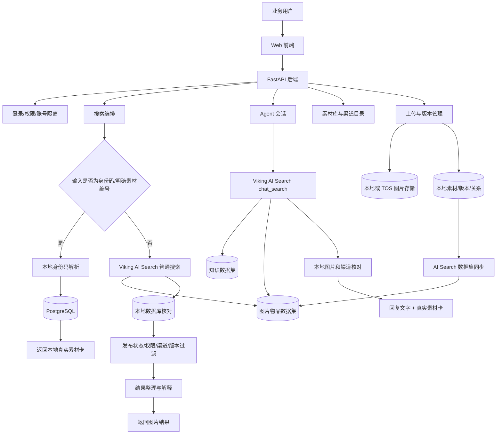
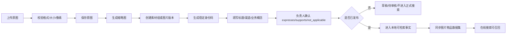
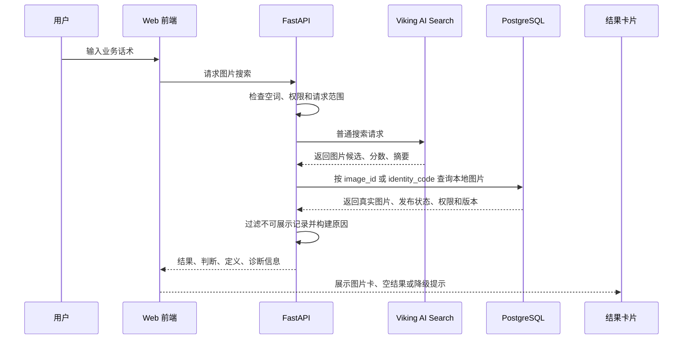
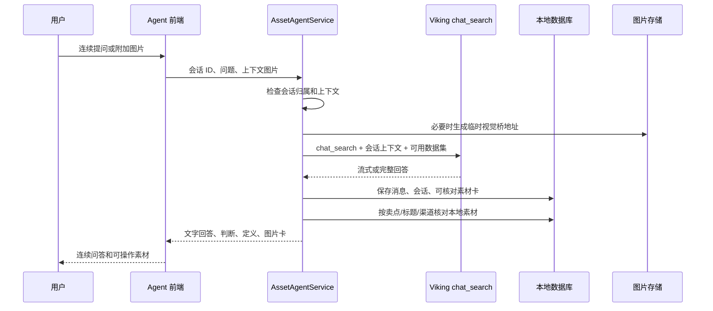
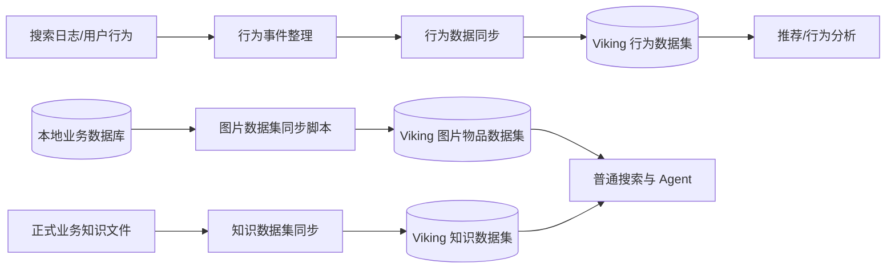

# 卖点智库系统蓝图与核心资产

> 面向：架构师、主创、技术负责人和需要理解系统全貌的接手人。
> 目的：说明当前卖点智库图片搜索系统由哪些模块组成、数据如何流动、哪些资产决定系统效果。
> 说明：本文只描述当前系统，不记录历史演变、不承担复刻操作教程，也不展开项目价值、画板内容和排期。

---

## 一、技术栈与工具链

### 1.1 系统整体分层

当前系统可以拆成四层运行结构：

```text
┌─────────────────────────────────────────────────────────────┐
│                         Web 前端层                          │
│ React 19 + Vite + TypeScript + TanStack Query + Radix UI   │
│ Tailwind CSS + Nginx                                       │
└──────────────────────────────┬──────────────────────────────┘
                               │ HTTP / JSON / SSE
┌──────────────────────────────▼──────────────────────────────┐
│                         应用服务层                          │
│ FastAPI + SQLAlchemy + Alembic                             │
│ 权限、素材、版本、业务概念、搜索编排、Agent、审计、日志      │
└───────────────┬──────────────────────┬──────────────────────┘
                │                      │
┌───────────────▼──────────────┐  ┌────▼─────────────────────┐
│       本地业务事实层           │  │       在线智能检索层       │
│ PostgreSQL / SQLite            │  │ 火山引擎 Viking AI Search │
│ 图片文件 / TOS 对象存储        │  │ 普通搜索 + chat_search    │
│ 人工关系 / 权限 / 审计         │  │ 知识数据集 + 图片数据集   │
└───────────────────────────────┘  └──────────────────────────┘
                │
┌───────────────▼──────────────────────────────────────────────┐
│                       可选增强与运营层                       │
│ Meilisearch 可选索引、行为数据集、搜索日志、评测脚本、同步任务 │
└─────────────────────────────────────────────────────────────┘
```

系统的关键边界是：

- Viking AI Search 负责在线语言理解、知识判断、图片数据集召回和 Agent 对话。
- Piancton 本地数据库负责业务事实、权限、图片生命周期、人工审核关系和最终素材卡。
- 对外展示的图片必须重新回本地数据库核对，不能直接把火山返回的文本、外部图片 ID 或不可访问地址当成素材事实。
- Meilisearch 是可选增强索引，不是当前业务事实源，也不是首次启动的必需组件。

### 1.2 技术栈与职责

| 模块 | 当前技术 | 主要职责 | 不能替代的部分 |
|---|---|---|---|
| Web 前端 | React 19、Vite、TypeScript | 搜索框、Agent、图片卡、图片详情、渠道目录、收藏、上传和管理操作 | 不直接决定业务关系，不直接保存搜索事实 |
| 前端状态与请求 | TanStack Query | 登录态数据、搜索结果、Agent 会话、目录和图片缓存失效 | 不代替后端权限校验 |
| UI 组件 | Radix UI、Tailwind CSS、自定义主题 | 弹窗、菜单、卡片、响应式布局、可访问交互 | 不承担搜索判断 |
| Web 服务 | Nginx | 托管前端构建结果、反向代理或提供生产入口 | 不承担业务逻辑 |
| 后端 API | FastAPI、Pydantic Schema | 登录、权限、图片、素材组、版本、搜索、Agent、渠道和管理接口 | 不把模型输出直接当成数据库事实 |
| ORM 与迁移 | SQLAlchemy、Alembic | 数据访问、事务、数据库结构演进 | 不负责图片文件本身 |
| 关系数据库 | 开发可用 SQLite；正式部署使用 PostgreSQL 17 | 用户、素材、图片版本、卖点、业务关系、渠道、Agent 会话、搜索日志、审计记录 | 不负责在线语义理解 |
| 图片存储 | 本地 storage/images 或火山 TOS | 原图、缩略图、回收站文件、版本文件、头像等私有文件 | 不负责卖点判断 |
| 在线搜索 | 火山引擎 Viking AI Search | 普通搜索、知识理解、chat_search Agent、推荐、补全、行为闭环 | 不负责本地权限和最终图片事实 |
| 可选搜索增强 | Meilisearch | 本地关键词和字段索引、快速候选召回 | 不能单独决定业务卖点关系 |
| 容器编排 | Docker Compose | PostgreSQL、Backend、Web、可选 Meilisearch 的统一启动和健康检查 | 不替代云端控制台资源配置 |
| 业务知识 | 六大体系、16 个核心卖点、定义、边界、证明点 | 为用户话术提供稳定的业务解释框架 | 不能由在线模型临时自由扩写成新卖点 |
| 评测与同步脚本 | backend/scripts/ | AI Search 数据集同步、行为同步、索引重建、搜索评测和健康检查 | 不绕过人工审核关系直接发布图片 |

### 1.3 当前运行组件

```text
postgres
  └─ 保存业务数据库和 Agent/搜索日志

backend
  ├─ FastAPI 接口
  ├─ 搜索和 Agent 编排
  ├─ AI Search 客户端
  ├─ 本地数据库/可选 Meilisearch 召回
  ├─ 图片存储访问
  └─ 行为数据同步任务

web
  ├─ 构建 React 前端
  └─ 通过 Nginx 提供页面入口

meilisearch（可选）
  └─ 仅在需要本地增强索引时启动
```

Backend 的关键外部配置分为六组：

| 配置组 | 典型变量 | 作用 |
|---|---|---|
| 数据库 | DATABASE_URL | 指向 PostgreSQL 或开发 SQLite |
| 图片存储 | STORAGE_BACKEND、STORAGE_DIR、TOS 配置 | 决定原图和缩略图保存位置 |
| AI Search 普通搜索 | AI_SEARCH_ENABLED、AI_SEARCH_BASE_URL、AI_SEARCH_API_KEY、AI_SEARCH_DATASET_ID、AI_SEARCH_SEARCH_PATH | 连接图片数据集和普通搜索接口 |
| AI Search Agent | AI_SEARCH_CHAT_ENABLED、AI_SEARCH_APPLICATION_ID、AI_SEARCH_CHAT_PATH、AI_SEARCH_CHAT_DATASET_IDS | 连接 Viking AI Search 应用的 chat_search |
| AI Search 推荐/行为 | AI_SEARCH_RECOMMEND_*、AI_SEARCH_BEHAVIOR_* | 查询推荐、行为数据写入和同步 |
| 搜索保护 | SEARCH_TIMEOUT_SECONDS、SEARCH_TOTAL_TIMEOUT_SECONDS、SEARCH_CACHE_* | 控制单分支超时、总超时、缓存和降级 |

### 1.4 火山 Viking AI Search 中的对象

```text
Viking AI Search
├── 图片物品数据集
│   └── 存放可检索图片记录和本地身份信息
├── 知识数据集
│   └── 存放六大体系、核心卖点、定义、边界和业务表达
├── 应用
│   └── 绑定知识数据集和图片数据集，承载 chat_search
├── 普通搜索场景
│   └── 提供首页关键词/自然语言图片搜索
├── chat_search
│   └── 提供 Agent 连续问答、知识解释和找图意图理解
└── 行为数据集（可选）
    └── 接收搜索和素材使用行为，用于推荐和后续调优
```

应用、数据集和接口路径不是一回事：

- 数据集 ID 指向被检索或写入的数据集合。
- 应用 ID 指向 Viking AI Search 中配置好的 Agent 应用。
- 普通搜索路径负责图片搜索、补全和推荐等接口。
- chat_search 路径负责对话式问答。
- Backend 只通过环境变量读取这些值，不把 API Key 和资源 ID 硬编码进仓库。

---

## 二、核心业务流向图（Workflow）

### 2.1 全局业务流



### 2.2 图片进入系统的流向



上传阶段最重要的不是“模型自动给这张图判一个卖点”，而是建立一条可追踪的业务事实链：

```text
图片文件
  → 图片版本
  → 素材组
  → 标题/渠道/身份码
  → 人工确认的业务概念关系
  → 发布状态
  → AI Search 图片数据集记录
```

### 2.3 首页普通搜索流向



普通搜索的核心原则：

1. 语义召回可以由 Viking AI Search 完成。
2. 图片展示必须经过本地数据库二次核对。
3. 火山返回了一个图片名称，不代表本地一定有这张图。
4. 外部 ID 无法映射到本地素材时，不能伪造图片卡。
5. Viking AI Search 暂时不可用时，系统可以回退本地搜索，但必须显示降级状态，不得把降级结果伪装成完整智能搜索结果。

### 2.4 Agent 对话流向



Agent 的数据边界：

- 会话消息和上下文属于用户自己的 Agent 会话。
- Agent 可以调用知识数据集回答体系、卖点和业务问题。
- Agent 可以调用图片数据集寻找候选，但最终图片卡仍需本地核对。
- 用户附加的图片可通过临时视觉桥提供给火山服务；不能把 localhost、127.0.0.1 或登录态地址直接交给火山。
- 普通问题不强制检索素材；明确找图时才补充图片上下文和本地素材卡。
- Agent 的回答不能修改六大体系、核心卖点或人工审核关系。

### 2.5 数据同步和行为闭环



同步不是“把数据库全量暴露给在线服务”：

- 图片数据集只同步可用于在线检索的字段和必要身份映射。
- 知识数据集同步正式业务知识，不把研发草稿和未确认结论当成正式知识。
- 行为数据集只在配置开启时同步。
- API Key、数据库密码、对象存储 Secret、用户私密信息不写入数据集正文。
- 同步失败应保留本地事实，不得因为在线同步失败而删除本地素材。

---

## 三、核心资产与系统边界

### 3.1 业务知识资产

当前系统最重要的业务资产不是某个模型，而是结构化业务知识：

```text
六大稳定业务体系
  → 16 个核心卖点
      → 卖点定义
      → 典型业务需求
      → 用户常用表达
      → 正向信号
      → 易混卖点
      → 排除边界
      → 证明点/证据表达点
```

六大体系是稳定业务地图，16 个核心卖点是搜索和解释的主要业务锚点。证明点和证据表达点用于说明“为什么这个卖点成立”，但不能因为某条原文证据存在，就自动制造一张图片或自动建立未经确认的图片关系。

### 3.2 图片事实资产

图片相关事实由本地数据库和图片存储共同组成：

| 资产 | 说明 | 主要用途 |
|---|---|---|
| 素材组 | 一组具有同一业务主题的图片资产 | 管理同主题主图和版本 |
| 图片版本 | 某个具体文件和尺寸版本 | 展示、下载和精确追踪 |
| 主图 | 素材组当前代表图片 | 默认结果和详情展示 |
| 延展尺寸 | 4:3、16:9、竖版等已发布版本 | 根据使用场景补充下载 |
| asset_code | 素材组稳定身份 | 精确定位素材组 |
| version_code | 图片版本稳定身份 | 精确定位某个文件 |
| 标题 | 业务可理解的素材名称 | 搜索、展示和 Agent 核对 |
| 渠道目录 | PPT、官网、区域或业务分类 | 浏览和渠道范围过滤 |
| 发布状态 | 草稿、已发布、回收站等生命周期 | 决定是否允许搜索和展示 |
| 原图/缩略图 | 不同分辨率的存储对象 | 页面加载和下载 |

身份码搜索和自然语言搜索必须分开：

```text
输入像身份码/分享链接
  → 规则解析
  → 本地查找
  → 权限校验
  → 返回唯一素材

普通业务话术
  → Viking AI Search 理解和召回
  → 本地事实核对
  → 返回候选和解释
```

### 3.3 人工业务关系资产

图片和业务概念之间的关系是搜索可信度的根：

| 关系 | 含义 | 正式搜索用途 |
|---|---|---|
| expresses | 图片主要表达该卖点/概念 | 可以作为高可信结果 |
| supports | 图片可以辅助支撑该卖点/概念 | 可以返回，但通常低于主要表达 |
| not_applicable | 图片不适合表达该概念 | 排除 |
| 待审核/未确认 | 还没有负责人确认 | 不作为正式业务事实 |

这套关系解决的是“图片看起来像不像”之外的业务问题：

- 让搜索结果有业务依据。
- 让相邻卖点可以共享同一张图片，但不被错误合并。
- 让一张图可以主要表达一个概念、同时支持多个概念。
- 让搜索结果可以解释为什么返回。
- 让错误结果可以追溯到关系、知识、索引还是展示层。

人工关系不是图片质量评分：

- expresses 不等于图片质量高。
- supports 不等于图片质量低。
- not_applicable 只表示不适合支撑该业务概念。
- 图片是否美观、是否符合视觉规范，属于另外的审核维度。

### 3.4 在线搜索资产

Viking AI Search 在线侧主要承载三类可检索资产：

| 在线资产 | 进入内容 | 不应进入内容 |
|---|---|---|
| 知识数据集 | 六大体系、卖点定义、业务表达、边界和正式解释 | 未确认的新卖点、研发草稿、私密信息 |
| 图片物品数据集 | 图片标题、业务概念、必要图片描述、身份码和可映射字段 | API Key、原图凭证、未发布图片、无法核验的外部 ID |
| 行为数据集 | 搜索、点击、使用和反馈等允许同步的行为事件 | 用户密码、完整密钥、无关私密聊天内容 |

在线数据集的作用是提升理解和召回速度，不是替代本地数据库：

```text
在线数据集 = 检索和理解层
本地数据库 = 业务事实和权限层
图片存储 = 文件内容层
```

### 3.5 核心代码资产

当前代码中，理解系统时优先关注这些服务：

| 代码位置 | 作用 |
|---|---|
| backend/app/services/volc_ai_search_client.py | Viking AI Search 普通搜索、chat_search、推荐、补全、数据写入客户端 |
| backend/app/services/volc_ai_search_service.py | 首页普通搜索适配、候选映射、本地图片核对和降级响应 |
| backend/app/services/asset_agent_service.py | Agent 会话、连续对话、上下文图片、chat_search 和素材卡补充 |
| backend/app/services/search_response_builder.py | 将候选、评分、原因和空结果整理为统一响应 |
| backend/app/services/search_orchestrator.py | 搜索分支、超时、缓存、降级和结果编排 |
| backend/app/services/identity_search_service.py | 身份码、分享链接和精确素材查找 |
| backend/app/services/business_concept_service.py | 业务体系、核心卖点和概念关系读取 |
| backend/app/services/search_log_service.py | 搜索请求、候选和结果的可追踪记录 |
| backend/app/services/volc_ai_search_sync.py | 图片数据集同步 |
| backend/app/services/ai_search_behavior_sync.py | 行为数据集同步 |
| backend/app/services/asset_agent_temporary_image_service.py | 给火山服务提供短期可访问的图片桥接地址 |
| backend/app/repositories/ | 本地素材、图片、关系、渠道、会话和用户数据访问 |
| backend/app/models/ | 业务事实对应的数据库模型 |
| client/src/pages/ImageHome/ | 搜索首页、结果卡、Agent、渠道筛选和图片交互 |
| docker-compose.yml | 本地/服务器运行组件和健康检查 |

### 3.6 系统不能做什么

为了避免主创或后续开发者误解，当前系统有明确边界：

1. 不把大模型临时说出的新卖点写回正式卖点目录。
2. 不把火山返回的图片名称直接当成已存在的本地素材。
3. 不把相似图片自动当成业务负责人已经确认的素材。
4. 不用搜索排序分数代替人工业务关系。
5. 不把渠道目录当成六大体系或核心卖点的替代分类。
6. 不把延展尺寸强制成首次上传必填项。
7. 不因为一次在线接口失败就删除本地图片、关系或知识。
8. 不把 API Key、对象存储凭证、用户私密信息同步进知识或图片数据集。
9. 不允许在线服务绕过本地权限、发布状态和素材生命周期。
10. 不让 Agent 的自由回答直接修改业务事实。

### 3.7 一句话总览

```text
业务用户的自然语言
  → Viking AI Search 理解业务意图并召回候选
  → Piancton 本地数据库核对业务事实、权限、发布状态和人工关系
  → 返回可解释、可下载、可追踪的真实素材卡
```

这三部分共同构成当前系统蓝图：

- 技术栈说明系统由什么组成。
- 业务流向图说明请求和数据如何流转。
- 核心资产与边界说明系统为什么可信、哪些东西不能被替代。
